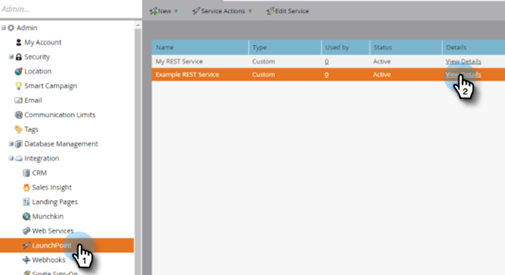

# Einrichten der Marketo-Verbindung {#set-up-marketo-connection}

So richten Sie Ihre Verbindung mit Marketo ein.

>[!PREREQUISITES]
>
>[Nur API-Benutzerrolle erstellen](https://experienceleague.adobe.com/docs/marketo/using/product-docs/administration/users-and-roles/create-an-api-only-user.html){target="_blank"} für die [!DNL Marketo Measure]/Marketo Engage-Verbindung.

1. Klicken Sie [!DNL Marketo Measure] auf die Dropdown **[!UICONTROL Liste Mein Konto]** und wählen Sie **[!UICONTROL Einstellungen]**.

   

1. Klicken [!UICONTROL &#x200B; unter &quot;]&quot; auf **[!UICONTROL Verbindungen]**.

   

1. Klicken Sie **[!UICONTROL Neue CRM-Verbindung einrichten]**.

   

1. Klicken Sie auf **[!UICONTROL Verbinden]**-Schaltfläche neben Marketo.

   

1. Melden Sie sich auf einer neuen Registerkarte bei Ihrem Marketo Engage-Konto an. Navigieren Sie **Admin** > **Web-Services**. Scrollen Sie nach unten zur REST-API. Markieren und speichern Sie den Endpunkt und die Identity Service-URL. Sie benötigen sie in den folgenden Schritten.

   

1. Wählen Sie noch im Marketo Engage **LaunchPoint** in der Baumstruktur auf der linken Seite aus. Suchen Sie den benutzerdefinierten Service, den Sie mit Marketo Measure verbinden möchten, und klicken Sie auf **Details anzeigen**.

   

1. Markieren und speichern Sie die Client-ID und den geheimen Client-Schlüssel. Klicken Sie auf **Schließen**.

   

1. Füllen Sie [!DNL Marketo Measure] die Felder mit den erfassten Daten aus.

   

1. Nachdem Sie die Werte eingegeben haben, klicken Sie auf **[!UICONTROL Authentifizieren]**. Ihr Marketo Engage-Konto ist mit [!DNL Marketo Measure] verbunden.

   

   >[!NOTE]
   >
   >[!DNL Marketo Measure] ruft die Marketo-API in Ihrem Namen auf, ohne Ihre Marketo-API-Beschränkungen zu nutzen, sodass Sie sich keine Gedanken über Obergrenzen und Kreditzuweisungen bei anderen Integrationen machen müssen.
