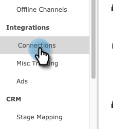

# Einrichten der Marketo-Verbindung {#set-up-marketo-connection}

So richten Sie Ihre Verbindung zu Marketo ein.

>[!PREREQUISITES]
>
>[Benutzerrolle &quot;Nur API erstellen&quot;](https://experienceleague.adobe.com/docs/marketo/using/product-docs/administration/users-and-roles/create-an-api-only-user.html) für die [!DNL Marketo Measure]/Marketo Engage-Verbindung.

1. In [!DNL Marketo Measure], klicken Sie auf die **[!UICONTROL Mein Konto]** und wählen Sie **[!UICONTROL Einstellungen]**.

   

1. under [!UICONTROL Integrationen]klicken **[!UICONTROL Verbindungen]**.

   

1. Klicks **[!UICONTROL Einrichten einer neuen CRM-Verbindung]**.

   

1. Klicken Sie auf **[!UICONTROL Verbinden]** neben Marketo.

   

1. Melden Sie sich in einer neuen Registerkarte bei Ihrem Marketo Engage-Konto an. Navigieren Sie zu **Admin** > **Web-Services**. Scrollen Sie nach unten zur REST-API. Markieren und speichern Sie den Endpunkt und die ID-Dienst-URL. Sie benötigen sie in den folgenden Schritten.

   

1. Wählen Sie noch im Marketo Engage aus. **LaunchPoint** im Baum auf der linken Seite. Suchen Sie den benutzerdefinierten Dienst, mit dem Sie eine Verbindung mit Marketo Measure herstellen möchten, und klicken Sie auf **Details anzeigen**.

   

1. Markieren und speichern Sie die Client-ID und das Client Secret. Klicken Sie auf **Schließen**.

   

1. Zurück in [!DNL Marketo Measure], füllen Sie die Felder mit den erfassten Daten aus.

   

1. Klicken Sie nach Eingabe der Werte auf **[!UICONTROL Authentifizieren]**. Ihr Marketo Engage-Konto ist mit [!DNL Marketo Measure].

   

   >[!NOTE]
   >
   >[!DNL Marketo Measure] führt Aufrufe an die Marketo-API in Ihrem Namen durch, ohne die Marketo-API-Beschränkungen zu nutzen. Daher müssen Sie sich keine Gedanken über die Obergrenze und die Zuordnung von Krediten zu anderen Integrationen machen.
