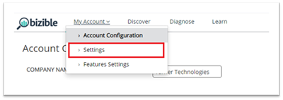
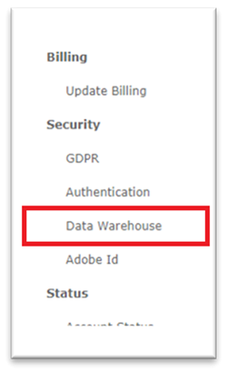
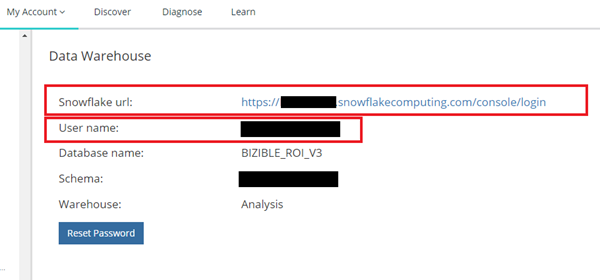
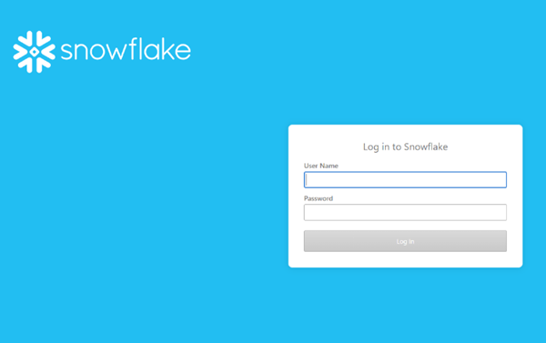
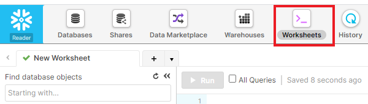
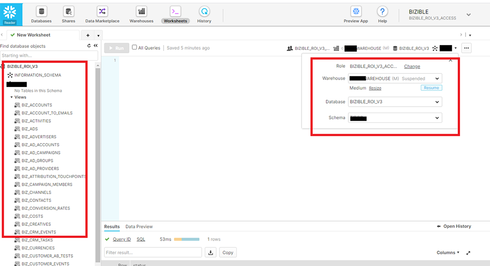
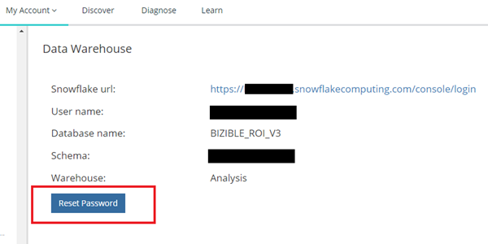
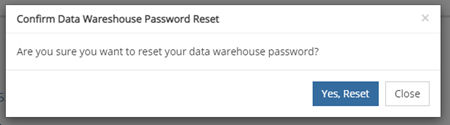
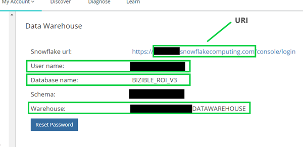

# Data Warehouse-Zugriff – Reader-Konto {#data-warehouse-access-reader-account}

## Snowflake-Zugriffs-Link {#snowflake-access-link}

Um auf Ihr Snowflake Data Warehouse zuzugreifen, müssen Sie zur spezifischen URL für Ihr Snowflake-Konto navigieren. Sie können diesen Zugriffs-Link finden, indem Sie sich bei [!DNL Marketo Measure] anmelden und die folgenden Schritte ausführen, um zur Informationsseite von Data Warehouse zu navigieren.

1. Klicken Sie in [!DNL Marketo Measure] oben auf der Seite auf **[!UICONTROL Mein Konto]** > **[!UICONTROL Einstellungen]**.

   

1. Klicken Sie im Menü links unter Sicherheit auf **[!UICONTROL Data Warehouse]**.

   

1. Diese Seite enthält den Link zu Ihrem Snowflake Data Warehouse und Ihrem Benutzernamen.

   

   >[!NOTE]
   >
   >Dies ist ein schreibgeschütztes Konto, das für Ihre Organisation verfügbar ist, nicht nur für einzelne Benutzer. Jeder Benutzer in Ihrem Unternehmen, der Zugriff auf [!DNL Marketo Measure] hat, kann dieses Konto verwenden, um sich beim Snowflake Data Warehouse-Leserkonto anzumelden.

1. Klicken Sie auf den in der Snowflake-URL angegebenen Link, um zur Snowflake-Anmeldeseite zu gelangen, auf der Sie Ihren Benutzernamen und Ihr Kennwort eingeben. _Wenn Sie Ihr Kennwort nicht haben, können Sie es mit den folgenden Schritten zurücksetzen_.

   

1. Klicken Sie nach der Anmeldung **[!UICONTROL oben]** der Seite auf „Arbeitsblätter“.

   

1. Die BIZIBLE_ROI_V3-Datenbankobjekte befinden sich auf der linken Bildschirmseite. Geben Sie Warehouse, Datenbank und Schema aus den Dropdown-Optionen oben im Abfragefenster ein. Es sollte nur eine Option für jeden geben. Jetzt können Sie Abfragen im Abfrage-Editor von Snowflake ausführen.

   

## Ihr Passwort zurücksetzen {#reset-your-password}

[!DNL Marketo Measure] hat keinen Zugriff auf Ihr Snowflake-Anmeldekennwort. Wenn Sie Ihr Kennwort zurücksetzen müssen, klicken Sie auf der Informationsseite von Data Warehouse auf [!UICONTROL Kennwort zurücksetzen] und befolgen Sie die Anweisungen. Ein temporäres Kennwort wird sofort in der Benutzeroberfläche angezeigt. Bei der nächsten Data Warehouse-Anmeldung werden Sie aufgefordert, Ihr eigenes Passwort zu erstellen.

>[!NOTE]
>
>* Durch Zurücksetzen des Kennworts wird es für alle [!DNL Marketo Measure] Benutzer in Ihrer Organisation zurückgesetzt, nicht nur für die aktuell angemeldeten Benutzer.
>* Wir zeigen nur das temporäre Passwort in der Benutzeroberfläche an. Eine E-Mail wird nicht gesendet.

## Herstellen einer Verbindung zu Snowflake über Drittanbieter-Tools {#connecting-to-snowflake-via-third-party-tools}

Sie müssen einige Informationen eingeben, um Ihr Snowflake Data Warehouse mit einem Tool eines Drittanbieters zu verbinden.

>[!NOTE]
>
>Jedes Tool hat unterschiedliche Verbindungsanforderungen. Es wird empfohlen, die Dokumentation für das spezifische Tool zu konsultieren, das Sie verbinden möchten.

* **URI** (immer erforderlich)
  * Dies ist der Domain-Name des Snowflake-Kontos. Sie ist in einem Abschnitt des Snowflake-Anmelde-Links enthalten.
* **Benutzername** (immer erforderlich)
  * Der Benutzername wird auf der Data Warehouse-Informationsseite in [!DNL Marketo Measure] aufgeführt.
* **Kennwort** (immer erforderlich)
  * Dies ist das Kennwort, das Sie beim ersten Anmelden bei Ihrem Snowflake-Konto festgelegt haben. Gehen Sie wie oben beschrieben vor, um Ihr Kennwort zurückzusetzen.
* **Datenbankname** (nicht immer erforderlich)
  * Die -Datenbank speichert die Daten in Snowflake. Es ist die Speicherressource. Der Datenbankname wird auf der Data Warehouse-Informationsseite in [!DNL Marketo Measure] aufgeführt.
* **Warehouse-Name** (nicht immer erforderlich)
  * Das Warehouse ist das, was Abfragen in Snowflake ausführt. Dies ist die berechnete Ressource. Der Warehouse-Name wird auf der Data Warehouse-Informationsseite in [!DNL Marketo Measure] aufgeführt.

  
