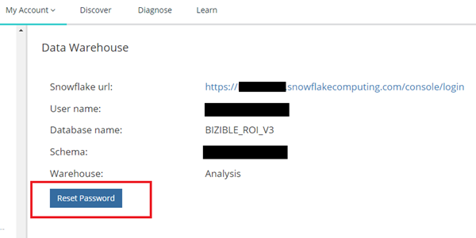

# Data Warehouse Access - Reader-Konto {#data-warehouse-access-reader-account}

## Snowflake-Zugangslink {#snowflake-access-link}

Um auf Ihr Snowflake Data Warehouse zuzugreifen, müssen Sie zur spezifischen URL für Ihr Snowflake-Konto navigieren. Sie finden diesen Zugriffs-Link, indem Sie sich bei [!DNL Marketo Measure] anmelden und die folgenden Schritte ausführen, um zur Data Warehouse-Informationsseite zu navigieren.

1. Klicken Sie in [!DNL Marketo Measure] oben auf der Seite auf **[!UICONTROL Mein Konto]** > **[!UICONTROL Einstellungen]**.

   

1. Klicken Sie im Menü auf der linken Seite unter &quot;Sicherheit&quot;auf **[!UICONTROL Data Warehouse]**.

   

1. Diese Seite enthält den Link zu Ihrem Snowflake Data Warehouse und Ihrem Benutzernamen.

   

   >[!NOTE]
   >
   >Dies ist ein schreibgeschütztes Konto, das für Ihr Unternehmen und nicht nur für einzelne Benutzer verfügbar ist. Jeder Benutzer in Ihrem Unternehmen, der Zugriff auf [!DNL Marketo Measure] hat, kann sich mit diesem Konto beim Snowflake Data Warehouse-Reader-Konto anmelden.

1. Klicken Sie auf den in der Snowflake-URL angegebenen Link. Dadurch gelangen Sie zur Snowflake-Anmeldeseite, auf der Sie Ihren Benutzernamen und Ihr Kennwort eingeben. _Wenn Sie Ihr Kennwort nicht haben, lesen Sie die folgenden Schritte, um es zurückzusetzen_.

   

1. Klicken Sie nach der Anmeldung oben auf der Seite auf **[!UICONTROL Arbeitsblätter]** .

   

1. Die Datenbankobjekte BIZIBLE_ROI_V3 befinden sich auf der linken Bildschirmseite. Geben Sie in den Dropdown-Optionen oben im Abfragefenster die Optionen Warehouse, Datenbank und Schema ein. Es sollte nur eine Option für jede geben. Jetzt können Sie Abfragen im Snowflake-Abfrageeditor ausführen.

   

## Ihr Passwort zurücksetzen {#reset-your-password}

[!DNL Marketo Measure] hat keinen Zugriff auf Ihr Snowflake-Login-Passwort. Wenn Sie Ihr Kennwort zurücksetzen müssen, klicken Sie auf der Data Warehouse-Informationsseite auf die Schaltfläche [!UICONTROL Kennwort zurücksetzen] und befolgen Sie die Anweisungen. In der Benutzeroberfläche wird sofort ein temporäres Kennwort angezeigt. Sie werden aufgefordert, Ihr eigenes Kennwort für Ihre nächste Data Warehouse-Anmeldung zu erstellen.

>[!NOTE]
>
>* Durch das Zurücksetzen des Kennworts wird es für alle [!DNL Marketo Measure] -Benutzer in Ihrer Organisation zurückgesetzt, nicht nur für den aktuell angemeldeten Benutzer.
>* Das temporäre Kennwort wird nur in der Benutzeroberfläche angezeigt. Eine E-Mail wird nicht gesendet.

## Verbindung zu Snowflake über Drittanbieter-Tools {#connecting-to-snowflake-via-third-party-tools}

Sie müssen einige Informationen eingeben, um Ihr Snowflake Data Warehouse mit einem Tool eines Drittanbieters zu verbinden.

>[!NOTE]
>
>Jedes Tool hat unterschiedliche Verbindungsanforderungen. Wir empfehlen, sich die Dokumentation für das spezifische Tool anzuschauen, das Sie verbinden möchten.

* **URI** (immer erforderlich)
   * Dies ist der Domänenname des Snowflake-Kontos. Sie ist in einem Teil des Snowflake-Anmelde-Links enthalten.
* **Benutzername** (immer erforderlich)
   * Der Benutzername wird auf der Data Warehouse-Informationsseite in [!DNL Marketo Measure] aufgeführt.
* **Kennwort** (immer erforderlich)
   * Dies ist das Kennwort, das Sie beim ersten Anmelden bei Ihrem Snowflake-Konto festgelegt haben. Informationen zum Zurücksetzen Ihres Kennworts finden Sie in den oben beschriebenen Schritten.
* **Datenbankname** (nicht immer erforderlich)
   * Die Datenbank speichert die Daten in Snowflake. Dies ist die Speicherressource. Der Datenbankname wird auf der Data Warehouse-Informationsseite in [!DNL Marketo Measure] aufgeführt.
* **Warehouse-Name** (nicht immer erforderlich)
   * Das Warehouse führt Abfragen im Snowflake aus. Dies ist die berechnete Ressource. Der Warehouse-Name wird auf der Data Warehouse-Informationsseite in [!DNL Marketo Measure] aufgeführt.

  
