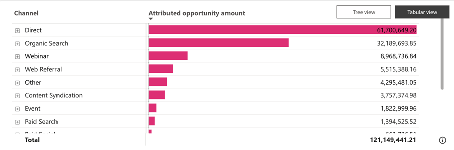

# Dashboard „Zugewiesene Opportunity“ {#attributed-opportunity-dashboard}

Das Dashboard &quot;Zugewiesene Chancen&quot;bietet einen umfassenden Überblick darüber, wie Marketing-Maßnahmen sowohl zu neuen als auch ausgereiften Pipeline-Chancen beitragen. Erfahren Sie mehr über die Details aller offenen und geschlossenen Möglichkeiten, die Ihren Strategien zugeordnet werden können, mit der Flexibilität, nach Opportunitätsstufe zu filtern und den gesamten Einfluss des Marketing über geschlossene Geschäfte hinaus zu unterstreichen.

**Fragen, die das Dashboard beantwortet**:

* Welche Kanäle, Unterkanäle oder Kampagnen rangieren in Bezug auf die zugewiesene Opportunitätsmenge am höchsten?
* Wie hoch sind die insgesamt zugewiesenen Chancen und die Anzahl unserer zugewiesenen offenen und geschlossenen Chancen?

## Dashboard-Komponenten {#dashboard-components}

### KPI-Kacheln {#kpi-tiles}

* **Zugewiesener Opportunity Amount**: Der Gesamtumsatzbeitrag, der auf Grundlage des ausgewählten Attributionsmodells aus geschlossenen und offenen Chancen mit Touchpoints bereitgestellt wird, die innerhalb des gefilterten Datumszeitraums erstellt wurden.
* **Zugewiesene Möglichkeiten**: Die Anzahl der geschlossenen und offenen Möglichkeiten mit Touchpoints.

### Zugewiesener Opportunity Amount by Channel Im Zeitdiagramm {#attributed-opportunity-amount-by-channel-over-time-chart}

Gestapeltes Balkendiagramm, das die nach Kanal segmentierte Summe der zugewiesenen Chancen für jeden Monat/Quartal/Jahr anzeigt.

* Nutzen Sie die Drilldown- und Up-Funktionen, um die Daten nach Monat, Quartal oder Jahr zu kategorisieren.
* Bewegen Sie den Mauszeiger über ein Balkensegment oder den Abstand zwischen Balken, um detaillierte Informationen anzuzeigen.

**Fragen Sie die Diagrammantworten**:

* Welche Kanäle generierten pro Quartal den am meisten zugewiesenen Opportunitätsbetrag?
* Wie hoch war die Aufteilung der zugeschriebenen Opportunitätsmenge nach Kanal im letzten Monat?

### Tabelle &quot;Zugewiesener Angebotsbetrag&quot; {#attributed-opportunity-amount-table}

Gesamtzahl der zugewiesenen Gelegenheitsmengen, segmentiert nach Kanal, Subkanal und Kampagne, sowohl im Tabellenformat als auch im Strukturformat dargestellt. Klicken Sie auf die Schaltfläche oben rechts, um zwischen Ansichten zu wechseln.

**Fragen, die die Pinnwand beantwortet**:

* Wie variiert die zugeschriebene Verteilung des Opportunitätsbetrags zwischen verschiedenen Unterkanälen innerhalb eines Kanals?
* Welche Kampagnen unter einem bestimmten Unterkanal verhelfen zu dem am meisten zugewiesenen Opportunity-Betrag?

#### Tabellenansicht {#tabular-view}

Die tabellarische Sicht bietet klare und organisierte Einblicke in die Verteilung der zugeschriebenen Opportunitätsmenge. Benutzer können Leistungsmuster schnell erkennen und wirkungsvolle Marketing-Strategien bestimmen, indem sie Daten in Kanäle, Unterkanäle und Kampagnen kategorisieren.

Klicken Sie auf das Symbol **+** neben jedem Kanal, um die Aufschlüsselung nach Subkanal und Kampagne anzuzeigen.

#### Baumansicht {#tree-view}

Die Baumansicht ermöglicht eine interaktivere und detailliertere Datenexploration, sodass Marketing-Experten Trends, Anomalien oder Leistungsmerkmale in ihren Marketing-Maßnahmen identifizieren können.

Klicken Sie auf einen Zweig, um tiefer in die nachfolgende Hierarchieebene zu gelangen.

### Filterbereich

Dieses Dashboard verfügt über die folgenden Einstellungen und Filter:

* Datum (basierend auf dem Erstellungsdatum der Gelegenheit)
* Attributionsmodell
   * Bei offenen Möglichkeiten bieten die Attributionsmodelle &quot;vollständiger Pfad&quot;und &quot;benutzerspezifische&quot;Point-in-Time-Ansichten und stellen keine endgültigen Attributionsergebnisse dar.
* Opportunity Stage (basierend auf der aktuellen Bühne)
* Kanal, Subkanal
* Kampagne
* Segmente
