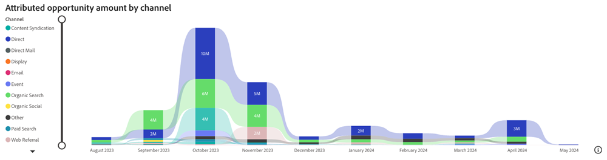

# Dashboard „Zugewiesene Opportunity“ {#attributed-opportunity-dashboard}

Das Dashboard Zugewiesene Vertriebschancen bietet einen umfassenden Überblick darüber, wie Marketing-Maßnahmen sowohl zu entstehenden als auch zu ausgereiften Pipeline-Vertriebschancen beitragen. Machen Sie sich mit den Details jeder offenen und geschlossenen Opportunity vertraut, die auf Ihre Strategien zurückzuführen sind, und nutzen Sie die Flexibilität, nach Opportunity-Stadium zu filtern. So wird unterstrichen, dass der Einfluss des Marketings über abgeschlossene Angebote hinaus umfassend ist.

**Fragen, die das Dashboard beantwortet**:

* Welche Kanäle, Unterkanäle oder Kampagnen rangieren gemessen an der zugewiesenen Opportunity-Menge am höchsten?
* Wie hoch ist der insgesamt zugewiesene Opportunity-Betrag und die Anzahl unserer zugewiesenen offenen und geschlossenen Opportunitys?

## Dashboard-Komponenten {#dashboard-components}

### KPI-Kacheln {#kpi-tiles}

* **Attributierter Opportunity-**: Der Gesamtumsatzbeitrag, basierend auf dem ausgewählten Attributionsmodell, von geschlossenen und offenen Opportunitys mit Touchpoints, die innerhalb des gefilterten Datumszeitraums erstellt wurden.
* **Zugewiesene Opportunitys**: Die Anzahl der geschlossenen und offenen Opportunitys mit Touchpoints.

### Zugewiesener Opportunity-Betrag nach Kanal im Zeitverlauf {#attributed-opportunity-amount-by-channel-over-time-chart}

Gestapeltes Balkendiagramm mit dem insgesamt zugewiesenen Opportunity-Betrag, segmentiert nach Kanal, für jeden Monat/Quartal/Jahr.

* Nutzen Sie die Aufschlüsselungs- und Nach-oben-Funktionen, um die Daten nach Monat, Quartal oder Jahr zu kategorisieren.
* Bewegen Sie den Mauszeiger über ein Balkensegment oder den Abstand zwischen Balken, um detaillierte Informationen anzuzeigen.

**Fragen in der Grafik beantworten**:

* Welche Kanäle generierten pro Quartal den am häufigsten zugewiesenen Opportunity-Betrag?
* Wie war die Aufschlüsselung des zugewiesenen Opportunity-Betrags nach Kanal im letzten Monat?

### Tabelle des zugeordneten Opportunity-Betrags {#attributed-opportunity-amount-table}

Insgesamt zugewiesener Opportunity-Betrag, segmentiert nach Kanal, Unterkanal und Kampagne, präsentiert sowohl in tabellarischer als auch in Baumstruktur-Format. Klicken Sie auf die Schaltfläche in der oberen rechten Ecke, um zwischen Ansichten zu wechseln.

**Fragen beantwortet das Board**:

* Wie variiert die Verteilung des zugeordneten Opportunity-Betrags zwischen verschiedenen Unterkanälen innerhalb eines Kanals?
* Welche Kampagnen in einem bestimmten Unterkanal führen zum am häufigsten zugewiesenen Opportunity-Betrag?

#### Tabellenansicht {#tabular-view}

Die Tabellenansicht bietet klare und organisierte Einblicke in die Verteilung des zugeordneten Opportunity-Betrags. Benutzer können schnell Leistungsmuster erkennen und wirkungsvolle Marketing-Strategien identifizieren, indem sie Daten in Kanäle, Unterkanäle und Kampagnen kategorisieren.

Klicken Sie auf das Symbol **+** neben jedem Kanal, um die Aufschlüsselung nach Unterkanal und Kampagne anzuzeigen.

#### Baumansicht {#tree-view}

Die Strukturansicht ermöglicht eine interaktivere und detailliertere Datenexploration, sodass Marketing-Experten Trends, Anomalien oder herausragende Leistungen bei ihren Marketing-Maßnahmen identifizieren können.

Klicken Sie auf eine Verzweigung, um tiefer in die nachfolgende Hierarchieebene einzutauchen.

### Filterbereich

Dieses Dashboard verfügt über die folgenden Einstellungen und Filter:

* Datum (basierend auf dem Erstellungsdatum der Opportunity)
* Attributionsmodell
   * Bei offenen Opportunitys bieten die Attributionsmodelle „Vollständiger Pfad“ und „Benutzerdefiniert“ Point-in-Time-Ansichten und stellen keine endgültigen Attributionsergebnisse dar.
* Opportunity-Stadium (basierend auf aktuellem Stadium)
* Kanal, Unterkanal
* Kampagne
* Segmente
