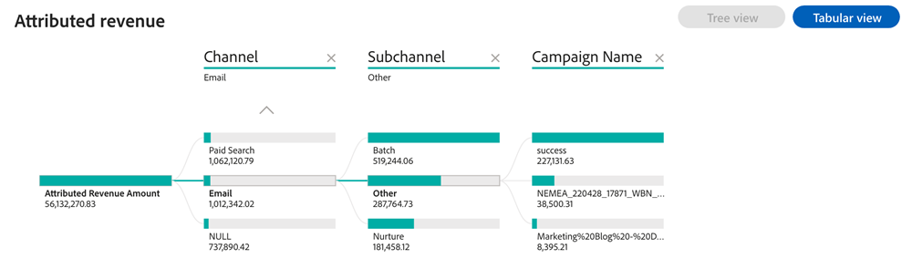

# Dashboard &quot;Zugewiesener Umsatz&quot; {#attributed-revenue-dashboard}

Das Dashboard &quot;Zugewiesener Umsatz&quot;bietet eine fokussierte Sicht auf den Umsatz, der direkt mit Ihren Marketingbemühungen verbunden ist. Informieren Sie sich ausführlich darüber, wie Ihre Marketingstrategien bei der Abdichtung von Geschäften hilfreich waren.

Fragen, die die Pinnwand beantwortet:

Welche Kanäle, Unterkanäle oder Kampagnen weisen den höchsten Umsatz auf?
Wie hoch ist der Gesamtbetrag unseres zugeordneten Umsatzes und die Anzahl unserer zugewiesenen geschlossenen Geschäfte?

<table style="table-layout:auto"> 
<tbody>
  <tr> 
   <th>Komponente</th> 
   <th>Beschreibung</th>
   <th>Durchsuchen von Feldern</th>
   <th>Datumstyp</th>
   <th>Filter</th>
  </tr>
  <tr>
    <td>Zugewiesene Umsatzkachel</td>
    <td>Gesamtzurechenbarer Umsatz aus "Geschlossenen Gewinnen"mit aufgezeichneten Touchpoints.</td>
    <td rowspan="6"><li>Opportunity-ID</li>
<li>Opportunity-Name</li>
<li>Opportunity-Erstellungsdatum</li>
<li>Opportunity Closed Date</li>
<li>Ist geschlossen (J/N)</li>
<li>Is Won (Y/N)</li>
<li>Aktuelles Stadium</li>
<li>Attributionsmodell</li>
<li>Attributierter Umsatz</li>
<li>Erzielter Umsatz</li></td>
    <td rowspan="6">Abschlussdatum</td>
    <td rowspan="6"><li>Datum</li>
<li>Attributionsmodell</li>
<li>Kanal</li>
<li>Unterkanal</li>
<li>Kampagne</li>
<li>Segmente</li></td>
  </tr>
  <tr>
    <td>Kachel "Zuweisbare Angebote"</td>
    <td>Gesamtzahl der "geschlossenen Gewinnen"-Angebote aus zurechenbaren Chancen.</td>
  </tr>
  <tr>
    <td>Zugewiesener Umsatz nach Kanal im Zeitverlauf</td>
    <td>Gestapeltes Balkendiagramm mit dem Gesamtumsatz, segmentiert nach zugehörigen Kanälen, für jedes Quartal/jeden Monat.
     </td>
  </tr>
  <tr>
    <td>Zugewiesene Umsatztabelle</td>
    <td>Gesegmenter Gesamtumsatz, segmentiert nach Kanal, Subkanal und Kampagne, in Tabellen- und Baum-Formaten dargestellt.
     
     </td>
  </tr>
  </tr>
</tbody>
</table>
