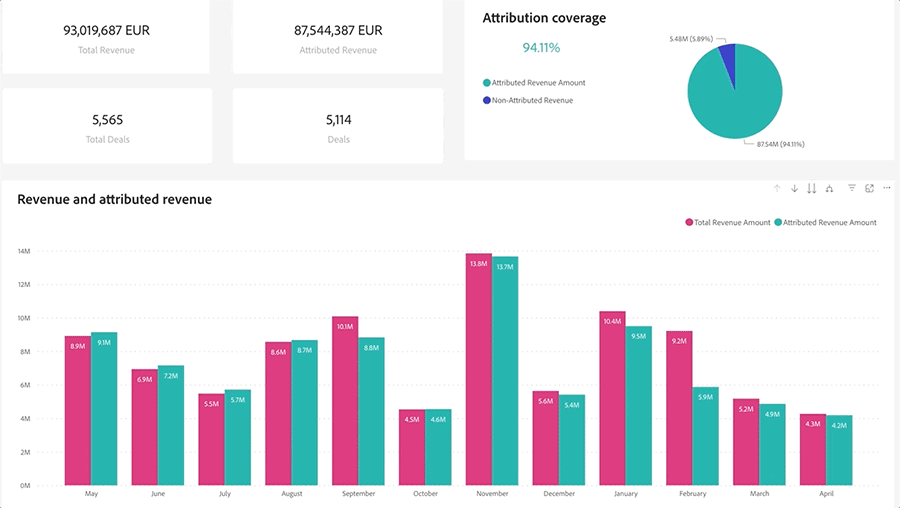

# Entdecken Sie die Grundlagen von Dashboards {#discover-dashboard-basics}

Dieser Artikel führt Sie durch die grundlegenden Funktionen der neu gestalteten Benutzeroberfläche und stellt sicher, dass Sie mühelos auf Ihre Daten zugreifen und sie interpretieren können. Machen Sie sich mit der Dynamik des Filterbereichs vertraut und entdecken Sie die Feinheiten unserer erweiterten Reporting-Funktionen, wie z. B. Drill-Funktionen, Kreuzfilterung und QuickInfos.

## Filterbereich {#filter-pane}

Jedes Dashboard verfügt über eine Reihe von Filtern sowie die folgenden Steuerelemente für eine nahtlose Navigation und Anpassung.

<table style="table-layout:auto"> 
 <tbody> 
  <tr> 
   <th>Name</th> 
   <th>Beschreibung</th>
  </tr> 
  <tr> 
   <td><b>Umschalter für Filter</b></td>
   <td>Schalten Sie den Filterbereich ein oder aus.
   
</td>
  </tr>
  <tr> 
   <td><b>Suchleiste</b></td>
   <td>Verwenden Sie die Suche oben im Filterbereich, um nach einem bestimmten Filter zu suchen. Jeder Filter verfügt außerdem über eine eigene Suchleiste.
   
</td>
  </tr>
   <tr> 
   <td><b>Filterschaltfläche löschen</b></td>
   <td>Um einen Filter zu löschen, klicken Sie auf das Radiergummi-Symbol oben rechts in jedem Filter.
   
</td>
  </tr>
  <tr> 
   <td><b>Schaltfläche „Anwenden“</b></td>
   <td>Klicken Sie auf , um Ihre Filteränderungen im Dashboard zu bestätigen und zu implementieren.
   
</td>
  </tr>
 </tbody> 
</table>

## Filter für visuelle Inhalte {#filters-on-visual}

Bewegen Sie den Mauszeiger über die obere rechte Ecke eines visuellen Elements, um eine schreibgeschützte Liste der angewendeten Filter anzuzeigen.

## Berichtsfunktionen {#report-capabilities}

### Aufschlüsselung {#drill-down-and-up}

* Bewegen Sie den Mauszeiger über ein visuelles Element, um festzustellen, ob es eine Hierarchie hat. Das Vorhandensein von Drill-Steuerungsoptionen in der Aktionsleiste zeigt dies an.

* Aktivieren Sie die Aufschlüsselung, indem Sie auf den einfachen Abwärtspfeil klicken, der durch einen grauen Hintergrund hervorgehoben wird. Verwenden Sie zum Zurücksetzen das Aufschlüsselungssymbol.

Um jeweils ein Feld aufzuschlüsseln, aktivieren Sie das Aufschlüsselungssymbol und wählen Sie ein visuelles Element aus, z. B. eine Leiste.

Verwenden Sie das Doppelpfeil-Drilldown-Symbol, um zur nächsten Hierarchieebene zu gelangen.

Verwenden Sie das Symbol Verzweigung , um Ihrer aktuellen Ansicht eine zusätzliche Hierarchieebene hinzuzufügen.

### Drill-Through {#drill-through}

Um die Daten hinter dem visuellen Element zu untersuchen, klicken Sie mit der rechten Maustaste auf das visuelle Element und wählen Sie die Option „Drill-Through“ aus.

### Daten exportieren {#export-data}

Um die zugrunde liegenden Daten aus einem visuellen Element zu exportieren, bewegen Sie den Mauszeiger über die obere rechte Ecke. Klicken Sie auf die Schaltfläche „Weitere Optionen“, wählen Sie „Daten exportieren“, wählen Sie Ihr bevorzugtes Format aus und klicken Sie dann auf „Exportieren“.

### Fokusmodus {#focus-mode}

Um ein bestimmtes Bild oder eine bestimmte Kachel heranzuzoomen, bewegen Sie den Mauszeiger über die obere rechte Ecke und wählen Sie die Schaltfläche „Fokus“ aus.

### Kreuzfilterung {#cross-filtering}

Wenn Sie in einer Visualisierung einen Wert oder eine Achsenbeschriftung auswählen, werden andere Visualisierungen auf der Berichtseite gefiltert, um sicherzustellen, dass nur die relevanten, gefilterten Daten angezeigt werden.

### Schnellinfo {#tooltips}

QuickInfos bieten zusätzliche Details zu den angezeigten Daten. Bewegen Sie den Mauszeiger über ein visuelles Element. Daraufhin wird eine kontextuelle QuickInfo angezeigt, die Einblicke oder Erklärungen zu diesem bestimmten Datenpunkt bietet.

