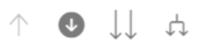
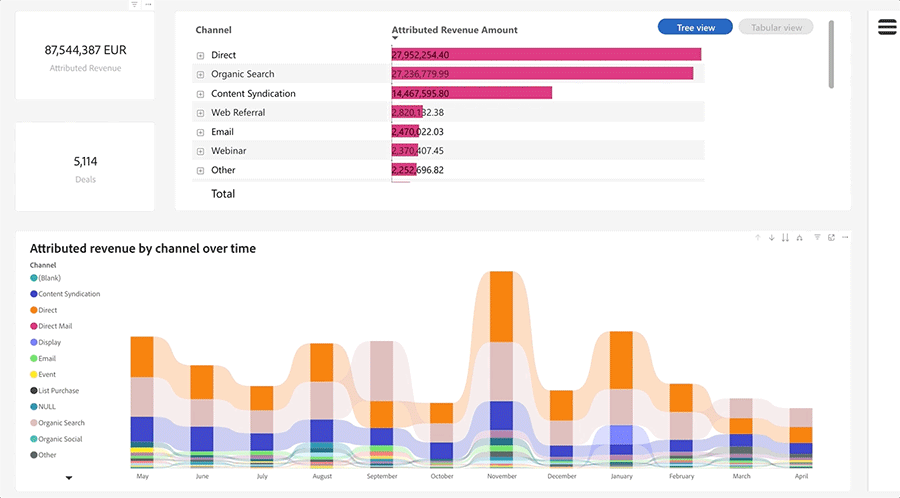

# Entdecken Sie die Grundlagen von Dashboards {#discover-dashboard-basics}

Dieser Artikel führt Sie durch die grundlegenden Funktionen der neu gestalteten Benutzeroberfläche, sodass Sie mühelos auf Ihre Daten zugreifen und sie interpretieren können. Lernen Sie die Dynamik des Filterbereichs kennen und lernen Sie die Komplexität unserer erweiterten Berichterstellungsfunktionen kennen, wie z. B. Drillfunktionen, Querfilterung und QuickInfos.

## Filterbereich {#filter-pane}

Jedes Dashboard verfügt über eine Reihe von Filtern, die von den folgenden Steuerelementen für eine nahtlose Navigation und Anpassung begleitet werden.

<table style="table-layout:auto"> 
 <tbody> 
  <tr> 
   <th>Name</th> 
   <th>Beschreibung</th>
  </tr> 
  <tr> 
   <td><b>Schaltfläche "Umschalten"filtern</b></td>
   <td>Schalten Sie den Filterbereich ein oder aus.
   
</td>
  </tr>
  <tr> 
   <td><b>Suchleiste</b></td>
   <td>Verwenden Sie die Suche oben im Filterbereich, um nach einem bestimmten Filter zu suchen. Jeder Filter verfügt auch über eine eigene Suchleiste.
   
</td>
  </tr>
   <tr> 
   <td><b>Schaltfläche "Filter löschen"</b></td>
   <td>Um einen Filter zu löschen, klicken Sie auf das Löschsymbol oben rechts in jedem Filter.
   
</td>
  </tr>
  <tr> 
   <td><b>Schaltfläche Anwenden</b></td>
   <td>Klicken Sie auf , um Ihre Filteränderungen im Dashboard zu bestätigen und zu implementieren.
   
</td>
  </tr>
 </tbody> 
</table>

## Visuelle Filter {#filters-on-visual}

Bewegen Sie den Mauszeiger über die obere rechte Ecke einer Visualisierung, um eine schreibgeschützte Liste der angewendeten Filter anzuzeigen.

## Berichtsfunktionen {#report-capabilities}

### Drilldown und Up {#drill-down-and-up}

* Bewegen Sie den Mauszeiger über eine Visualisierung, um festzustellen, ob sie über eine Hierarchie verfügt. Das Vorhandensein von Optionen zur Bohrsteuerung in der Aktionsleiste zeigt dies an.

* Aktivieren Sie den Drilldown, indem Sie auf den einzelnen Pfeil nach unten klicken, der durch einen grauen Hintergrund hervorgehoben wird. Verwenden Sie zum Wiederherstellen das Drilldown-Symbol.

Um ein Feld einzeln aufzuschlüsseln, aktivieren Sie das Drilldown-Symbol und wählen Sie ein visuelles Element aus, z. B. einen Balken.

Verwenden Sie das Drilldown-Symbol mit dem Doppelpfeil, um zur nächsten Hierarchieebene zu wechseln.

Verwenden Sie das abspaltbare Symbol, um Ihrer aktuellen Ansicht eine zusätzliche Hierarchieebene hinzuzufügen.

### Durchfahren {#drill-through}

Um die Daten hinter der Visualisierung zu untersuchen, klicken Sie mit der rechten Maustaste auf das visuelle Element und wählen Sie die Option &quot;Drillthrough&quot;.

### Daten exportieren {#export-data}

Um die zugrunde liegenden Daten aus einer Visualisierung zu exportieren, bewegen Sie den Mauszeiger über die obere rechte Ecke. Klicken Sie auf die Schaltfläche &quot;Mehr Optionen&quot;, wählen Sie &quot;Daten exportieren&quot;, wählen Sie Ihr bevorzugtes Format aus und klicken Sie dann auf &quot;Exportieren&quot;.

### Fokusmodus {#focus-mode}

Um eine bestimmte Visualisierung oder Kachel heranzoomen, halten Sie den Mauszeiger über die obere rechte Ecke und wählen Sie die Schaltfläche &quot;Fokus&quot;aus.

### Cross-Filter {#cross-filtering}

Wenn Sie einen Wert oder eine Achsenbeschriftung in einer Visualisierung auswählen, werden andere Visualisierungen auf der Berichtseite gefiltert, sodass nur die relevanten gefilterten Daten angezeigt werden.

### Schnellinfo {#tooltips}

QuickInfos bieten zusätzliche Details zu den angezeigten Daten. Bewegen Sie den Mauszeiger über ein visuelles Element und es wird ein Pop-up mit einer kontextuellen QuickInfo angezeigt, die Einblicke oder Erklärungen zu diesem Datenpunkt liefert.

