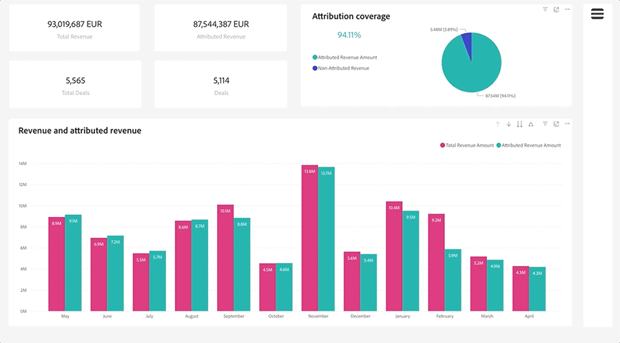

# Dashboard-Grundlagen {#discover-dashboard-basics}

Dieser Artikel führt Sie durch die grundlegenden Funktionen der neu gestalteten Benutzeroberfläche, sodass Sie mühelos auf Ihre Daten zugreifen und sie interpretieren können. Lernen Sie die Dynamik des Filterbereichs kennen und lernen Sie die Komplexität unserer erweiterten Berichterstellungsfunktionen kennen, wie z. B. die Drillfunktionen, die Querfilterung und QuickInfos.

## Filterbereich {#filter-pane}

Jedes Dashboard verfügt über eine Reihe von Filtern, die von den folgenden Steuerelementen für eine nahtlose Navigation und Anpassung begleitet werden.

<table style="table-layout:auto"> 
 <tbody> 
  <tr> 
   <th>Name</th> 
   <th>Symbol</th>
   <th>Beschreibung</th>
  </tr> 
  <tr> 
   <td>Hamburger-Schaltfläche</td> 
   <td></td>
   <td>Schalten Sie den Filterbereich ein oder aus.</td>
  </tr>
  <tr> 
   <td>Zurücksetzen</td> 
   <td></td>
   <td>Kehren Sie Filter zu den Standardeinstellungen zurück.</td>
  </tr>
   <tr> 
   <td>Visuelle Filter</td> 
   <td></td>
   <td>Bewegen Sie den Mauszeiger über die obere rechte Ecke einer Visualisierung und klicken Sie auf die Schaltfläche , um die aktiven Filter anzuzeigen.</td>
  </tr>
 </tbody> 
</table>

## Berichtsfunktionen {#report-capabilities}

### Drilldown und Up {#drill-down-and-up}

* Bewegen Sie den Mauszeiger über eine Visualisierung, um festzustellen, ob sie über eine Hierarchie verfügt. Das Vorhandensein von Optionen zur Bohrsteuerung in der Aktionsleiste zeigt dies an.

* Aktivieren Sie den Drilldown, indem Sie auf den einzelnen Pfeil nach unten klicken, der durch einen grauen Hintergrund hervorgehoben wird. Verwenden Sie zum Wiederherstellen das Drilldown-Symbol.

Um ein Feld einzeln aufzuschlüsseln, aktivieren Sie das Drilldown-Symbol und wählen Sie ein visuelles Element aus, z. B. einen Balken.

Verwenden Sie das Drilldown-Symbol mit dem Doppelpfeil, um zur nächsten Hierarchieebene zu wechseln.

Verwenden Sie das abspaltbare Symbol, um Ihrer aktuellen Ansicht eine zusätzliche Hierarchieebene hinzuzufügen.

### Durchfahren {#drill-through}

* Um die Daten hinter der Visualisierung zu untersuchen, klicken Sie mit der rechten Maustaste auf das visuelle Element und wählen Sie die Option &quot;Drillthrough&quot;.

* Um die zugrunde liegenden Daten zu exportieren, bewegen Sie den Mauszeiger über die rechte obere Ecke der Durchlaufseite, klicken Sie auf die Schaltfläche &quot;Mehr Optionen&quot;und wählen Sie &quot;Daten exportieren&quot;.

* Um eine bestimmte Visualisierung oder Kachel heranzoomen, halten Sie den Mauszeiger über die obere rechte Ecke und wählen Sie die Schaltfläche &quot;Fokus&quot;aus.

### Cross-Filter {#cross-filtering}

Standardmäßig werden bei Auswahl eines Werts oder einer Achsenbeschriftung in einer Visualisierung andere Visualisierungen auf der Berichtsseite gefiltert, sodass nur die relevanten gefilterten Daten angezeigt werden.

### Schnellinfo {#tooltips}

QuickInfos bieten zusätzliche Details zu den angezeigten Daten. Bewegen Sie einfach den Mauszeiger über ein visuelles Element und es wird ein Pop-up mit einer kontextuellen QuickInfo angezeigt, die Einblicke oder Erklärungen zu diesem Datenpunkt liefert.

