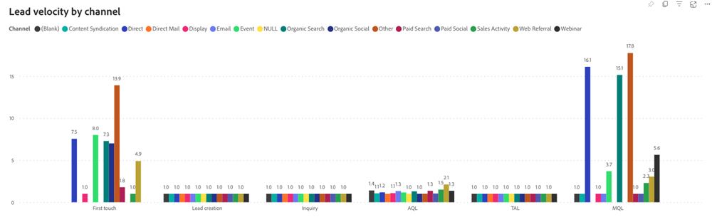

# Dashboard „Lead-Geschwindigkeit“ {#lead-velocity-dashboard}

Das Velocity-Dashboard bietet einen dynamischen Einblick in das Tempo, in dem sich Interessenten durch den Verkaufstrichter bewegen, und bietet Marketing-Experten und Vertriebsteams wichtige Einblicke in die Konversionszeiten auf verschiedenen Kanälen. Dieses Tool ist für die Beantwortung wichtiger Fragen zur Lead-Konversionsdauer und zur Effizienz der Progression in den Vertriebsstufen von unschätzbarem Wert. So können Sie Ihre Interaktionsstrategien für beschleunigtes Wachstum und Konversionen optimieren.

Fragen, die dieses Dashboard beantwortet:

* Wie lange dauert es im Durchschnitt, einen Lead zu konvertieren?
* Wie lange dauert es im Durchschnitt für jedes Stadium, bis ein Lead oder Kontakt zum nächsten Stadium wechselt? Wie ändert sich dieser Zeitraum im Laufe der Zeit?

## Dashboard-Komponenten {#dashboard-components}

Ob „Lead“ oder „Kontakt“ angezeigt werden soll, hängt von den Voreinstellungen ab, die in festgelegt sind: Einstellungen > Attributionseinstellungen > Standard-Dashboard-Objekt.

### Lead-/Kontaktgeschwindigkeit nach Stadium {#lead-contact-velocity-by-stage}

Das Balkendiagramm zeigt die durchschnittliche Dauer in Tagen an, die Leads/Kontakte in jedem Verkaufsstadium während eines bestimmten Zeitraums verbringen.

Fragen, die in der Tabelle beantwortet werden:

* Welche Verkaufsstufe hat in der Regel die längste Dauer für Leads/Kontakte?
* Wie verhält sich die Zeit, die im Stadium „Erstkontakt“ verbracht wird, mit der Zeit im Stadium „MQL“?

### Lead-/Kontaktgeschwindigkeit im Zeitverlauf {#lead-contact-velocity-over-time}

Das Zeitreihen-Liniendiagramm zeigt die durchschnittliche Zeit in Tagen an, die Leads/Kontakte in jedem Verkaufsstadium im angegebenen Zeitraum verbringen.

* Verwenden Sie die Aufschlüsselungs- und Nach-oben-Funktionen, um die Daten nach Monat, Quartal oder Jahr zu kategorisieren.
* Bewegen Sie den Mauszeiger über eine Linie, um detaillierte Informationen anzuzeigen.

Fragen, die in der Tabelle beantwortet werden:

* Welche Trends gibt es bei der Besuchszeit für Leads/Kontakte in den einzelnen Monaten?
* In welchem Monat erlebten Leads/Kontakte den schnellsten Fortschritt durch die Vertriebsphasen?

### Lead-/Kontaktgeschwindigkeit nach Kanal {#lead-contact-velocity-by-channel}

Das Balkendiagramm zeigt die durchschnittliche Dauer in Tagen an, die Leads/Kontakte in jeder Trichterphase verbleiben, segmentiert nach Kanal.

Bewegen Sie den Mauszeiger über eine Linie, um detaillierte Informationen anzuzeigen.

Fragen, die in der Tabelle beantwortet werden:

* Welcher Kanal zeigt die schnellste Lead-Progression durch die Trichterstufen?
* Wie variiert die Lead-Geschwindigkeit in der „MQL“-Phase über verschiedene Kanäle hinweg?

## Filterbereich {#filter-pane}

Dieses Dashboard verfügt über die folgenden Einstellungen und Filter:

* Datum
   * Basierend auf: Übergang in Datum
* Phase
* Kanal
* Unterkanal
* Kampagne
* Segment
