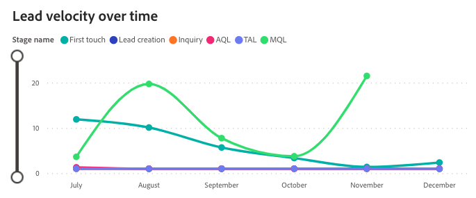

# Dashboard „Opportunity-Geschwindigkeit“ {#opportunity-velocity-dashboard}

Das Velocity-Dashboard bietet einen dynamischen Einblick in das Tempo, in dem potenzielle Kunden durch den Verkaufstrichter navigieren. So erhalten Marketingexperten und Vertriebsteams wichtige Einblicke in Konversionszeiten über verschiedene Kanäle hinweg. Dieses Tool ist für die Beantwortung von wichtigen Fragen über den Lebenszyklus von Opportunitätsmöglichkeiten und die Effizienz des Fortschritts in den Verkaufsstadien unentbehrlich und ermöglicht es Ihnen, Ihre Interaktionsstrategien für beschleunigtes Wachstum und Konversionen zu optimieren.

Fragen, die dieses Dashboard beantwortet:

* Wie lange dauert es durchschnittlich, einen Lead umzurechnen?
* Wie lange dauert es im Durchschnitt für jede Phase, bis ein Lead oder Kontakt zur nächsten Stufe gelangt? Wie ändert sich dieser Zeitraum im Laufe der Zeit?

## Dashboard-Komponenten {#dashboard-components}

### KPI-Kachel {#kpi-tile}

* **Geschlossene Kaufgeschwindigkeit**: Die durchschnittliche Anzahl von Tagen für &quot;Geschlossene Gewinner&quot;-Chancen vom ersten Schritt bis zum Schließen.

### Opportunity Velocity by Staging {#opportunity-velocity-by-stage}

Das Balkendiagramm zeigt die durchschnittliche Dauer (in Tagen) der in den einzelnen Verkaufsphasen während eines bestimmten Zeitraums verbrachten Gelegenheiten.

Fragen zu den Grafikantworten:

* In welchem Stadium verbringen Chancen im angegebenen Zeitraum im Durchschnitt die meiste Zeit?
* Wie lässt sich die durchschnittliche Opportunity-Erstellungsdauer in der Phase der &quot;Opportunity Creation&quot;mit der Prospect- und der Opportunity-Qualifikationsstufe vergleichen?

>[!NOTE]
>
>Phasen vor der &quot;Opportunity Creation&quot;verwenden das neueste Touchpoint-Datum als &quot;Transition in&quot;-Datum.

### Opportunity-Geschwindigkeit im Zeitablauf {#opportunity-velocity-over-time}

Das Liniendiagramm der Zeitreihen zeigt die durchschnittliche Zeit (in Tagen), die in den einzelnen Verkaufsphasen verbracht wird, über den festgelegten Zeitraum hinweg.

* Verwenden Sie die Drilldown- und Up-Funktionen, um die Daten nach Monat, Quartal oder Jahr zu kategorisieren.
* Bewegen Sie den Mauszeiger über eine Zeile, um detaillierte Informationen anzuzeigen.

Fragen zu den Grafikantworten:

* Wie hoch ist die Zeitspanne, die in den einzelnen Phasen der Entwicklung von Möglichkeiten in den beobachteten Monaten verbracht wurde?
* In welchem Monat haben die Chancen die schnellste Entwicklung in den Verkaufsstadien erfahren?

### Opportunity Velocity nach Kanal {#opportunity-velocity-by-channel}

Das Balkendiagramm zeigt die durchschnittliche Dauer in Tagen an, für die Leads/Kontakte in den einzelnen Trichterphasen nach Kanal segmentiert bleiben.

* Bewegen Sie den Mauszeiger über eine Zeile, um detaillierte Informationen anzuzeigen.

Fragen zu den Grafikantworten:

* Welcher Kanal zeigt den schnellsten Fortschritt durch die Trichterphasen?
* Inwiefern variiert die Opportunitätsgeschwindigkeit in der Phase des &#39;Interessenten&#39; je nach Kanal?

## Filterbereich {#filter-pane}

Dieses Dashboard verfügt über die folgenden Einstellungen und Filter:

* Datum
   * Basierend auf: Übergang am Datum
* Phase
* Kanal
* Unterkanal
* Kampagne
* Segment
