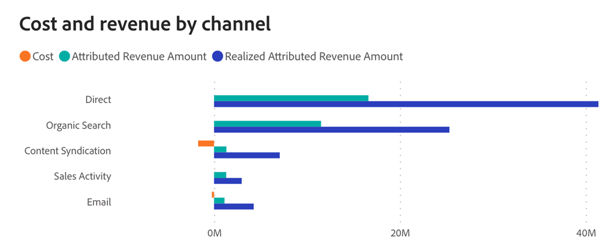

# ROI-Dashboard {#roi-dashboard}

Das ROI-Dashboard bietet Marketing-Experten einen detaillierten Überblick über die Investitionsrenditen in Kanälen, Unterkanälen und Kampagnen. Sie schlüsselt Kosten- und Umsatzmuster akribisch auf und beleuchtet Metriken wie Kosten pro Lead, Abschluss und Opportunity und stellt so ein umfassendes Verständnis der Marketing-Attribution sicher.

**Fragen, die das Board beantwortet**

* Wie lauteten die ROI-Werte für jeden Kanal, Unterkanal und jede Kampagne?
* Wie verteilten sich Kosten und Einnahmen auf die einzelnen Kanäle, Unterkanäle und Kampagnen?
* Was waren die Kosten pro Lead, Kosten pro Abschluss und Kosten pro Vertriebschance?

## Dashboard-Komponenten {#dashboard-components}

### KPI-Kacheln {#kpi-tiles}

* **Kosten**: Gesamtkosten aus verbundenen Datenquellen und manuell hochgeladenen Kosten.
* **Attributierter Umsatz** Der Gesamtumsatzbeitrag, basierend auf dem ausgewählten Attributionsmodell, von Opportunities mit Touchpoints, die innerhalb des gefilterten Datumszeitraums geschlossen wurden.
* **Realisierter zugewiesener Umsatz**: Der Gesamtumsatzbeitrag, basierend auf dem ausgewählten Attributionsmodell, von Opportunitys mit Touchpoints innerhalb des gefilterten Datumszeitraums, unabhängig davon, wann sie geschlossen wurden.
* **Total New Leads**: Gesamtzahl der neu generierten Leads, einschließlich sowohl kontaktierter als auch nicht kontaktierter Leads.
* **Kosten pro neuem Lead**: Die durchschnittlichen Kosten pro neuem Lead, abgeleitet von den Gesamtkosten dividiert durch die Gesamtzahl neuer Leads.
* **Total New Opportunities**: Gesamtzahl der neu generierten Opportunitys, einschließlich sowohl kontaktierter als auch unberührter Opportunitys.
* **Kosten pro neuer Opportunity**: Die durchschnittlichen Kosten pro neuer Opportunity, abgeleitet von den Gesamtkosten dividiert durch die Gesamtzahl neuer Opportunitys.
* **Abschlüsse insgesamt**: Die Anzahl der „abgeschlossenen gewonnenen“ Opportunitys, einschließlich Opportunitys ohne Touchpoints.
* **Einfacher ROI**: Attributierter Umsatz dividiert durch die Kosten in der gefilterten Datumsperiode.
* **Realisierter ROI**: Realisierter zugewiesener Umsatz dividiert durch die Kosten im gefilterten Datumsbereich.

### Kosten und Umsatz nach Kanaldiagramm {#cost-and-revenue-by-channel-graph}

Balkendiagramm, das die Kosten und den Umsatz darstellt und eine vergleichende Perspektive auf ihre Größe in Bezug auf verschiedene Kanäle, Unterkanäle und Kampagnen bietet.

* Verwenden Sie die Drilldown- und Nach-oben-Funktionen, um die Daten nach Unterkanal und Kampagne zu kategorisieren.
* Bewegen Sie den Mauszeiger über jede Leiste, um die einfachen und realisierten ROIs anzuzeigen.

**Fragen in der Grafik beantworten**

* Wie lauteten die ROI-Werte für jeden Kanal, Unterkanal und jede Kampagne?
* Gibt es Ausreißer-Kanäle oder Unterkanäle mit ungewöhnlich hohen oder niedrigen Kosten im Verhältnis zu ihrem Umsatz?

### Realisierter vs. einfacher ROI im Zeitverlauf {#realized-vs-simple-roi-over-time}

Zeitreihen-Liniendiagramm, das den Vergleich zwischen realisiertem und einfachem ROI anzeigt und deren Fortschritt im Zeitverlauf verfolgt.

* Bewegen Sie den Mauszeiger über einen Abschnitt im Diagramm, um die einfachen und realisierten ROIs anzuzeigen.

**Fragen in der Grafik beantworten**

* Wie lässt sich der realisierte ROI mit dem einfachen ROI über bestimmte Zeiträume vergleichen?
* In welchem Zusammenhang steht der Trend der realisierten ROI mit wichtigen Marketing-Ereignissen im selben Zeitraum?

### Diagramm zu Kosten im Zeitverlauf {#cost-over-time-graph}

Gestapeltes Balkendiagramm mit den Gesamtkosten, segmentiert nach zugehörigen Kanälen für jeden Monat/Quartal/Jahr.

* Verwenden Sie die Aufschlüsselungs- und Nach-oben-Funktionen, um die Daten nach Monat, Quartal oder Jahr zu kategorisieren.
* Bewegen Sie den Mauszeiger über ein Balkensegment oder den Abstand zwischen Balken, um detaillierte Informationen anzuzeigen.

**Fragen in der Grafik beantworten**

* Wie vergleichen sich die Gesamtkosten aller Kanäle von einem Quartal/Monat zum nächsten?
* Wie haben sich die Kosten für einen bestimmten Kanal im Laufe der Zeit entwickelt?

### Kosten nach Kanaldiagramm {#cost-by-channel-graph}

Balkendiagramm mit einer Darstellung der Marketingausgaben nach Kanal/Unterkanal/Kampagne.

* Verwenden Sie die Drill-down- und Up-Funktionen, um die Daten nach Kanal/Unterkanal/Kampagne zu kategorisieren.

**Fragen in der Grafik beantworten**

* Welche Unterkanäle oder Kampagnen innerhalb eines primären Kanals haben die höchste Zuordnung?
* Welche Marketing-Möglichkeiten (Kanal, Unterkanal oder Kampagne) scheinen im Vergleich zu anderen unterfinanziert zu sein?

### ROI-Zusammenfassungstabelle {#roi-summary-table}

Tabelle mit zugeordneten Einnahmen, Kosten und ROI, nach einzelnen Kanälen segmentiert, für eine detaillierte Aufschlüsselung.

* Klicken Sie auf das Symbol &quot;+&quot; neben jedem Kanal, um die Aufschlüsselung nach Unterkanal und Kampagne anzuzeigen.

**Spalten**

* channel/subchannel/campaign
* Kosten
* Attributierter Umsatz
* Realisierter zugewiesener Umsatz
* Einfacher ROI
* Realisierter ROI
* Nicht realisierter zugewiesener Pipeline-Umsatz : Pipeline-Umsatz in Verbindung mit Touchpoints (offene Vertriebschancen), die innerhalb des Zeitraums mit gefiltertem Datum erstellt wurden.

### Marketing-Ausgabentabelle {#marketing-spend-table}

Tabelle mit Kosten, neuen Leads, Vertriebschancen und Abschlüssen, die nach einzelnen Kanälen segmentiert sind, für eine detaillierte Aufschlüsselung.

* Klicken Sie auf das Symbol &quot;+&quot; neben jedem Kanal, um die Aufschlüsselung nach Unterkanal und Kampagne anzuzeigen.

**Spalten**

* channel/subchannel/campaign
* Kosten
* New Leads
* Kosten pro neuem Lead
* Neue Chancen
* Kosten pro neuer Opportunity
* Angebote
* Kosten pro Abschluss

## Filterbereich {#filter-pane}

Dieses Dashboard verfügt über die folgenden Einstellungen und Filter:

* Datum
   * Basierend auf:
      * Erstellungsdatum: Leads, neue Opportunities
      * Anfallsdatum für Kosten: Kosten
      * Abschlussdatum: Attributierter Umsatz (einfacher ROI), Abschlüsse
      * Touchpoint-Datum: Touchpoints aus realisiertem zugeordneten Umsatz (realisierter ROI)
* Attributionsmodell
* Kanal, Unterkanal
* Kampagne

>[!MORELIKETHIS]
>
>* [Entdecken Sie die Grundlagen von Dashboards](/help/marketo-measure-discover-ui/dashboards/discover-dashboard-basics.md){target="_blank"}
>* [Richtlinie für die Datensichtbarkeit im Dashboard](/help/marketo-measure-discover-ui/dashboards/dashboard-data-visibility-policy.md){target="_blank"}

