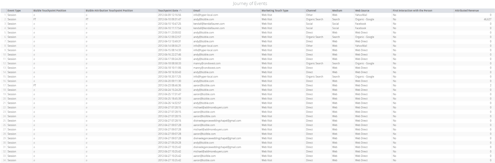

# Interaktionsverlauf {#engagement-path}

Interaktionspfad ermöglicht es Ihnen, eine vollständige Ansicht der Interaktionen mit Lead, Kontakt, Konto und Chancen von Erstkontakt bis zum Schließen anzuzeigen.

## Kachelbeschreibung {#tile-description}

**Ereignistyp:** Der Typ des Touchpoints (Sitzung, CRM-Kampagne, CRM-Ereignis, CRM-Aufgabe, Impression)

**Touchpoint-Position des Kunden:** Touchpoint-Position des Leads/Kontakts

**Touchpoint-Position der Käuferzuordnung:** Touchpoint-Position der Käuferzuordnung

**Touchpoint-Datum:** Für Online-Quellen: Datum und Uhrzeit der Interaktion. Für Offline-Ereignisse: Datum und Uhrzeit in der Salesforce-Kampagne festgelegt. Bei Aktivitäten Touchpoint: Touchpoint-Datumsfeld, auf das in der Aktivitätskonfiguration verwiesen wird

**E-Mail:** Die der Interaktion zugeordnete E-Mail

**Marketing-Touch-Typ:** Art der Interaktion (Webbesuch, Webformular, Webchat, CRM, Aktivitätstypen)

**Kanal:** Marketing-Kanal, der die Interaktion angetrieben hat

**Mittel:** Interaktionsmittel

* Wenn die Interaktion von einer API-verbundenen Plattform (Adwords/BingAds) erfolgt, ist das Medium CPC
* Wenn die Einstiegsseite der Interaktion utm_medium enthält, werden wir analysieren
* Wenn die Interaktion von einer CRM-Kampagne stammt, stammt das Medium aus dem Feld Typ der CRM-Kampagne.

**Webquelle:** In dieser Spalte wird die Quelle der Interaktion angezeigt

* Wenn die Interaktion von einer mit einer API verbundenen Plattform erfolgt, zeigt die Webquelle den Namen der Anzeigenplattform an
* Wenn der Touchpoint aus einer organischen Suche stammt, zeigt dieses Feld den Namen der Suchmaschine an
* Wenn weder #1 noch #2 zutreffen und der Wert von utm_source in der URL der Landingpage für den Touchpoint vorhanden ist, wird dieser Wert hier angezeigt
* Wenn nicht #1 oder #2 und kein utm_source -Wert vorhanden ist, wird hier die Stammdomäne der verweisenden URL angezeigt.
* Wenn keine der oben genannten Optionen angezeigt wird, wird Web Direct oder Web

**Erste Interaktion mit der Person:** Diese Spalte zeigt Ja oder Nein an, wenn dieser Touchpoint die erste Interaktion der Kontakte war.

**Zugewiesener Umsatz:** Diese Spalte zeigt den diesem Touchpoint zugeordneten Umsatz basierend auf dem ausgewählten Attributionsmodell an

## Filterbeschreibung {#filter-description}

<table> 
 <colgroup> 
  <col> 
  <col> 
 </colgroup> 
 <tbody> 
  <tr> 
   <th>Filtername</th> 
   <th>Beschreibung</th> 
  </tr> 
  <tr> 
   <td>
Kontoname/ID
</td> 
   <td>
Ermöglicht mehrere Werte durch Hinzufügen von Filtern über das Pluszeichen "+"rechts. Mehrere Filterwerte weisen die Beziehung "Entweder"oder auf, d. h. die Kachel zeigt Ergebnisse für beide Filterwerte an. Wenn einer der Filterwerte ungültig ist, liefert das Dashboard keine Ergebnisse für den ungültigen Wert, filtert aber trotzdem nach den gültigen Filterwerten. Nicht zwischen Groß- und Kleinschreibung unterscheiden.
</td> 
  </tr> 
  <tr> 
   <td>
Opportunity Name/ID
</td> 
   <td>
Ermöglicht mehrere Werte durch Hinzufügen von Filtern über das Pluszeichen "+"rechts. Mehrere Filterwerte weisen die Beziehung "Entweder"oder auf, d. h. die Kachel zeigt Ergebnisse für beide Filterwerte an. Wenn einer der Filterwerte ungültig ist, liefert das Dashboard keine Ergebnisse für den ungültigen Wert, filtert aber trotzdem nach den gültigen Filterwerten. Nicht zwischen Groß- und Kleinschreibung unterscheiden.
</td> 
  </tr> 
  <tr> 
   <td>
Lead-ID/E-Mail
</td> 
   <td>
Ermöglicht mehrere Werte durch Hinzufügen von Filtern über das Pluszeichen "+"rechts. Mehrere Filterwerte weisen die Beziehung "Entweder"oder auf, d. h. die Kachel zeigt Ergebnisse für beide Filterwerte an. Wenn einer der Filterwerte ungültig ist, liefert das Dashboard keine Ergebnisse für den ungültigen Wert, filtert aber trotzdem nach den gültigen Filterwerten. Nicht zwischen Groß- und Kleinschreibung unterscheiden.
</td> 
  </tr> 
  <tr> 
   <td>
Kontakt-ID/E-Mail
</td> 
   <td>
Ermöglicht mehrere Werte durch Hinzufügen von Filtern über das Pluszeichen "+"rechts. Mehrere Filterwerte weisen die Beziehung "Entweder"oder auf, d. h. die Kachel zeigt Ergebnisse für beide Filterwerte an. Wenn einer der Filterwerte ungültig ist, liefert das Dashboard keine Ergebnisse für den ungültigen Wert, filtert aber trotzdem nach den gültigen Filterwerten. Nicht zwischen Groß- und Kleinschreibung unterscheiden.

Kontoname/ID, Lead-ID/E-Mail, Kontakt-ID/E-Mail-Filter sind eine "Entweder-Oder-Beziehung. Wenn also sowohl der Lead-Filter als auch der Kontaktfilter einen Wert haben, werden alle Datensätze für eine der IDs angezeigt.
</td> 
  </tr> 
  <tr> 
   <td>
Attributionsmodell
</td> 
   <td>
Geben Sie an, mit welchem Modell der zugeordnete Umsatz berechnet werden soll. Zulässige Werte: "Vollständige Pfadzuordnung", "Erstkontakt-Zuordnung", "Benutzerdefinierte Modellzuordnung", "Lead-Erstellung-Zuordnung", "U-förmige Zuordnung", "W-förmige Zuordnung".
</td> 
  </tr> 
  <tr> 
   <td>
Ereignistyp
</td> 
   <td>
Filtern Sie die Journey nach Ereignistyp, auf dem der Benutzer-Touchpoint basiert. Ermöglicht mehrere Werte durch Hinzufügen von Filtern über das Pluszeichen "+"rechts. Zulässige Werte: "Sitzung", "CRM-Kampagne", "CRM-Ereignis", "CRM-Aufgabe", "Impression".
</td> 
  </tr> 
  <tr> 
   <td>
Lead-Stadien
</td> 
   <td>
Filtern Sie Journey nach Lead-Bühne, auf der der Benutzer-Touchpoint basiert. Ermöglicht mehrere Werte durch Hinzufügen von Filtern über das Pluszeichen "+"rechts. Filter default zu "ist gleich"zeigt Vorschläge zur Auswahl an, empfiehlt jedoch die Verwendung von "enthält"als Filterkriterium für mehrere Filter auf Bühnen.
</td> 
  </tr> 
  <tr> 
   <td>
Chancen-Stadien
</td> 
   <td>
Filtern Sie Journey nach Opportunity, auf der der User-Touchpoint basiert. Ermöglicht mehrere Werte durch Hinzufügen von Filtern über das Pluszeichen "+"rechts. Filter default zu "ist gleich"zeigt Vorschläge zur Auswahl an, empfiehlt jedoch die Verwendung von "enthält"als Filterkriterium für mehrere Filter auf Bühnen.
</td> 
  </tr> 
  <tr> 
   <td>
Touchpoint-Datum
</td> 
   <td>
Filtern Sie die Journey nach Datum/Uhrzeit des Touchpoints.
</td> 
  </tr> 
  <tr> 
   <td>
E-Mail-Adresse des User Touchpoint
</td> 
   <td>
Filtern Sie Journey per E-Mail nach Benutzer-Touchpoint. Dies ermöglicht das Filtern von E-Mails, die nicht mit einem Lead/Kontakt/Konto verknüpft sind.
</td> 
  </tr> 
  <tr> 
   <td>
Marketing-Kontakttyp
</td> 
   <td>
Filtern Sie Journey nach Marketing-Touchtyp.
</td> 
  </tr> 
  <tr> 
   <td>
Kanal
</td> 
   <td>
Journey nach Kanal filtern.
</td> 
  </tr> 
  <tr> 
   <td>
Medium
</td> 
   <td>
Journey nach Medium filtern.
</td> 
  </tr> 
  <tr> 
   <td>
Webquelle
</td> 
   <td>
Journey nach Webquelle filtern.
</td> 
  </tr> 
  <tr> 
   <td>
Erste Interaktion mit der Person
</td> 
   <td>
Filtern Sie die Journey nach der Spalte "Ist Erstkontakt"in der Tabelle der Benutzer-Touchpoints.
</td> 
  </tr> 
  <tr> 
   <td>
Attributierter Umsatz
</td> 
   <td>
Filtern Sie die Journey nach dem zugeordneten Umsatzwert.
</td> 
  </tr> 
 </tbody> 
</table>
