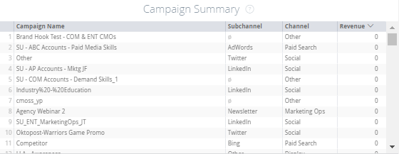

# Übersichtskacheln {#overview-board-tiles}

Das Übersichtsmenü bietet einen umfassenden Überblick über Ihre Marketing-Performance und hilft Marketingteams dabei, beim Wachstum Ihres Teams, Budgets oder Umsatzes die richtigen Entscheidungen zu treffen.

<table> 
 <colgroup> 
  <col> 
  <col> 
  <col> 
  <col> 
  <col> 
  <col> 
  <col> 
  <col> 
  <col> 
  <col> 
  <col> 
 </colgroup> 
 <tbody> 
  <tr> 
   <td> </td> 
   <td>
<strong>Datumstyp</strong>
</td> 
   <td>
<strong>Datum</strong>
</td> 
   <td>
<strong>Attributionsmodell</strong>
</td> 
   <td>
<strong>Metrisch</strong>
</td> 
   <td>
<strong>Abmessung</strong>
</td> 
   <td>
<strong>Kanal</strong>
</td> 
   <td>
<strong>Unterkanal</strong>
</td> 
   <td>
<strong>Kampagne</strong>
</td> 
   <td>
<strong>Werbekonto-ID</strong>
</td> 
   <td>
<strong>CRM-Kontoname</strong>
</td> 
  </tr> 
  <tr> 
   <td>
<strong>Umsatz</strong>
</td> 
   <td><strong>X</strong></td> 
   <td><strong>X</strong></td> 
   <td><strong>X</strong></td> 
   <td> </td> 
   <td> </td> 
   <td><strong>X</strong></td> 
   <td><strong>X</strong></td> 
   <td><strong>X</strong></td> 
   <td><strong>X</strong></td> 
   <td><strong>X</strong></td> 
  </tr> 
  <tr> 
   <td>
<strong>Überblick</strong>
</td> 
   <td><strong>X</strong></td> 
   <td><strong>X</strong></td> 
   <td><strong>X</strong></td> 
   <td><strong>X</strong></td> 
   <td><strong>X</strong></td> 
   <td><strong>X</strong></td> 
   <td><strong>X</strong></td> 
   <td><strong>X</strong></td> 
   <td><strong>X</strong></td> 
   <td><strong>X</strong></td> 
  </tr> 
  <tr> 
   <td>
<strong>Ausgaben</strong>
</td> 
   <td> </td> 
   <td><strong>X</strong></td> 
   <td> </td> 
   <td> </td> 
   <td> </td> 
   <td><strong>X</strong></td> 
   <td><strong>X</strong></td> 
   <td><strong>X</strong></td> 
   <td><strong>X</strong></td> 
   <td> </td> 
  </tr> 
  <tr> 
   <td>
<strong>ROI</strong>
</td> 
   <td><strong>X</strong></td> 
   <td><strong>X</strong></td> 
   <td><strong>X</strong></td> 
   <td> </td> 
   <td> </td> 
   <td><strong>X</strong></td> 
   <td><strong>X</strong></td> 
   <td><strong>X</strong></td> 
   <td><strong>X</strong></td> 
   <td><strong>X</strong></td> 
  </tr> 
  <tr> 
   <td>
<strong>Abschlüsse</strong>
</td> 
   <td><strong>X</strong></td> 
   <td><strong>X</strong></td> 
   <td><strong>X</strong></td> 
   <td> </td> 
   <td> </td> 
   <td><strong>X</strong></td> 
   <td><strong>X</strong></td> 
   <td><strong>X</strong></td> 
   <td><strong>X</strong></td> 
   <td><strong>X</strong></td> 
  </tr> 
  <tr> 
   <td>
<strong>Kosten pro Abschluss</strong>
</td> 
   <td><strong>X</strong></td> 
   <td><strong>X</strong></td> 
   <td><strong>X</strong></td> 
   <td> </td> 
   <td> </td> 
   <td><strong>X</strong></td> 
   <td><strong>X</strong></td> 
   <td><strong>X</strong></td> 
   <td><strong>X</strong></td> 
   <td><strong>X</strong></td> 
  </tr> 
  <tr> 
   <td>
<strong>Pipeline-Umsatz</strong>
</td> 
   <td><strong>X</strong></td> 
   <td><strong>X</strong></td> 
   <td><strong>X</strong></td> 
   <td> </td> 
   <td> </td> 
   <td><strong>X</strong></td> 
   <td><strong>X</strong></td> 
   <td><strong>X</strong></td> 
   <td><strong>X</strong></td> 
   <td><strong>X</strong></td> 
  </tr> 
  <tr> 
   <td>
<strong>Geschäftsumfang</strong>
</td> 
   <td><strong>X</strong></td> 
   <td><strong>X</strong></td> 
   <td><strong>X</strong></td> 
   <td> </td> 
   <td> </td> 
   <td><strong>X</strong></td> 
   <td><strong>X</strong></td> 
   <td><strong>X</strong></td> 
   <td><strong>X</strong></td> 
   <td><strong>X</strong></td> 
  </tr> 
  <tr> 
   <td>
<strong>Kanal-Zusammenfassung</strong>
</td> 
   <td><strong>X</strong></td> 
   <td><strong>X</strong></td> 
   <td><strong>X</strong></td> 
   <td><strong>X</strong></td> 
   <td> </td> 
   <td><strong>X</strong></td> 
   <td><strong>X</strong></td> 
   <td><strong>X</strong></td> 
   <td><strong>X</strong></td> 
   <td><strong>X</strong></td> 
  </tr> 
  <tr> 
   <td>
<strong>Unterkanal-Zusammenfassung</strong>
</td> 
   <td><strong>X</strong></td> 
   <td><strong>X</strong></td> 
   <td><strong>X</strong></td> 
   <td><strong>X</strong></td> 
   <td> </td> 
   <td><strong>X</strong></td> 
   <td><strong>X</strong></td> 
   <td><strong>X</strong></td> 
   <td><strong>X</strong></td> 
   <td><strong>X</strong></td> 
  </tr> 
  <tr> 
   <td>
<strong>Kampagnenzusammenfassung</strong>
</td> 
   <td><strong>X</strong></td> 
   <td><strong>X</strong></td> 
   <td><strong>X</strong></td> 
   <td><strong>X</strong></td> 
   <td> </td> 
   <td><strong>X</strong></td> 
   <td><strong>X</strong></td> 
   <td><strong>X</strong></td> 
   <td><strong>X</strong></td> 
   <td><strong>X</strong></td> 
  </tr> 
  <tr> 
   <td>
<strong>ROI</strong>
</td> 
   <td><strong>X</strong></td> 
   <td><strong>X</strong></td> 
   <td><strong>X</strong></td> 
   <td> </td> 
   <td><strong>X</strong></td> 
   <td><strong>X</strong></td> 
   <td><strong>X</strong></td> 
   <td><strong>X</strong></td> 
   <td><strong>X</strong></td> 
   <td><strong>X</strong></td> 
  </tr> 
  <tr> 
   <td>
<strong>ROI Zusammenfassung</strong>
</td> 
   <td><strong>X</strong></td> 
   <td><strong>X</strong></td> 
   <td><strong>X</strong></td> 
   <td> </td> 
   <td><strong>X</strong></td> 
   <td><strong>X</strong></td> 
   <td><strong>X</strong></td> 
   <td><strong>X</strong></td> 
   <td><strong>X</strong></td> 
   <td><strong>X</strong></td> 
  </tr> 
 </tbody> 
</table>

## Umsatzbereich {#revenue-tile}

Gesamtzahl der zugewiesenen Einnahmen aus geschlossenen Gewinner-Chancen basierend auf dem Attributionsmodell.

-Opportunity Details: Zeigt eine Aufschlüsselung der zugehörigen Opportunity-IDs, des Erstellungsdatums, des Schließdatums, des ISO-Codes und der Umsatzzuordnung an.\
-Details anzeigen: Eine Aufschlüsselung nach Monat.

## Übersicht (Diagramm) Kachel {#overview-chart-tile}

Das Diagramm zeigt den jedem Kanal zugewiesenen Umsatz im Zeitverlauf an.

-Opportunity Details: Zeigt eine Aufschlüsselung der zugehörigen Opportunity-IDs, des Erstellungsdatums, des Schließdatums, des ISO-Codes und der Umsatzzuordnung an.\
-Zeigt eine Aufschlüsselung der beitragenden Opp-IDs an:

* Nach ROI-Woche
* Nach ROI-Daten
* Nach ROI Hour
* Nach ROI-Minute
* Nach ROI-Zeit

## Ausgabekachel {#spend-tile}

Die Gesamtausgaben aus API-Kosten und selbst gemeldeten Kosten für den angegebenen Zeitraum.

>[!NOTE]
>
>bei der Einbohren in weniger als einem Monat, [!DNL Marketo Measure] verwendet den Durchschnitt der Ausgaben für diesen Monat und ordnet diesen Durchschnittswert jedem Tag zu.

- Ausgabedetails: Zeigt eine Aufschlüsselung der zugehörigen eindeutigen Kampagnen-ID, Kampagnenname, Kanal, Unterkanal, Datum, Ursprungswährung, Ausgaben an.  -Details anzeigen: Eine Aufschlüsselung nach Monat.

## ROI-Kachel {#roi-tile}

Der berechnete ROI (RoI) aus dem Gesamtumsatz (aus dem ausgewählten Attributionsmodell) und den Gesamtausgaben (Umsatzbereich ÷ Ausgabenkachel = ROI-Bereich).

## Kachel &quot;Angebote&quot; {#deals-tile}

Zeigt die Gesamtzahl der zugewiesenen Angebote an (Angebote zählen als Geschlossene Chancen).

>[!NOTE]
>
>Wenn der Datumstyp &quot;Touchpoint-Datum&quot;ausgewählt ist, sind partielle Zählungen möglich, da es möglicherweise bestimmte Touchpoints gibt, die nicht in den Zeitraum fallen.

- Opportunity Details: Zeigt eine Aufschlüsselung der zugehörigen Opportunity-IDs, des Erstellungsdatums, des Schließdatums und der Attribution (Zählung) an.  -Details anzeigen: Eine Aufschlüsselung nach Monat.

## Kosten pro Kachel {#cost-per-deal-tile}

Durchschnittliche Kosten, die benötigt werden, um eine geschlossene Chance zu erhalten. Die Gesamtausgaben dividiert durch die Gesamtanzahl der Angebote (Ausgabenkachel ÷ Tile Angebote = Kosten pro Tile).

## Pipelineumsatzbereich {#pipeline-revenue-tile}

Gesamtpotenzial der zurechenbaren Einnahmen aus offenen Opportunities

>[!NOTE]
>
>Der Umsatz wird für das angegebene Attributionsmodell übernommen.

-Opportunity Details: Zeigt eine Aufschlüsselung der zugehörigen Opportunity-IDs, des Erstellungsdatums, des Schließdatums, des ISO-Codes und der Umsatzzuordnung an.  -Details anzeigen: Eine Aufschlüsselung nach Monat.

## Kachel &quot;Größe anpassen&quot; {#deal-size-tile}

Durchschnittlicher Umsatz geschlossener Chancen mit gewinnorientierter Nutzung (Umsatzbereich ÷ Kachel Angebote = Kachel &quot;Größe anpassen&quot;).

## Kachel &quot;Kanalzusammenfassung&quot; {#channel-summary-tile}

Zeigt eine Liste der Kanäle basierend auf der ausgewählten Metrik an (Umsatz, Pipeline-Umsatz, Ausgaben, Angebote, Chancen, Leads, Kontakte).

## Unterkanal-Zusammenfassungsbereich {#subchannel-summary-tile}

Zeigt eine Liste der Unterkanäle basierend auf der ausgewählten Metrik an (Umsatz, Pipeline-Umsatz, Ausgaben, Angebote, Chancen, Leads, Kontakte).

## Kampagnenzusammenfassung {#campaign-summary-tile}

Zeigen Sie eine Liste von Kampagnen basierend auf der ausgewählten Metrik an (Umsatz, Pipeline-Umsatz, Ausgaben, Angebote, Chancen, Leads, Kontakte).

## ROI (Diagramm)-Kachel {#roi-chart-tile}

Zeigt den ROI an, der der ausgewählten Metrik (Kanal, Unterkanal, Kampagne, Konto, Adgroup, Anzeige, Advertiser, Kreativ, Keyword, Platzierung, Site) basierend auf dem ausgewählten Attributionsmodell zugeordnet wurde.

## ROI-Zusammenfassungsbereich {#roi-summary-tile}

Zeigt den ROI an, der der ausgewählten Metrik (Kanal, Unterkanal, Kampagne, Konto, Adgroup, Anzeige, Advertiser, Kreativ, Keyword, Platzierung, Site) basierend auf dem ausgewählten Attributionsmodell zugeordnet wurde.

- Opportunity Details: Zeigt eine Aufschlüsselung der zugehörigen Opportunity-IDs, des Erstellungsdatums, des Schließdatums und der Attribution (Zählung) an.

-Details anzeigen: Eine Aufschlüsselung nach Monat.
