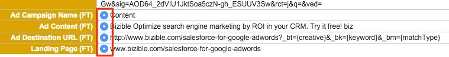

# Best Practices für die Zusammenführung von Leads {#best-practices-for-merging-leads}

Wenn es um das Zusammenführen von Leads in [!DNL Salesforce]ist es immer am besten, vorsichtig zu sein, um sicherzustellen, dass keine Daten verloren gehen.

Für Ihre Referenz finden Sie hier eine Aufschlüsselung der [Zusammenführen von Leads](https://help.salesforce.com/HTViewHelpDoc?id=leads_merge.htm&amp;language=en_US) von [!DNL Salesforce] Support.

Wo [!DNL Marketo Measure] kommt in, wenn es Zeit ist, Felder auszuwählen, die in den zusammengeführten Datensatz gefüllt werden. Überprüfen Sie nach Auswahl des Übergeordneten Datensatzes, ob das [!DNL Marketo Measure] -Felder für die Übertragung auf den neuen Datensatz ausgewählt werden.

Wenn mehrere Datensätze mit [!DNL Marketo Measure] müssen Sie sicherstellen, dass der Übergeordnete Datensatz die ausgewählten Felder für den Lead enthält, der zuerst erstellt wurde. Zusätzliche [!DNL Marketo Measure] -Daten werden im Abschnitt &quot;Insights&quot;angezeigt. Stellen Sie außerdem sicher, dass die E-Mail-Adresse des getrackten Leads die E-Mail-Adresse ist, die beibehalten wird, da sie es uns ermöglicht, diesen Lead mit neuen Attributionsdaten weiter zu aktualisieren.

Dort sollten Sie die Leads und [!DNL Marketo Measure] Daten werden in den neuen Datensatz übertragen.

Sollten Sie Fragen haben, wenden Sie sich bitte an das Adobe Account Team (Ihren Kundenbetreuer) oder [Marketo-Support](https://nation.marketo.com/t5/support/ct-p/Support){target="_blank"}.

