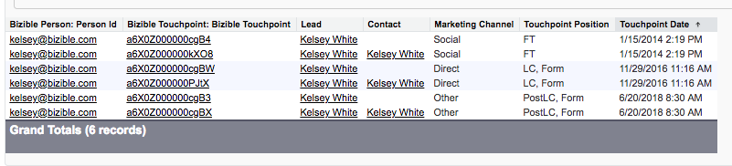

# Datensätze duplizieren und [!DNL Marketo Measure] {#duplicate-records-and-marketo-measure}

>[!NOTE]
>
>Es werden möglicherweise Anweisungen angezeigt, die[!DNL Marketo Measure]&quot; in unserer Dokumentation, sehen aber immer noch &quot;Bizible&quot; in Ihrem CRM. Wir arbeiten daran, diese Aktualisierung durchzuführen, und das Rebranding wird sich in Kürze in Ihrem CRM widerspiegeln.

[!DNL Marketo Measure] nutzt die E-Mail-Adresse als eindeutige Kennung bei der Zuordnung von Daten zu einem verbundenen Lead oder Kontakt im CRM. Wann [!DNL Marketo Measure] findet mehrere Leads oder Kontakte mit derselben E-Mail-Adresse, wir werden die gleichen Daten auf allen Datensätzen aufdecken. Die Auswirkungen sind zu erwarten, wenn Sie über Leads oder Kontakte mit [!DNL Marketo Measure] und kann die Anzahl der Einzelanwender, die Touchpoints des Käufers haben, fälschlicherweise erhöhen.

Wie sieht dies aus in [!DNL Marketo Measure] Reporting?

_Beispielbericht: [!DNL Marketo Measure] Personen mit Touchpoints des Käufers._

Sie können die [!DNL Marketo Measure] Personen-ID von kelsey@adobe.com , dass es sowohl eine Lead- als auch eine Kontaktperson mit dieser E-Mail-Adresse gibt. Sie werden feststellen, dass in diesem Bericht 2 Erstkontakt-Meldungen, 2 Lead-Erstellungskontakt und 2 PostLC-Interaktionen gemeldet werden. Diese doppelten Datensätze haben dasselbe Kontaktpunktdatum und dieselben Touchpoint-Informationen, was zu dem Schluss führen könnte, dass es sich um zwei verschiedene Personen handelt, obwohl es sich um dieselbe Person handelt.

**Empfehlung**

* Um die Rendite in Ihren Berichten zu maximieren, empfehlen wir die Nutzung eines Deduplizierungs-Tools in Ihrem CRM-System, um sicherzustellen, dass Sie nur netto neue, eindeutige Datensätze erstellen. Dies kann mit Ihrem Marketing-Automatisierungs-Tool oder einer separaten Software erfolgen, die in Ihrem CRM-System installiert ist. [!DNL Marketo Measure] dedupliziert keine Datensätze automatisch und bietet diesen Service nicht über unsere Software an.
* Eine alternative Option wäre das manuelle Zusammenführen von Datensätzen bei der Identifizierung von Duplikaten. Dieser Prozess kann zeitaufwendig und mühsam sein, aber die Ausgabe präziser Berichte ist die Zeitinvestition wert.
