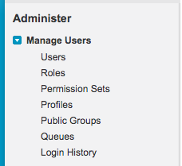

# Aktivierung der Berechtigung zum Bearbeiten konvertierter Leads {#enabling-the-permission-to-edit-converted-leads}

Erfahren Sie, wie Sie die Berechtigung zum Bearbeiten konvertierter Lead-Datensätze in [!DNL Salesforce] aktivieren. [!DNL Marketo Measure] hat die Möglichkeit, Daten an Ihre verschiedenen Objekte in Salesforce zu übertragen. Beim Pushen zu Leads stellen wir fest, dass wir in einigen Szenarien möglicherweise einen Lead-Datensatz erneut pushen müssen, der bereits konvertiert wurde. Damit wir Daten an diese Datensätze senden können, muss der Benutzer, über den wir verbunden sind, über die Berechtigung verfügen, konvertierte Leads auf Profilebene anzuzeigen und zu bearbeiten.

1. Gehen Sie zu [!UICONTROL Setup] und erweitern Sie die [!UICONTROL Benutzer verwalten] Gruppierung, um Profile auszuwählen.

   

1. Wählen Sie das Profil des Benutzers aus, über den wir verbunden sind.

1. Suchen Sie nach der Berechtigung zum Anzeigen und Bearbeiten konvertierter Leads.

   

1. Aktivieren Sie das Kontrollkästchen, um die Berechtigung zum Anzeigen und Bearbeiten konvertierter Leads zu aktivieren.

   

Und Sie sind fertig!
