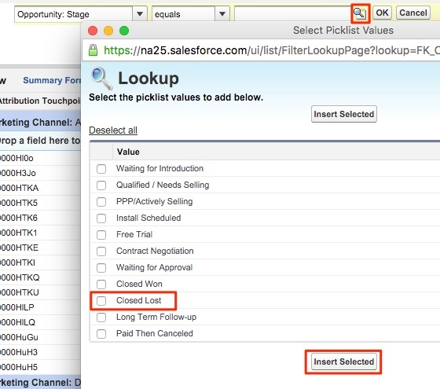

# Geschlossene verlorene Opportunitys nach Marketingkanal {#closed-lost-opportunities-by-marketing-channel}

Obwohl dieser Bericht von Ihren Opportunity Stages abhängen kann, wird in diesem Bericht aufgezeigt, welche Marketing-Kanäle zu nicht geschlossenen Chancen beigetragen haben.

1. Klicken Sie auf **[!UICONTROL Berichte]** Registerkarte in Salesforce und wählen Sie **[!UICONTROL Neuer Bericht]**.

   

1. Suchen Sie im Schnellsuche-Feld &quot;Bizible Attribution&quot;und wählen Sie die **[!UICONTROL Bizible Attribution Touchpoint mit Chancen]** Berichtstyp und wählen Sie **[!UICONTROL Erstellen]**.

   

1. Zeigen Sie oben im Bericht &quot;[!UICONTROL Alle Touchpoints der biziblen Attribution]und passen Sie das Datumsfeld an den Zeitrahmen an, über den Sie einen Bericht erstellen möchten. In unserem Beispiel betrachten wir &quot;All Time&quot;. Ändern Sie außerdem das Berichtsformat von &quot;Tabelle&quot;in &quot;Zusammenfassung&quot;.

   

   

1. Jetzt werden wir dem Bericht Felder hinzufügen. Geben Sie in die Schnellsuche auf der linken Seite &quot;Marketing-Kanal&quot;ein und fügen Sie ihn zur Zusammenfassungsgruppe im Bericht hinzu.

   

1. Als Nächstes fügen wir einen Filter hinzu, um nur geschlossene verlorene Populationen anzuzeigen. Suchen Sie in der linken Schnellsuche nach dem Feld &quot;Bühne&quot;und ziehen Sie es in den Filterbereich.

   

1. Von dort wählen Sie die Lupe aus, um die Bühne(n) auszuwählen, die Sie für &quot;Geschlossene verlorene Chancen&quot;verwenden. In unserem Fall verwenden wir die Standardbenennung &quot;Geschlossener Verlust&quot;.

   

1. Nun, führen Sie den Bericht aus!

   Dies ist ein Angebotsbericht, der nach Marketing-Kanälen zusammengefasst wird, um geschlossene verlorene Chancen über Ihre Kanäle hinweg zu messen. Dieser Bericht zeigt Ihnen, welche Kanäle eine zu geringe Leistung aufweisen können. Sie können beliebige Filter oder Felder hinzufügen, über die Sie Berichte erstellen möchten.

>[!MORELIKETHIS]
>
>[[!DNL Marketo Measure] Tutorials: Zusätzliche SFDC-Berichte](https://experienceleague.adobe.com/en/docs/marketo-measure-learn/tutorials/onboarding/marketo-measure-102/addtional-salesforce-reports)
