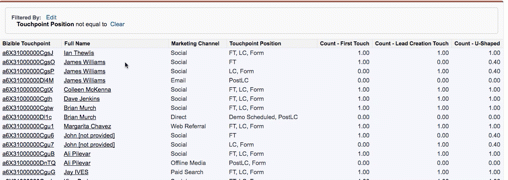

# Duplizieren von Datensätzen in meinem Bericht {#duplicate-records-in-my-report}

>[!NOTE]
>
>Es werden möglicherweise Anweisungen angezeigt, die[!DNL Marketo Measure]&quot; in unserer Dokumentation, sehen aber weiterhin &quot;[!DNL Bizible]&quot; in Ihrem CRM-System. Wir arbeiten daran, diese Aktualisierung durchzuführen, und das Rebranding wird sich in Kürze in Ihrem CRM widerspiegeln.

Während du in die [!DNL Marketo Measure] Berichte in [!DNL Salesforce]können Sie in Ihren Berichten &quot;doppelte&quot; Datensätze finden. Dieses Gefühl wird wahrscheinlich bei der Überprüfung auftreten [!DNL Marketo Measure] nativen Berichten.

Bei der Berichterstellung mit dem Touchpoint-Objekt des Käufers oder dem Touchpoint der Käuferzuordnung ist es wichtig zu verstehen, dass Sie nicht mehr über die Anzahl der Leads, Kontakte oder Gelegenheiten berichten, sondern über die Anzahl der Touchpoints der Käuferzuordnung oder der Touchpoints der Käuferzuordnung, die mit diesen Standardobjekten (Leads, Kontakte, Chancen) verknüpft sind.

Nehmen wir als Beispiel den folgenden Bericht:

Dies ist ein **Kontakte mit Kunden-Touchpoints** Bericht. Auch dies bedeutet, dass wir uns die Anzahl der Touchpoints ansehen, die einem einzelnen Kontakt zugeordnet sind.

Wie Sie sehen können, scheint es drei James Williams-Kontakte in dem Bericht zu geben, und deshalb denken Sie vielleicht: &quot;Duplikate!&quot;

Dieser Bericht zeigt jedoch die Anzahl der Touchpoints im Zusammenhang mit James. Im Bericht sehen Sie, dass James über einen individuellen FT (Erstkontakt), einen einzelnen LC, ein Formular (Lead Creation Touch) und einen PostLC-Touchpoint (eine Formularübermittlung, die nach dem LC-Touchpoint erfolgt) verfügt.

Wenn Sie die Anzahl der Kontakte verstehen möchten, können Sie dann die Felder &quot;Zählung - Erstkontakt&quot;, &quot;Kontaktanzahl - Erstellung zählen&quot;oder &quot;Anzahl U-förmig&quot;verwenden, um zu verstehen, wie viele Kontakte Marketinginteraktionen hatten.

>[!MORELIKETHIS]
>
>[[!DNL Marketo Measure] Universität: SFDC-Lagerberichte](https://universityonline.marketo.com/courses/bizible-fundamentals-bizible-102/#/page/5c5cb68dfb384d0c9fb96cc4)
