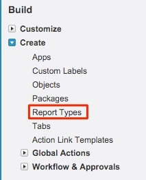
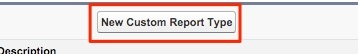
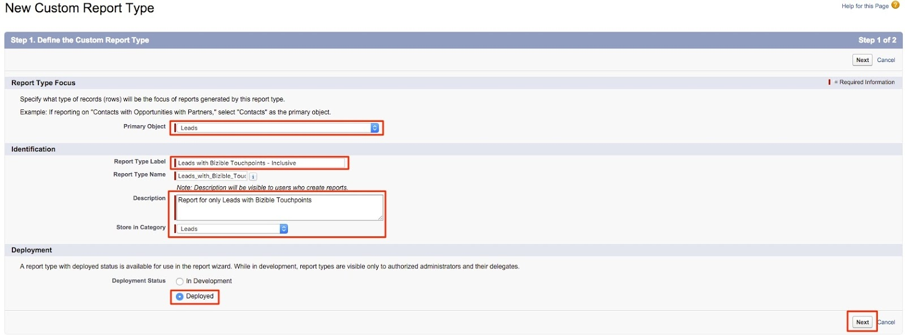
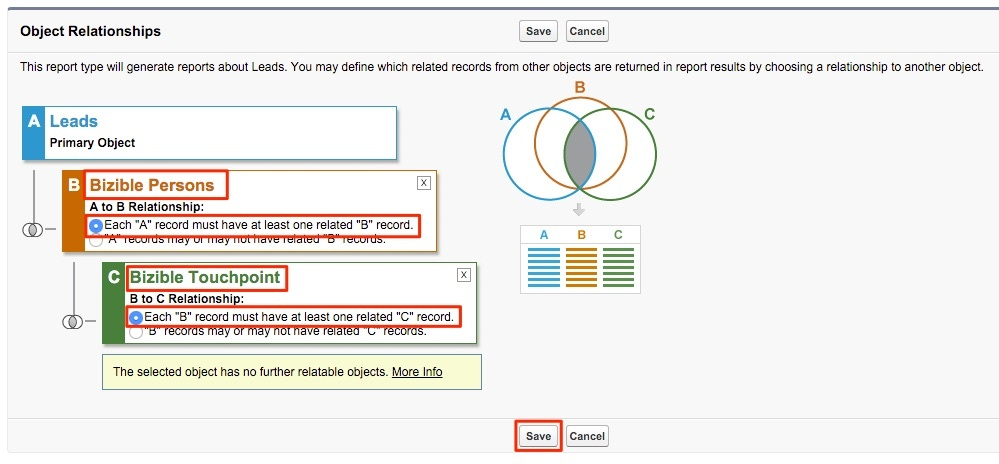

# Bericht zu Leads mit Käufer-Touchpoints {#leads-with-buyer-touchpoints-report}

>[!NOTE]
>
>Möglicherweise werden in der Dokumentation Anweisungen für &quot;[!DNL Marketo Measure]&quot; angezeigt, in Ihrem CRM-System wird jedoch weiterhin &quot;[!DNL Bizible]&quot; angezeigt. Wir arbeiten an dieser Aktualisierung, und das Rebranding sollte bald in Ihrem CRM zu sehen sein.

Standardmäßig stehen Ihnen viele Reporting-Funktionen zur Verfügung, wenn es um [!DNL Marketo Measure] geht. Es gibt jedoch einige zusätzliche Berichtstypen, deren Erstellung wir empfehlen. Unten finden Sie Informationen zum Erstellen eines inklusiven Leads mit dem Berichtstyp Käufer-Touchpoints .

1. Navigieren Sie in [!DNL Salesforce] zur Option Setup . Erweitern Sie von dort aus die Gruppierung „Erstellen“ und wählen Sie **[!UICONTROL Berichtstypen]** aus.

   

1. Wählen Sie **[!UICONTROL Neuer benutzerdefinierter Berichtstyp]**.

   

1. Legen Sie das primäre Objekt als „Leads“ fest und geben Sie in der Eingabe „Berichtstypbezeichnung“ „Leads mit Käufer-Touchpoints - Einschließlich“ ein. Speichern Sie den Bericht in der Kategorie „Leads“ und ändern Sie den Bereitstellungsstatus in **[!UICONTROL bereitgestellt]**. Wählen Sie dann **[!UICONTROL Weiter]** aus.

   

1. Wählen Sie für die Objektbeziehungen das Objekt **[!DNL Marketo Measure]Personen** als sekundäres Objekt aus. Wählen Sie die Beziehung A zu B als „Jeder Datensatz &#39;A&#39; muss mindestens einen zugehörigen Datensatz &#39;B&#39; haben.“ Dort verknüpfen Sie das Objekt &quot;Buyer Touchpoint&quot; und wählen Sie dieselbe Beziehung zwischen den Objekten B und C aus.

   

1. Speichern Sie und beginnen Sie mit dem Erstellen einiger Berichte!
