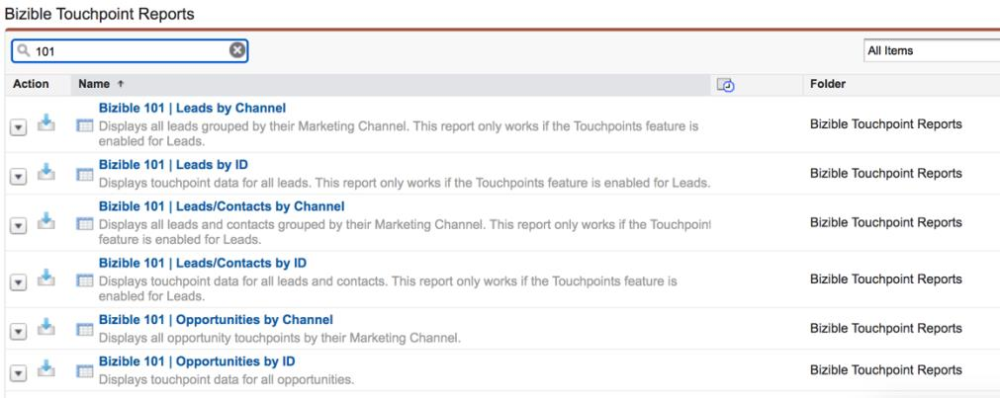

# [!DNL Marketo Measure] 101 Berichte - Überblick {#marketo-measure-101-reports-overview}

>[!NOTE]
>
>Es werden möglicherweise Anweisungen mit den folgenden Eigenschaften angezeigt:[!DNL Marketo Measure]&quot; in der Dokumentation, sehen aber trotzdem &quot;Bizible&quot;in Ihrem CRM. Wir arbeiten an dieser Aktualisierung, und das Rebranding wird bald in Ihrem CRM zu sehen sein.

Alle [!DNL Marketo Measure] Kunden, die [!DNL Marketo Measure] und [!DNL Salesforce] haben Zugriff auf den Ordner &quot;Buyer Touchpoints Reports&quot;in ihrer SFDC-Instanz. Dieser Ordner enthält eine Reihe vordefinierter Berichte, die Ihnen bei den ersten Schritten mit der Berichterstellung für Käufer-Touchpoint-Daten helfen können.

Während für viele dieser Berichte bereits spezifische Berichtsziele festgelegt wurden, gibt es sechs &quot;_[!DNL Marketo Measure]101.._&quot;, die durch drei wichtige Berichtstypen repräsentiert werden, die einen Großteil des Berichterstattungsbedarfs decken.

* Leads mit Käufer-Touchpoints
* [!DNL Marketo Measure] Personen mit Touchpoints des Käufers
* Touchpoints der Käuferzuordnung mit Chancen

Diese Berichte bieten Ihnen die grundlegenden Felder und die Infrastruktur, die für alle [!DNL Marketo Measure] verwandten Bericht, den Sie erstellen möchten. Wir empfehlen allen neuen und alten Kunden, mit diesen Berichten zu beginnen, wenn sie Fragen zur Marketing-Attribution untersuchen. Unten finden Sie eine Erklärung zu jedem der sechs &quot;_[!DNL Marketo Measure]101.._&quot;.

_Wenn Sie den Ordner &quot;Touchpoints-Bericht des Käufers&quot;oder die sechs &quot;_[!DNL Marketo Measure] 101.._&quot; Berichte in diesem Ordner, wenden Sie sich an den Support für Unterstützung._

**Leads mit Käufer-Touchpoints** | Die folgenden beiden Varianten zeigen Leads und ihre Käufer-Touchpoints an. Obwohl sie denselben Basisberichtstyp verwenden, werden sie nach verschiedenen Metriken gruppiert: Lead-ID vs. Marketing-Kanal, um zwei wichtige Ansichten der Daten bereitzustellen. Dieser Berichtstyp wurde als Grundlage für Trichterberichte konzipiert und eignet sich ideal als Ausgangspunkt, um zu untersuchen, wie Ihre Leads mit Ihren Marketing-Maßnahmen interagieren. Vor einer Anpassung zeigen die beiden folgenden Berichte Folgendes an:

**[!DNL Marketo Measure]101: Leads nach Kanal** | Ein Überblick darüber, wie Ihre Marketingkanäle die Erstellung von Leads und deren zusätzlichen Interaktionen beeinflussen.
**[!DNL Marketo Measure]101: Leads nach ID** | Daraufhin wird die Leads-Meldung angezeigt. Es handelt sich um einen detaillierteren Bericht, in dem jeder Lead und die zugehörigen Käufer-Touchpoints angezeigt werden.

**Leads/Kontakte mit Kunden-Touchpoints** | Diese Berichte werden häufig als [!DNL Marketo Measure] Persons-Berichte. Sie verwenden die [!DNL Marketo Measure] benutzerdefiniertes Objekt _[!DNL Marketo Measure]Person_ im Gegensatz zum Lead-Objekt in den oben genannten Berichten.

Das Objekt „[!DNL Marketo Measure]-Person“ verknüpft die Lead- und Kontaktobjekte miteinander. Vorkonfiguriert, [!DNL Salesforce] bietet keine Option zum Erstellen von Berichten mit dem Lead- und Kontaktobjekt im selben Bericht. Indem sie sich auf das Lead- und Kontaktobjekt beziehen, verwenden sie die eindeutige Kennung einer Person, ihre E-Mail, die [!DNL Marketo Measure] Personen können über Interessenten- und Kontaktpunkte von Käufern im selben Bericht berichten. Dieser Berichtstyp eignet sich ideal zur Überprüfung Ihrer [!DNL Marketo Measure] Kontoeinstellungen, da dies die integrativste Ebene für die Touchpoint-Berichterstellung ist.

Die folgenden beiden Berichtsvarianten verwenden denselben Berichtstyp, werden jedoch nach verschiedenen Metriken gruppiert: Personen-ID (E-Mail) oder Marketing-Kanal. Dies sind die wichtigsten Trichterberichte bzw. Trichterberichte, mit denen Sie herausfinden können, wie Ihre Leads und Kontakte mit Ihren Marketing-Maßnahmen interagieren. Vor einer Anpassung zeigen die beiden folgenden Berichte Folgendes an:

**[!DNL Marketo Measure]101: Lead/Kontakte nach Kanal** | Ein Überblick darüber, wie Ihre Marketingkanäle die Erstellung von Leads oder Kontakten und deren zusätzlichen Interaktionen beeinflussen. Dieser Bericht ist ideal, um die Gesamtinteraktion über Ihre Marketing-Kanäle hinweg zu verstehen und herauszufinden, welche Marketing-Kanäle in Ihrer Salesforce-Instanz zu neuen Netznamen führen.
**[!DNL Marketo Measure]101: Lead/Kontakte nach ID** | Jeder [!DNL Marketo Measure] Die Geschichte der Person und ist ein viel detaillierterer Bericht, in dem jede Person und ihre Kunden-Touchpoints angezeigt werden, unabhängig davon, ob der Touchpoint als Lead oder als Kontakt auftrat.

**Möglichkeiten mit Touchpoints der Käuferzuordnung** | Die letzten beiden &quot;_[!DNL Marketo Measure]101.._&quot; -Berichte sind unten in den Trichterberichten aufgeführt, in denen die Touchpoint-Daten der Käuferzuordnung zu Opportunities angezeigt werden. Der Hauptunterschied für diese Berichte besteht darin, dass sie auf _Touchpoints der Käuferzuordnung_ , die sich auf die Daten auf Opportunity- und Opportunity-Ebene wie den Umsatz beziehen. Wann immer Sie Berichte über Chancen oder zurechenbare Einnahmen erstellen möchten, sollte dieser Berichtstyp verwendet werden. Die beiden folgenden Berichte verwenden denselben Berichtstyp, werden jedoch nach verschiedenen Metriken gruppiert: Chancen-ID vs. Marketing-Kanal. Vor einer Anpassung zeigen die beiden folgenden Berichte Folgendes an:

**[!DNL Marketo Measure]101: Möglichkeiten nach Kanal** | Ein Überblick darüber, wie Ihre Marketing-Kanäle in Ihren Opportunities beeinflussen und Umsatz mit Attributen generieren.
**[!DNL Marketo Measure]101: Chancen nach ID** | Diese granulare Berichtsversion zeigt Ihnen die vollständige Journey Ihrer Möglichkeiten. In diesem Bericht können Sie jeden Touchpoint der Käuferzuordnung sehen, der einer Gelegenheit zugeordnet ist, sowie den ihm zugewiesenen Umsatz über die verschiedenen Attributionsmodelle.

Es wird als Best Practice erachtet, die _[!DNL Marketo Measure]101.._&quot; als Vorlagen für Ihre Berichterstellungsanforderungen. Wenn Sie mit einem der oben genannten Berichte beginnen, sparen Sie Zeit und stellen Sie sicher, dass Sie mit den richtigen Feldern arbeiten, die sich auf [!DNL Marketo Measure] Daten. Stellen Sie immer sicher, dass Sie &quot;Speichern unter&quot;jedes Mal verwenden, wenn Sie Anpassungen an der _[!DNL Marketo Measure]101.._&quot;, um die ursprüngliche Variante des Berichts beizubehalten.

Der Ordner &quot;Touchpoint-Berichte für Käufer&quot;soll Ihnen bei den ersten Schritten mit Ihrem [!DNL Marketo Measure] Berichterstellung verwenden, müssen Sie diese Berichte für ausführbare Berichte anpassen, damit sie auf Ihre Berichterstattungsanforderungen zugeschnitten sind. müssen Sie die erforderlichen Filter hinzufügen, um sicherzustellen, dass die Datensätze im Bericht (und die zugehörigen Touchpoints) mit Ihrem Berichterstellungsziel übereinstimmen.

Sobald Sie mit dem &quot;_[!DNL Marketo Measure]101.._&quot;, können Sie sie aus benutzerspezifischen Berichtstypen neu erstellen, um benutzerspezifischere Berichtsanforderungen zu erfüllen. Erstellen der [[!DNL Marketo Measure] Benutzerspezifische Berichtstypen](/help/marketo-measure-salesforce-reporting/new-report-types/creating-custom-marketo-measure-report-types.md) können Sie benutzerdefinierte Felder abrufen, die Sie in anderen CRM-Berichten häufig verwenden. Dies hilft Ihnen, [!DNL Marketo Measure] Reporting auf die nächste Ebene!
