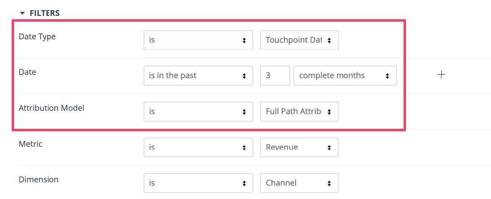
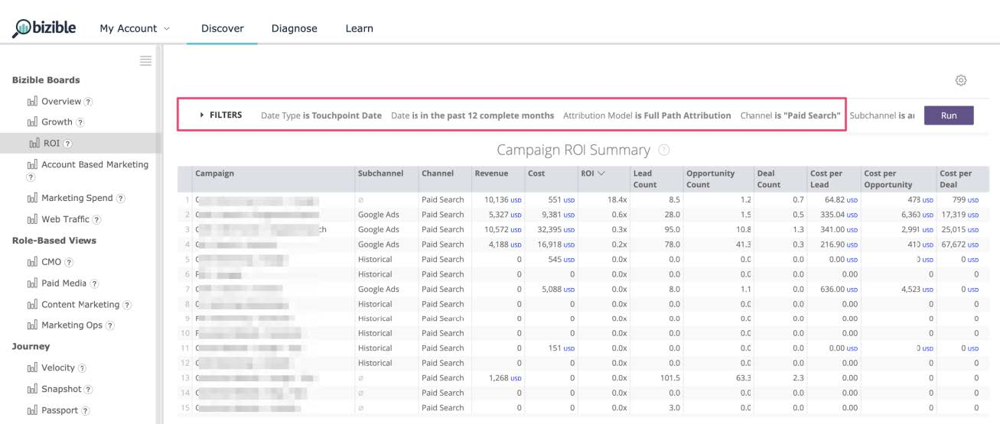

# [!DNL Marketo Measure] Reporting-Handbuch {#marketo-measure-reporting-guide}

>[!NOTE]
>
>Möglicherweise werden Anweisungen zu „[!DNL Marketo Measure]“ in der Dokumentation angezeigt, obwohl Sie in Ihrem CRM weiterhin „Bizible“ sehen. Wir arbeiten an dieser Aktualisierung, und das Rebranding sollte bald in Ihrem CRM zu sehen sein.

Bevor Sie einen [!DNL Marketo Measure] -Bericht erstellen, müssen Sie unbedingt sicherstellen, dass Ihre [!DNL Marketo Measure] Kontoeinstellungen überprüft und konfiguriert wurden, um sicherzustellen, dass die Daten in den Berichten korrekt sind und die Besonderheiten Ihres Unternehmens widerspiegeln. Darüber hinaus funktionieren Reporting-Projekte am besten, wenn sie einem strukturierten Prozess folgen. Justin Norris, ein [!DNL Marketo Measure] Power-User, Fürsprecher und Partner von [Perkuto](https://perkuto.com/), fasste sachkundig zusammen, wie mit der Berichterstellung in  [!DNL Marketo Measure]](https://perkuto.com/blog/turning-attribution-data-into-actionable-insights/) verfahren werden soll:[

**Ziele festlegen**: &quot;Die erste Frage lautet: &quot;Warum messen wir?&quot; Lori Wizdo von [Forrester Research](https://go.forrester.com/) fasste es schön in einem [Marketo-Webinar](https://www.marketo.com/webinars/beyond-revenue-performance-real-kpis-of-b2b-marketing/) zusammen. Ihr zufolge &quot;messen wir, um eine Entscheidung oder den Wert des Marketings zu beweisen oder zu validieren oder besser zu werden (Prozessverbesserung)&quot;. Wir würden hinzufügen, dass die Erkenntnisse aus einer guten Messung auch einen Beitrag und eine Anleitung zum Marketing-Planungsprozess liefern.

Bevor Sie also anfangen, ist es wichtig, dass Sie Ihre Ziele klar erkennen, die Fragen, die Sie zu beantworten versuchen, oder die Probleme, die Sie zu lösen versuchen. Welche Geschichte willst du erzählen? Welche Entscheidungen werden sich daraus ergeben? Allzu oft sind diese Grundlagen schlecht durchdacht, was zu Frustration für alle Beteiligten führt.&quot;

**Berichtsdesign**: &quot;Als Nächstes müssen Sie den Bericht entwerfen und die spezifischen Dimensionen, Metriken und Datensätze bestimmen, die dieser enthalten wird. Eine gängige Erfahrung besteht darin, einem Business-Anwender genau das zu bieten, was er verlangt, nur damit er immer noch das Gefühl hat, dass seine Bedürfnisse nicht erfüllt werden. Dies liegt daran, dass der Einblick, den ein Business-Anwender tatsächlich sucht, nicht immer in dem von ihm angeforderten Bericht enthalten ist. Ein guter Analytiker (oder eine MOPS-Person mit einem Analysten, der aktiv ist) wird Fragen zur Klärung stellen, gemeinsame Definitionen festlegen (&quot;so, was meinen Sie wirklich mit Lead?&quot;) und sogar eine Visualisierung des Abschlussberichts entwerfen, um sicherzustellen, dass eine Anpassung erfolgt. Erst dann erstellen Sie den Bericht in dem Wissen, dass Sie über eine Reihe von Anforderungen verfügen.&quot;

**Berichterstellung**: &quot;Sobald Sie zum Erstellen übergegangen sind, kommt es nicht selten vor, auf Straßenblockaden oder Sackgassen zu stoßen. Sie können beispielsweise feststellen, dass Ihnen ein wichtiger Datenpunkt fehlt oder dass Ihre Objekte nicht so miteinander verknüpft sind, wie Sie es benötigen. Um diese Probleme zu lösen, denke ich auch, dass es wichtig ist zu verstehen, was &quot;unter der Haube&quot; in Ihrer Berichterstellungsmaschine &quot;passiert&quot;. Mit dieser Flexibilität können Sie eine Berichterstellungsanforderung schnell aufstocken und bewerten, ob sie erreichbar ist (und kreative Lösungen leichter entwickeln können, wenn dies nicht möglich ist).&quot;

Sehen wir uns &quot;unter der Haube&quot;an, um besser zu verstehen, was die Ausführung des Attributionsberichtscomputers [!DNL Marketo Measure] ermöglicht.

## Buyer Touchpoint-Objekte (CRM) {#buyer-touchpoint-objects-crm}

Auf der höchsten Ebene gibt es zwei Berichterstellungskategorien, die auf den beiden verschiedenen Buyer Touchpoint-Objekten basieren: Diese Kategorien bestimmen, über welchen Datentyp Sie [!DNL Marketo Measure] Berichte erstellen möchten: Daten, die sich auf eine _Person_ beziehen, oder Daten, die sich auf eine _Gelegenheit_ beziehen.

1. **Käufer-Touchpoints** (BT) / Individuen / Gesamtinteraktion

   * Wird häufig für &quot;Top of the Trichter&quot;-Metriken (TOFU) und Berichte zu _Individuen_ (Leads, Kontakte, [!DNL Marketo Measure] Personen) verwendet
   * BT werden verwendet, um alle mit **Personen** verbundenen Marketing-Interaktionen zu verstehen, da sie den vollständigen Touchpoint-Verlauf für jede Person enthalten. Zur Erinnerung: Diese Touchpoints werden im CRM für den anonymen Erstkontakt, den Lead-Erstellungs-Touch und alle nachfolgenden Formularübermittlungen oder Touchpoints erstellt, von denen Sie die Synchronisierung wählen
eine Offline-Kampagne oder -Aktivität.

1. **Touchpoints der Käuferzuordnung** (BAT) / Chancen / Kontoebene / Umsatz

   * Wird häufig für Metriken vom Typ &quot;Mittel und/oder Unterer des Trichters&quot;(MOFU und BOFU) und Berichterstellung im Zusammenhang mit _Chancen_ verwendet.
   * BAT stellen die relevanten Touchpoints aller Personen dar, die mit der **Opportunity** verbunden sind (entweder über die Kontaktrollen für Gelegenheiten oder über eine gemeinsam genutzte Konto-ID, je nach Ihren Einstellungen). Im Gegensatz zu BT, die nur Personen betreffen, können BAT auch mit **Umsatz** verknüpft werden. Daher können Sie BAT verwenden, um Fragen im Zusammenhang mit Chancen zu beantworten, einschließlich der Anzahl der geöffneten oder geschlossenen Möglichkeiten oder des Pipeline-Wertes und des erzielten Umsatzes.

>[!NOTE]
>
>BAT werden aus BT erstellt. Im Wesentlichen beginnt das Tracking auf individueller Ebene über die BT. Nachdem eine Chance für ein Konto erstellt wurde, werden alle BT aus Kontakten unter demselben Konto referenziert und können BAT erstellen, die sich auf die Chancen beziehen. Sie sollten also eine oder andere verwenden, je nachdem, welche Fragen Sie beantworten möchten: Fragen zu &quot;Personen&quot;-Metriken (BT) oder Fragen im Zusammenhang mit &quot;Chancen&quot;-Metriken (BAT Berichte).

Support-Artikel: [Unterschied zwischen Käufer-Touchpoints und Touchpoints bei der Käuferzuordnung](/help/configuration-and-setup/getting-started-with-marketo-measure/difference-between-buyer-touchpoints-and-buyer-attribution-touchpoints.md#configuration-and-setup)

## Buyer Touchpoint (BT) {#buyer-touchpoint-bt}

Die Buyer Touchpoint (BT) ist das Objekt, mit dem jede Marketing-Interaktion verfolgt wird, die eine Person mit Ihren Marketing-Materialien hat. Die Journey jeder Person (Lead/Kontakt/[!DNL Marketo Measure] Person) würde durch ihre zugehörige BT repräsentiert. In [!DNL Marketo Measure] besteht die Journey einer Person aus:

1. Wie hat diese Person zuerst mit unserer Marke interagiert? (Erstkontakt oder _FT_)
1. Wie hat sich diese Person umgestellt / bekannt geworden / ist Lead geworden? (Lead-Erstellung oder _LC_)
1. Wie sonst hat diese Person mit unserer Marke und unseren Marketingmaterialien interagiert, seit sie Lead geworden ist? (_PostLC_)

Käufer-Touchpoints werden verwendet, um Fragen zu _Personen_ zu beantworten (&quot;Personen&quot;werden entweder durch Leads oder Kontakte in einem CRM-System repräsentiert), z. B. die Generierung von Leads/Kontakten oder die Akquise-Metriken, und nicht die Metriken zur Opportunity. Beispiel:

* Welche Kanäle liefern die meisten Leads?
* Welche Kanäle sind mehr oder weniger kostspielig, um einen neuen Lead zu erstellen?
* Mit welchem Inhalt beschäftigen sich meine Leads/Kontakte?
* Was ist die Marketing-Geschichte bestimmter Titel, Rollen und Personas?
* Welche Kanäle verhelfen zu MQLs oder anderen Status von Lead/Kontakt?

In erster Linie müssen Unternehmen wissen, &quot;woher kommen meine Leads/Kontakte?&quot; Historisch gesehen wurde dies mit einem einzigen eindimensionalen Wert beantwortet (z. B. Lead Source ). Wie jedoch in den obigen Nummern 1 und 2 beschrieben, wissen wir, dass Leads mehrere Touchpoints während ihrer Journey des Leads haben können. Die Buyer Touchpoint bietet uns Einblicke in die beiden wichtigsten Interaktionen, die zeigen, wie ein Lead generiert wurde: seinen Erstkontakt und seinen Lead-Erstellungskontakt. Käufer-Touchpoints sind auch _multidimensional_ und bedeuten, dass sie eine Menge Marketing-Daten übertragen, in erster Linie, woher die Person aus dem Marketing-Kanal stammt und mit welcher Person (Inhalt) sie interagiert haben.

Die [Attributionsmodelle](/help/introduction-to-marketo-measure/overview-resources/marketo-measure-attribution-models.md), die den besten Einblick in benutzerbasierte Metriken bieten, sind:

* **Erstkontakt** - 100 %-Attribution zum Erstkontakt (FT) des Leads
* **Lead-Erstellung** - 100 %-Attribution zum Lead-Erstellungskontakt (Lead Creation Touch, LC)
* **U-förmig** - Multi-Touch-Ansatz, bei dem dem FT 40 % zugeschrieben werden, dem LC 40 %.

<table> 
 <tbody>
  <tr>
   <td></td> 
   <td>Das U-Shape-Modell wurde entwickelt, um jedem Käufer Touchpoints zuzuschreiben, die zusammenfassen, wie ein Lead zu einem Lead wurde. Nachfolgende Touchpoints aus diesen Leads können zwar auch gemeldet werden, um zusätzliche Interaktionen (Post LC) zu verstehen, sind jedoch nicht Teil der Journey <strong>Lead-Erstellung</strong>, sodass sie in den FT-, LC- oder U-förmigen Modellen keine Zuordnungskredite erhalten.

&#42;Am häufigsten spiegelt die U-förmige Attribution eine gerade 50/50-Aufteilung zwischen FT und LC wider. Wenn der Lead in derselben Sitzung wie der Erstkontakt konvertiert wird, stellt ein einzelner Touchpoint sowohl die FT- als auch die LC-Touchpoint-Position dar. Daher würden 100 % der Attribution an einen einzelnen Touchpoint vergeben.</td>
</tr>
 </tbody>
</table>

Diese Modelle legen großen Wert auf Interaktionen in der Anfangsphase und auf die Trichterinteraktion. Die U-förmige Attribution ist das empfohlene Modell, da sie sowohl an den FT- als auch an den LC-Touchpoints berücksichtigt wird, um sicherzustellen, dass alle Berührungen, die den Lead bei der Erstellung beeinflusst haben, mit Guthaben versehen werden. Weitere Einblicke erhalten Sie jedoch bei den Modellen Erstkontakt und Lead-Erstellung Touch , wenn Sie diese spezifischen Teile des Lead-Journey genauer verstehen möchten.

## Empfohlene Berichte mit Buyer Touchpoint (BT) {#recommended-reports-using-the-buyer-touchpoint-bt}

1. **FÜHRT MIT KÄUFERTOUCHPOINTS**

**1.1 | Neue Leads nach Marketing-Kanal**

Die Zusammenfassung der Buyer Touchpoint-Daten Ihres Leads nach dem Feld &quot;Marketingkanal&quot;ist die Ansicht auf oberster Ebene, die angibt, welche Kanäle/Taktiken neue Leads zur Erstellung beeinflussen. Wenn Sie diesen Bericht auf einen Datumstyp (&quot;Erstellungsdatum&quot;) umstellen, wird im Bericht eine Kohorte von &quot;Netto-neue Leads&quot;(wenn der Lead in Ihrem CRM-System erstellt wurde) eingerichtet.

<table> 
 <tbody>
  <tr>
   <td>Frage</td> 
   <td>Welche Marketingkanäle beeinflussen Leads zur Erstellung?</td> 
  </tr>
  <tr>
   <td>Berichtstyp</td> 
   <td>Interessenten und Käufer-Touchpoints (CRM) 
   Metrik: Leads ([!DNL Marketo Measure] Discover)</td> 
  </tr>
  <tr>
   <td>Datumsfeld/Datumstyp</td> 
   <td>Lead-Erstellungsdatum (CRM) / Erstellungsdatum (Discover)</td> 
  </tr>
  <tr>
   <td>Datumsbereich</td> 
   <td><i>gewünschten Datumsbereich auswählen</i></td> 
  </tr>
  <tr>
   <td>Gruppe/Dimension</td> 
   <td>Marketing-Kanal</td> 
  </tr>
  <tr>
   <td>Optimale Modelle</td> 
   <td>Erstkontakt, Lead-Erstellung, <strong>U-förmig</strong> 
   * Setzen Sie die Felder "Zählung"in Ihre CRM-Berichte (Zählung - Erstkontakt, Zählung - Lead-Erstellung, Zählung - U-förmig).</td> 
  </tr>
 </tbody>
</table>

>[!TIP]
>
>Beginnen Sie bei allen Berichtstypen &quot;Leads mit Käufer-Touchpoints&quot;mit der Anpassung des vordefinierten Berichts mit dem Titel &#39;[!DNL Marketo Measure] 101 . | Leads nach Kanal&quot;. Dieser Bericht ist standardmäßig verfügbar und ist eine großartige, vorkonfigurierte Sandbox, wie in der obigen Tabelle beschrieben, und kann schnell für spezifischere Berichtsanforderungen angepasst werden.

**1.2 | Neue Leads nach Campaign (oder granularere Einblicke)**

Für einen detaillierteren Einblick in die Daten, die im Bericht &quot;Neue Leads nach Marketing-Kanal&quot;(1.1) zusammengefasst sind, fügen Sie eine zusätzliche Zusammenfassung auf Kampagnenebene hinzu. Auf diese Weise können Sie nicht nur verstehen, welche &quot;Marketing-Kanäle&quot;neue Leads zur Erstellung bringen, sondern insbesondere, welche Kampagnen innerhalb dieser Kanäle die beste Leistung erzielen:

<table> 
 <tbody>
  <tr>
   <td>Frage</td> 
   <td>Welche <i>Kampagnen</i> beeinflussen Leads zur Erstellung?</td> 
  </tr>
  <tr>
   <td>Berichtstyp</td> 
   <td>Interessenten und Käufer-Touchpoints (CRM) 
   Metrik: Leads ([!DNL Marketo Measure] Discover)</td> 
  </tr>
  <tr>
   <td>Datumsfeld/Datumstyp</td> 
   <td>Lead-Erstellungsdatum (CRM) / Erstellungsdatum (Discover)</td> 
  </tr>
  <tr>
   <td>Datumsbereich</td> 
   <td><i>gewünschten Datumsbereich auswählen</i></td> 
  </tr>
  <tr>
   <td>Gruppe/Dimension</td> 
   <td>Name der Anzeigenkampagne (CRM)</td> 
  </tr>
  <tr>
   <td>Optimale Modelle</td> 
   <td>Erstkontakt, Lead-Erstellung, <strong>U-förmig</strong> 
   * Setzen Sie die Felder "Zählung"in Ihre CRM-Berichte (Zählung - Erstkontakt, Zählung - Lead-Erstellung, Zählung - U-förmig).</td> 
  </tr>
 </tbody>
</table>

>[!TIP]
>
>Erhalten Sie noch detailliertere Einblicke, indem Sie den Bericht mit anderen verfügbaren Feldern aus dem Buyer Touchpoint-Objekt zusammenfassen. Setzen Sie dazu zusätzliche Gruppierungen (CRM) oder Dimensionen (Discover) ein. Abhängig vom Kanal (der möglicherweise für Ihre Rolle repräsentativ ist) können über die Kampagnenebene hinaus weitere Details angezeigt werden, über die Sie Einblicke gewinnen möchten. Gehen wir zum Beispiel in die &quot;Paid Search&quot;-Tabelle unten...

<table> 
 <tbody>
  <tr>
   <td>Frage</td> 
   <td>Welche <i>Schlüsselwörter</i> beeinflussen Leads zur Erstellung?</td> 
  </tr>
  <tr>
   <td>Berichtstyp</td> 
   <td>Interessenten und Käufer-Touchpoints (CRM) 
   Metrik: Leads ([!DNL Marketo Measure] Discover)</td> 
  </tr>
  <tr>
   <td>Filter</td> 
   <td>Marketing-Kanal = Gebührenpflichtige Suche</td> 
  </tr>
  <tr>
   <td>Datumsfeld/Datumstyp</td> 
   <td>Lead-Erstellungsdatum (CRM) / Erstellungsdatum (Discover)</td> 
  </tr>
  <tr>
   <td>Datumsbereich</td> 
   <td><i>gewünschten Datumsbereich auswählen</i></td> 
  </tr>
  <tr>
   <td>Gruppe/Dimension</td> 
   <td>Schlüsselworttext (CRM)/Suchbegriff (Discover)</td> 
  </tr>
  <tr>
   <td>Optimale Modelle</td> 
   <td>Erstkontakt, Lead-Erstellung, <strong>U-förmig</strong> 
   * Setzen Sie die Felder "Zählung"in Ihre CRM-Berichte (Zählung - Erstkontakt, Zählung - Lead-Erstellung, Zählung - U-förmig).</td> 
  </tr>
 </tbody>
</table>

Die Granularität kann je nach Kanal variieren. Der empfohlene Ansatz wäre, sich zu fragen: &quot;Was ist mit &#39;channel X&#39;, den ich genauer verstehen möchte?&quot; Manager für gebührenpflichtige Suchvorgänge können auch an zusätzlichen Dimensionen wie folgenden interessiert sein:

* Name der Anzeigenkampagne
* Anzeigeninhalt
* Anzeigengruppe

Eventmanager können jedoch mehr daran interessiert sein, welche bestimmten Ereignisse oder welche Arten von Ereignissen die meisten Interessenten bei der Erstellung beeinflusst haben:

* Anzeigenkampagnenname / Salesforce-Kampagne = spezifisches Ereignis
* Medium = Campaign &#39;Type&#39;

**HINWEIS**: Zusätzliche Filter müssen ggf. zu allen oben oder unten beschriebenen Berichtsvarianten hinzugefügt werden. Diese Filter sind unternehmensspezifisch und können von Ihren Marketing Ops- oder Sales Ops-Teams empfohlen werden. Es ist nicht ungewöhnlich, dass eine Organisation dieselben Filter für alle Berichte durchführt, um sicherzustellen, dass der Bericht so sauber und präzise wie möglich ist. Häufige Beispiele sind:

* Filtern interner Datensätze aus Tests, in der Regel nach E-Mail-Adresse
* Filterung anhand bestimmter &quot;Datensatztypen&quot;, die für Ihr Geschäftsfeld spezifisch sein können

**1.3 | Neue Leads nach Inhalt (nur CRM-Berichte)**

<table> 
 <tbody>
  <tr>
   <td>Frage</td> 
   <td>Welche <i>Inhalte</i> beeinflussen Leads zur Erstellung?</td> 
  </tr>
  <tr>
   <td>Berichtstyp</td> 
   <td>Interessenten und Käufer-Touchpoints (CRM)</td> 
  </tr>
  <tr>
   <td>Datumsfeld</td> 
   <td>Lead Erstellungsdatum</td> 
  </tr>
  <tr>
   <td>Datumsbereich</td> 
   <td><i>gewünschten Datumsbereich auswählen</i></td> 
  </tr>
  <tr>
   <td>Gruppe/Dimension</td> 
   <td>Landingpage  
   Formular-URL</td> 
  </tr>
  <tr>
   <td>Optimale Modelle</td> 
   <td>Erstkontakt, Lead-Erstellung, <strong>U-förmig</strong> </td> 
  </tr>
 </tbody>
</table>

**ERINNERN**: Die beiden Hauptfelder für die Berichterstellung über digitale Inhalte/Assets sind &quot;Landingpage&quot;und &quot;Formular-URL&quot;. Diese beiden Werte können identisch sein, wenn der Lead auf derselben Seite, auf der er &quot;gelandet&quot;(Landingpage) ist (Formular sendet), _jedoch_ konvertiert, manchmal sind diese Werte jedoch unterschiedlich. Beispielsweise kann der Lead auf einen Link in Facebook klicken, über den sie zu einer Seite Ihrer Website gelangen (dies wäre der Wert &quot;Landingpage&quot;). Der Lead kann dann von dieser Seite weg navigieren, seine Sitzung auf der Site fortsetzen und schließlich ein Formular auf einer anderen Seite senden (Formular-URL). Dies würde in einem einzigen Touchpoint zusammengefasst, der angibt, woher der Lead stammt (Marketingkanal), welcher Inhalt ihn zur Site brachte (Landingpage) und welcher Inhalt schließlich heruntergeladen wurde (Formular-URL). &quot;Formular-URL&quot;ist auch das Zielfeld für die Berichterstellung zu anderen Formularen, die nicht mit herunterladbaren Inhalten wie &quot;Kontakt&quot;oder &quot;Demo-Anfrage&quot;verknüpft sind.

>[!TIP]
>
>Hier erhalten Sie Einblicke in bestimmte &quot;Inhalte&quot;mit zusätzlichen Filtern.
>
>* Filtern nach: &quot;Landingpage&quot;ENTHÄLT (z. B.:
>   * /blog
>   * /ebook
>   * /webinar
>
>* ODER: &quot;Formular-URL&quot;ENTHÄLT (z. B.)
>   * /contact
>   * /demo

Inhaltsbasierte Berichte bieten bei der Berichterstellung für einen beliebigen Teil des Trichters einen großen Wert. Sie werden jedoch am häufigsten oben im Trichter verwendet, um zusätzliche Einblicke in die anfängliche Interaktion der Leads zu erhalten. Wenn man bedenkt, dass &quot;Organische Suche&quot;der stärkste Kanal bei der Förderung der anfänglichen Interaktion ist, gibt es nicht so viele Daten auf Kampagnenebene.

Inhaltsbasierte Berichte eignen sich hervorragend, um Einblicke in die treibenden Faktoren von Leads im übergeordneten Marketingkanal zu erhalten, in diesem Fall &quot;Organische Suche&quot;.

**1.4 | Gesamte Lead-Interaktion in einem bestimmten Datumsbereich**

<table> 
 <tbody>
  <tr>
   <td>Frage</td> 
   <td>Welche Marketing-Kanäle hatten die meisten <i>gesamten Interessenten-Interaktionen</i> in der Vergangenheit (Woche/Monat/Quartal)?</td> 
  </tr>
  <tr>
   <td>Berichtstyp</td> 
   <td>Interessenten und Käufer-Touchpoints (CRM)  
   Metrik: Leads ([!DNL Marketo Measure] Discover)</td> 
  </tr>
  <tr>
   <td>Datumsfeld/Datumstyp</td> 
   <td>Touchpoint-Datum</td> 
  </tr>
  <tr>
   <td>Datumsbereich</td> 
   <td><i>gewünschten Datumsbereich auswählen</i></td> 
  </tr>
  <tr>
   <td>Gruppe/Dimension</td> 
   <td>Marketingkanal (oder granularer)</td> 
  </tr>
  <tr>
   <td>Optimale Modelle*</td> 
   <td>*Bei diesem Bericht geht es weniger darum zu messen, woher Leads mit einem Attributionsmodell stammen, sondern mehr um die <i>Gesamtanzahl der Touchpoints (Interaktionsbetrag)</i>, inklusive derer nach dem Touch bei der Lead-Erstellung. Die Gesamtzahl der Touchpoints in den Datensätzen würde widerspiegeln, welche Kanäle die am meisten Interessenten-Interaktion gesehen haben.</td> 
  </tr>
 </tbody>
</table>

**HINWEIS**: Die Stützung Ihrer Berichte auf das &quot;Touchpoint-Datum&quot;ist die reflektierende Methode zum Verständnis der Marketing-Leistung in einem bestimmten Datumsbereich. &quot;Touchpoint-Datum&quot;strukturiert den Bericht so, dass die Attribution nicht nur mit dem Kanal, der Kampagne oder dem Inhalt in Beziehung steht, sondern auch anzeigt, wann der Touchpoint aufgetreten ist. Dies ist die effektivste Methode, um zu verstehen, welche Marketing-Interaktionen zu einem bestimmten Zeitpunkt stattfanden, und auch die empfohlene Methode zur Messung der Auswirkungen des Marketing, da sie mit den gleichzeitig investierten Marketing-Ausgaben verglichen werden. Es wird empfohlen, Marketingausgaben oder ROI-Analysen zu verwenden (siehe 5.1).

**2. MARKETING QUALIFIZIERTER LEADS MIT KÄUFERTOUCHPOINTS**

Einer der häufigsten Berichte konzentriert sich nicht nur auf neue Leads oder Interaktionen auf Lead-Ebene, sondern insbesondere auf &quot;Marketing-qualifizierte Leads&quot;(MQLs). Es gibt verschiedene Ansätze für die Berichterstellung über MQLs, je nachdem, auf welche [!DNL Marketo Measure]-Funktionen Sie Zugriff haben.

**2.1 | Marketing-qualifizierte Leads nach Kanal (Multi-Touch)**

Dieser Ansatz zur Messung der Auswirkungen des Marketing auf die Einflussnahme auf MQLs ist im Wesentlichen eine Fortsetzung des Berichts &quot;Neue Leads nach Marketing-Kanal&quot;(1.1), jedoch mit den zusätzlichen Kriterien, die bei den gemessenen Leads gemessen werden, handelt es sich um spezifischere MQLs. Das U-förmige Attributionsmodell wird hier weiterhin empfohlen, um zu ermitteln, welche Marketing-Kanäle und Inhalte Leads generieren, die dann mit _wahrscheinlicher_ zu einer MQL werden:

<table> 
 <tbody>
  <tr>
   <td>Frage</td> 
   <td>Welche Marketing-Kanäle eignen sich am besten zum Generieren neuer Leads, die zu <i>MQLs</i> gehören?</td> 
  </tr>
  <tr>
   <td>Berichtstyp</td> 
   <td>Interessenten und Käufer-Touchpoints (CRM)  
   Metrik: Leads ([!DNL Marketo Measure] Discover)</td> 
  </tr>
  <tr>
   <td>Filter</td> 
   <td>MQL = true* 
   *<i>MQLs können für jedes Unternehmen unterschiedlich definiert werden. Stellen Sie sicher, dass der Bericht [!DNL Marketo Measure] nach MQLs gefiltert wird, indem Sie dieselben Felder wie andere MQL-basierte Berichte verwenden. Ein Segmentfilter muss auf die gleiche Weise für die Berichterstellung über MQLs in [!DNL Marketo Measure] Discover</i> erstellt werden.</td> 
  </tr>
  <tr>
   <td>Datumsfeld/Datumstyp</td> 
   <td>MQL-Datum (oder gleichwertiges Datum) / Erstellungsdatum ([!DNL Marketo Measure] Discover)  <i>Das Erstellungsdatum des Leads kann auch in CRM-Berichten verwendet werden, wenn "MQL-Datum"keine Option in Ihrem CRM-System ist. Beachten Sie dabei, welches Datumsfeld Sie verwenden, um den kohortierten Datensatz zu definieren.</i></td> 
  </tr>
  <tr>
   <td>Datumsbereich</td> 
   <td><i>gewünschten Datumsbereich auswählen</i></td> 
  </tr>
  <tr>
   <td>Gruppe/Dimension</td> 
   <td>Marketing-Kanal</td> 
  </tr>
  <tr>
   <td>Optimale Modelle</td> 
   <td>Erstkontakt, Lead-Erstellung, <strong>U-förmig</strong>  
   Setzen Sie die Felder "Zählung"in Ihre CRM-Berichte ein (Zählung - Erstkontakt, Zählung - Lead-Erstellung, Zählung - U-förmig).</td> 
  </tr>
 </tbody>
</table>

**2.2 | Qualifizierte Marketing-Leads nach Kanal (nur Einzelkontakt, nur CRM)**

Dieser Ansatz zur Messung der Auswirkungen des Marketing auf die Einflussnahme auf MQLs konzentriert sich eher darauf, herauszufinden, welcher _einzelne Touchpoint_ der letzte Kontakt war, bevor der Lead die MQL erreichte.

>[!NOTE]
>
>Um diesen Bericht auszuführen, ist der Wert &quot;Lead-Status&quot;von &quot;MQL&quot;erforderlich, um die MQL-Phase zu Tracking-Zwecken (Trichterphase) zu definieren. Wenn MQLs nicht über das Feld &quot;Lead-Status&quot;verfolgt werden, ist die Funktion &quot;Benutzerdefiniertes Attributionsmodell mit benutzerdefinierten Phasen&quot;erforderlich, um eine benutzerdefinierte MQL-Phase in den [!DNL Marketo Measure] Kontoeinstellungen zu erstellen.

<table> 
 <tbody>
  <tr>
   <td>Frage</td> 
   <td>Welche Marketing-Kanäle bringen Leads am stärksten zum Erreichen des MQL-Status?</td> 
  </tr>
  <tr>
   <td>Berichtstyp</td> 
   <td>Interessenten und Käufer-Touchpoints (CRM) 
   <i>Dieser Bericht ist nur in CRM-Berichten möglich. Es ist nicht möglich, bestimmte Werte der "Touchpoint-Position"in [!DNL Marketo Measure] Discover</i> zu filtern</td> 
  </tr>
  <tr>
   <td>Filter</td> 
   <td><strong>Touchpoint-Position ENTHÄLT "MQL"</strong></td> 
  </tr>
  <tr>
   <td>Datumsfeld/Datumstyp</td> 
   <td>MQL-Datum (oder gleichwertiges Datum)</td> 
  </tr>
  <tr>
   <td>Datumsbereich</td> 
   <td><i>gewünschten Datumsbereich auswählen</i></td> 
  </tr>
  <tr>
   <td>Gruppe/Dimension</td> 
   <td>Marketing-Kanal</td> 
  </tr>
  <tr>
   <td>Optimale Modelle</td> 
   <td><i>Da dieser Bericht nach einem einzelnen Touchpoint gefiltert wird, sind die Attributionsmodelle auf Lead-Ebene nicht so relevant. Wie der "Bericht zur Lead-Interaktion"(1.4) würde hier die Anzahl der Touchpoint-Datensätze verwendet, um zu verstehen, welche Kanäle am stärksten sind (jeder Lead hätte nur einen MQL-Touchpoint).</i></td> 
  </tr>
 </tbody>
</table>

>[!TIP]
>
>Erkunden Sie andere Gruppierungen oder Dimensionen, um weitere Einblicke in MQLs zu erhalten. Wie in den anderen Berichten &quot;Interessenten mit Kunden-Touchpoints&quot;erwähnt, bietet die Buyer Touchpoint deutlich mehr Granularität als nur Marketingkanäle. Ein &quot;Content&quot;-basierter Bericht könnte auch mit einem der oben genannten MQL-Berichte kombiniert werden, um besser zu verstehen, welchen Inhalt MQLs am besten beeinflusst.

**3. [!DNL MARKETO MEASURE] PERSONEN MIT KÄUFERTOUCHPOINTS**

Es gibt ein drittes benutzerdefiniertes [!DNL Marketo Measure] -Objekt in Salesforce, das bei Berichten zu personenbezogenen Metriken sehr nützlich sein kann: **die [!DNL Marketo Measure] Person (BP)**. Das BP löst das jahrhundertealte Problem, wie die Leads- und Kontaktinformationen im selben Bericht dargestellt werden. Sie vereint alle BT, die mit einer &quot;Person&quot;in Verbindung stehen (die Kennung einer [!DNL Marketo Measure] Person ist ihre E-Mail-Adresse). Unabhängig davon, ob sie als Lead oder Kontakt existieren, fungiert das BP als Brückenobjekt, um Berichte über Lead und Kontakt hinweg zu ermöglichen, und ist sehr nützlich bei der Erstellung komplexerer Personenberichte.

Die Person &quot;[!DNL Marketo Measure]&quot; bezieht sich nur auf eines der Touchpoint-Objekte, die Buyer Touchpoint (BT). Dies bedeutet, dass sie nicht für eine Metrik im Zusammenhang mit Chancen oder Umsatz verwendet werden kann. Der Berichtstyp &quot;[!DNL Marketo Measure] Personen- und Käufer-Touchpoints&quot;eignet sich hervorragend zum Verständnis der _Gesamtinteraktion_, da er alle BT anzeigt, ob sich die BT auf einen Lead oder Kontakt beziehen. Wenn beispielsweise eine Salesforce-Kampagne zur Verfolgung eines Ereignisses verwendet wird, können Kampagnenmitglieder in der CRM-Kampagne vorhanden sein, die entweder als Leads ODER Kontakte bestehen. [!DNL Marketo Measure] erstellt unabhängig davon Touchpoints für die Kampagnenmitglieder. Ohne die Person &quot;[!DNL Marketo Measure]&quot;wären für die standardmäßige Salesforce-Berichterstellung zwei separate Berichte erforderlich, um zu verstehen, wie viele Touchpoints insgesamt _insgesamt_ Sie vom Ereignis haben: einen, der &quot;Interessenten mit Kunden-Touchpoints&quot;ist und einen, der &quot;Kontakte mit Kunden-Touchpoints&quot;. Nachfolgend sind einige weitere Anwendungsfälle für benutzerspezifische Berichte aufgeführt:[!DNL Marketo Measure]

**3.1 [!DNL Marketo Measure] Personen, die &quot;Bücher&quot;oder &quot;Whitepapers&quot;heruntergeladen haben (insgesamt Downloads)**

Dieser Bericht wäre mit einem inhaltsbasierten Bericht auf Lead-Ebene identisch. Anstatt jedoch die Anzahl der zurechenbaren Leads für jeden Inhalt zu messen, ist die Verwendung eines Berichts &quot;[!DNL Marketo Measure] Personen&quot;hilfreich, um die Gesamtanzahl der Downloads _zu verstehen, wenn das Asset erfasst wird (die Gesamtanzahl der Touchpoints entspricht der Gesamtanzahl der Downloads/Formularübermittlungen)._

<table> 
 <tbody>
  <tr>
   <td>Frage</td> 
   <td>Wie viele Personen haben ein bestimmtes Asset heruntergeladen?</td> 
  </tr>
  <tr>
   <td>Berichtstyp</td> 
   <td>[!DNL Marketo Measure] Personen und Käufer-Touchpoints (CRM)</td> 
  </tr>
  <tr>
   <td>Filter</td> 
   <td>"Formular-URL"ENTHÄLT (z. B. 
   <li>/ebook</li>
   <li>/whitepaper</li>
   <i>Die oben genannten Filterwerte sind nur Beispiele. Der tatsächliche Wert basiert auf der URL-Struktur der einzelnen Organisationen.</i></td> 
  </tr>
  <tr>
   <td>Datumsfeld/Datumstyp</td> 
   <td>Touchpoint-Datum <i> (Datum, an dem das Asset heruntergeladen wurde)</i></td> 
  </tr>
  <tr>
   <td>Datumsbereich</td> 
   <td><i>gewünschten Datumsbereich auswählen</i></td> 
  </tr>
  <tr>
   <td>Gruppe/Dimension</td> 
   <td>Formular/URL</td> 
  </tr>
  <tr>
   <td>Optimale Modelle</td> 
   <td>In diesem Bericht geht es weniger darum zu messen, woher die Leads oder Kontakte mit einem Attributionsmodell stammen, sondern mehr um die <i>Gesamtanzahl der Touchpoints (Interaktionsbetrag)</i>, einschließlich derer nach dem Touch der Lead-Erstellung. Mit diesem Bericht möchten wir die <i>Gesamtinteraktion</i> verstehen. Die Gesamtzahl der Touchpoints im Datensatz gibt an, welche Assets am häufigsten heruntergeladen wurden.</td> 
  </tr>
 </tbody>
</table>

>[!TIP]
>
>Beginnen Sie bei allen Berichtstypen &quot;Leads mit [!DNL Marketo Measure] Personen&quot;mit der Anpassung des vordefinierten Berichts mit dem Titel &#39;**[!DNL Marketo Measure]101. | Leads/Kontakte nach Kanal**&#39;. Dieser Bericht ist standardmäßig verfügbar und eine großartige Sandbox auf Basis von [!DNL Marketo Measure] Personen . Sie ist vorkonfiguriert und kann schnell für spezifischere Berichtsanforderungen angepasst werden.

>[!TIP]
>
>Sie können diesen Bericht verwenden, um Einblicke in die Gesamtinteraktion einer Marketing-Dimension über das Buyer Touchpoint-Objekt zu erhalten, nicht nur in die im Beispiel dargestellten Inhalts-Downloads. Stattdessen kann der Bericht nach Dimensionen wie &quot;Marketing-Kanal&quot;oder &quot;Anzeigenkampagnenname&quot;gruppiert oder gefiltert werden, um die Gesamtinteraktion sowohl von Leads als auch von Kontakten in Ihrer Datenbank besser zu verstehen. Ändern Sie die Filter oder Gruppierungen im Bericht in andere Dimensionen, die von anderen Feldern des Touchpoint-Objekts dargestellt werden, in Null.

**3.2 [!DNL Marketo Measure] Personen, die sich für ein Ereignis registriert haben (nur CRM)**

_Dieser Bericht gilt nur, wenn Registrierungsformulare auf Ihren Websites gehostet werden, die [!DNL Marketo Measure] digital verfolgen kann._

<table> 
 <tbody>
  <tr>
   <td>Frage</td> 
   <td>Welche Marketingkanäle lenken meine Ereignisregistrierungen?</td> 
  </tr>
  <tr>
   <td>Berichtstyp</td> 
   <td>[!DNL Marketo Measure] Personen und Käufer-Touchpoints (CRM)</td> 
  </tr>
  <tr>
   <td>Filter</td> 
   <td>"Formular-URL"ENTHÄLT (z. B. 
   <li>/event</li>
   <i>Der oben stehende Filterwert ist nur Beispiele. Der tatsächliche Wert basiert auf der URL-Struktur der einzelnen Organisationen.</i></td> 
  </tr>
  <tr>
   <td>Datumsfeld/Datumstyp</td> 
   <td>Touchpoint-Datum <i>(Zeitpunkt, zu dem das Registrierungsformular übermittelt wurde)</i></td> 
  </tr>
  <tr>
   <td>Datumsbereich</td> 
   <td><i>gewünschten Datumsbereich auswählen</i></td> 
  </tr>
  <tr>
   <td>Gruppe/Dimension</td> 
   <td>Formular-URL 
   Marketingkanal</td> 
  </tr>
  <tr>
   <td>Optimale Modelle</td> 
   <td>In diesem Bericht geht es weniger darum zu messen, woher die Leads oder Kontakte mit einem Attributionsmodell stammen, sondern mehr um die <i>Gesamtanzahl der Touchpoints (Anzahl der Registrierungen)</i>, einschließlich derer nach dem Touch der Lead-Erstellung. Mit diesem Bericht möchten wir Einblicke in die Ursachen von Ereignisregistrierungen erhalten. Die Gesamtzahl der Touchpoints pro "Marketing-Kanal"würde widerspiegeln, welche Kanäle zu den meisten Registrierungen geführt haben.</td> 
  </tr>
 </tbody>
</table>

Der Hauptvorteil dieses Berichts besteht darin, dass die Buyer Touchpoint-Daten auch Marketingkanaldaten bereitstellen. Vielleicht haben Sie bereits Einblicke in die Anzahl der Personen, die sich für Ihre Veranstaltungen registriert haben, aber dieser Bericht bietet auch Einblicke in die digitalen Marketing-Kanäle, Quellen und/oder Kampagnen, die Menschen auf Ihre Website bringen und sich dann für die Veranstaltung registrieren lassen.

>[!TIP]
>
>Dieser Ansatz ist auch möglich, wenn Sie Einblicke in Webinar-Registrierungen oder möglicherweise On-Demand-Webinar-Downloads erhalten möchten (wenn es sich um ein abgegrenztes Asset handelt). Der einzige Unterschied wäre der Filterwert in der Formular-URL, wenn diese Formulare auf eindeutigen Seiten Ihrer Website gehostet werden. Das Ziel ist jedoch dasselbe. Es beantwortet die Fragen, &quot;welche meiner Marketing-Kanäle zu den meisten Registrierungen/On-Demand-Webinar-Downloads führen.

**3.3 [!DNL Marketo Measure] Personen mit Touchpoints des Käufers (Touchpoint-Überprüfung)**

Wenn wir davon ausgehen, dass [!DNL Marketo Measure] Personen uns erlauben, über alle Touchpoints in einem einzelnen Bericht zu berichten, ist dies der ideale Berichtstyp, der bei der Überprüfung Ihrer Daten verwendet werden sollte. Wir möchten sicherstellen, dass wir keine Touchpoints übersehen, die zeigen könnten, wo beispielsweise ein Problem in der Konfiguration Ihrer &quot;Marketing-Kanäle&quot;liegt (weitere Informationen zur Konfiguration Ihrer &quot;Marketing-Kanäle&quot;finden Sie in den unten verlinkten Support-Artikeln ).

* [Online-Einrichtung benutzerdefinierter Kanäle](/help/channel-tracking-and-setup/online-channels/online-custom-channel-setup.md)
* [Offline-Einrichtung benutzerdefinierter Kanäle](/help/channel-tracking-and-setup/offline-channels/offline-custom-channel-setup.md)

Im Wesentlichen spiegeln die Touchpoint-Daten wider, was von [!DNL Marketo Measure] verfolgt wurde, und können geprüft werden, um sicherzustellen, dass Ihre Konfiguration Eingaben basierend auf Folgendem abgleicht: UTM-Parameterwerte, verweisende Seiten oder Kampagnentypen. Wenn die Touchpoint-Daten nicht mit Ihrer Konfiguration übereinstimmen, muss höchstwahrscheinlich etwas angepasst werden. Über die Einrichtung des Marketing-Kanals hinaus können Sie sich Touchpoint-Daten ansehen, um zu bestimmen, welche Touchpoints möglicherweise [unterdrückt](/help/advanced-marketo-measure-features/touchpoint-settings/touchpoint-removal-and-touchpoint-suppression.md) oder [segmentiert](/help/advanced-marketo-measure-features/segmentation/custom-segmentation.md) sein müssen. Es wird empfohlen, Ihre Touchpoint-Daten nach Möglichkeit am Ende jedes Monats oder Quartals in einem &quot;[!DNL Marketo Measure] Personen- und Käufer-Touchpoints&quot;-Bericht zu überprüfen. Dadurch wird sichergestellt, dass Ihre Attribution so präzise wie möglich ist. Der &quot;[!DNL Marketo Measure] 101 | Der vordefinierte Bericht Leads/Kontakte nach Kanal ist ein guter Ausgangspunkt. Schließen Sie die folgenden Felder ein, wenn sie noch nicht enthalten sind, um einige der wichtigsten Konfigurationselemente zu überprüfen:

* **Marketing-Kanal** - Pfad = Marketing-Kanal.Subchannel (Werte festgelegt in [!DNL Marketo Measure])
* **Touchpoint Source** = utm_source
* **Medium** = utm_medium (Online-Touchpoints) ODER CRM-Kampagnentyp (Offline-Touchpoints)
* **Referrer Page** (verwendet die Konfiguration &quot;Online-Kanäle&quot;)
* **Landingpage - Roh** (verwendet die Konfiguration &quot;Online-Kanäle&quot;) ist auch eine allgemeine Eingabe für die Touchpoint-Unterdrückung auf der Registerkarte &quot;Touchpoint-Einstellungen&quot;Ihrer Einstellungen)
* **Formular-URL** (eine allgemeine Eingabe für die Touchpoint-Unterdrückung auf der Registerkarte &quot;Touchpoint-Einstellungen&quot;Ihrer Einstellungen)

**BUYER ATTRIBUTION TOUCHPOINT (BAT)**

Touchpoints der Käuferzuordnung (BAT) stellen die relevanten Touchpoints aller Kontakte dar, die mit der Gelegenheit verbunden sind (entweder über Kontaktrollen der Opportunity oder über eine gemeinsam genutzte Konto-ID, je nach Ihren Einstellungen). Im Gegensatz zu BT (die hauptsächlich mit Personen verbunden sind) können BAT mit dem Umsatz verbunden sein. Daher verwenden Sie BAT, um Fragen im Zusammenhang mit Chancen zu beantworten, in erster Linie offene _Chancen/Pipeline-Umsatz_ und geschlossene _Chancen/Angebote/Umsatz_. Ein BAT wird über die BT Datensätze eines Kontakts erstellt, sobald eine Gelegenheit unter demselben Konto wie der Kontakt erstellt wird (der BT wird nicht in einen BAT umgewandelt. Die BT Daten werden einfach referenziert, um einen zusätzlichen Datensatz zu erstellen - die BAT, die sich dann auf die Möglichkeit bezieht).

Die Buyer Attribution Touchpoint ermöglicht es uns, die Auswirkungen des Marketing im Trichter tiefer zu messen. _Die Tiefe des Trichters, mit dem Sie messen möchten, kann durch die verschiedenen Multi-Touch-Attributionsmodelle dargestellt werden._

Wenn man bedenkt, dass BAT primäre Beziehung mit der Möglichkeit besteht, werden sie zur Beantwortung von Fragen verwendet, z. B.:

* Welche meiner Marketing-Maßnahmen haben die meisten Chancen beeinflusst?
* Wie viel neuer Pipeline-Umsatz kann ich jedem meiner Marketing-Kanäle zuordnen?
* Welche meiner Kampagnen verzeichneten den größten ROI im letzten Quartal?

Die [Attributionsmodelle](/help/introduction-to-marketo-measure/overview-resources/marketo-measure-attribution-models.md) bieten beste Einblicke in Opportunity-basierte Metriken:

**W-förmig** - Das &#39;_Pipeline-Modell_&#39;. Das W-förmige Modell umfasst drei Meilensteinkontaktpunkte. In diesem Modell werden den Touchpoints FT, LC und OC jeweils 30 % des Attributionskredits zugeordnet. Die verbleibenden 10 % werden zu gleichen Teilen allen zwischengeschalteten Touchpoints zugeordnet, die zwischen den drei Meilenstein-Touchpoints auftreten.

<table> 
 <tbody>
  <tr>
   <td></td> 
   <td>Dieses Modell fasst im Wesentlichen die Journey einer neuen Chance zusammen, die normalerweise mit der Generierung neuer Pipeline-Umsätze synonym ist.

   

   Wenn Sie die Auswirkungen des Marketing auf neue Chancen oder neu generierte Pipeline messen möchten, wird das W-förmige Modell empfohlen.</td> 
  </tr>
 </tbody>
</table>

**Vollständiger Pfad** - Der &quot;_geschlossene Won-Modell_&quot;. Dieses Modell umfasst die vier Meilensteinkontaktpunkte FT, LC, OC und Closed. Jeder erhält 22,5% des Opportunity-Kredits, und die verbleibenden 10% werden gleichmäßig auf die zwischengeschalteten Touches verteilt.

<table> 
 <tbody>
  <tr>
   <td></td> 
   <td>Dieses Modell fasst im Wesentlichen die Journey eines geschlossenen Gewinnergeschäfts zusammen, das typischerweise mit geschlossenen Gewinnen Umsatz/Buchungen gleichgesetzt wird.

   

   Wenn Sie die Auswirkungen des Marketing auf geschlossene Angebote oder geschlossene Gewinne messen möchten, wird das vollständige Pfadmodell empfohlen.</td> 
  </tr>
 </tbody>
</table>

Dieses Modell fasst im Wesentlichen die Journey eines geschlossenen Gewinnergeschäfts zusammen, das typischerweise mit geschlossenen Gewinnen Umsatz/Buchungen gleichgesetzt wird.

Wenn Sie die Auswirkungen des Marketing auf geschlossene Angebote oder geschlossene Gewinne messen möchten, wird das vollständige Pfadmodell empfohlen.

**Benutzerdefiniert** - [!DNL Marketo Measure] bietet außerdem ein benutzerdefiniertes Attributionsmodell, mit dem Benutzer auswählen können, welche Touchpoints oder benutzerdefinierten Bühnen in ihr Modell aufgenommen werden sollen. Darüber hinaus können Benutzer den Prozentsatz des Attributionszuschreibens steuern, der diesen Touchpoints und Phasen zugeordnet wird. Je nach Einrichtung Ihres benutzerdefinierten Modells kann es am besten verwendet werden, um entweder Chancen und Pipeline-ODER-, Angebote- und geschlossene Umsatz zu messen. Beachten Sie dies bei der Verwendung in Ihren Berichten.

>[!NOTE]
>
>Das benutzerdefinierte Attributionsmodell ist eine zusätzliche Funktion, die nicht allen Kunden zur Verfügung steht. Wenden Sie sich an das Adobe Account Team (Ihren Kundenbetreuer), um mehr über das Hinzufügen dieser Funktion zu Ihrem Konto zu erfahren.

Im Allgemeinen müssen Marketing-Experten wissen, &quot;woher kommen meine Chancen?&quot; Ähnlich wie bei Berichten auf Lead-Ebene wurde diese Frage historisch mit einem einzigen eindimensionalen Wert beantwortet (z. B. Primär Campaign Source ). Wir wissen jedoch, dass viel mehr in die Entwicklung einer Chance geht als ein einzelner Kontaktpunkt aus einem einzigen Kontakt. Es gibt in der Regel mehrere Touchpoints aus verschiedenen Kanälen und von mehreren Interessengruppen, die eine Chance zur Erstellung beeinflussen. Mit [!DNL Marketo Measure] können wir alle Touchpoints aus einem Konto aufdecken, um am besten zu verstehen, woher eine Gelegenheit kam. Darüber hinaus können wir jedoch weiterhin jeden Touchpoint aufdecken, der nach der Erstellung der Opportunity aufgetreten ist und bis zu dem Zeitpunkt, an dem die Opportunity geschlossen ist. Dies ermöglicht es uns nicht nur, einen Multi-Touch-Ansatz zu verfolgen, um zu verstehen, woher eine Chance kam, sondern auch, was sie zur Schließung und letztendlich zur Darstellung geschlossener Erlöse beeinflusste. Dies gibt Einblicke in verschiedene Fragen, wie z. B. &quot;Welche Auswirkungen hat das Marketing auf die Beeinflussung von Deals zum Schließen?&quot;, &quot;Welches Marketing treibt den geschlossenen Umsatz voran?&quot; und schließlich &quot;Welche meiner Marketing-Maßnahmen erzielen den höchsten ROI?&quot;

## EMPFOHLENE BERICHTE MIT DER BUYER ATTRIBUTION TOUCHPOINT (BAT) {#recommended-reports-using-the-buyer-attribution-touchpoint}

**4.1 | Neue Möglichkeiten nach Marketing-Kanal**

Die Zusammenfassung der Buyer Attribution Touchpoint-Daten Ihrer Chancen nach dem Feld &quot;Marketingkanal&quot;ist die Ansicht auf oberster Ebene, die angibt, welche Kanäle/Taktiken neue Möglichkeiten zur Erstellung beeinflussen. Wenn Sie diesen Bericht auf einen Datumstyp (&quot;Erstellungsdatum der Chance&quot;) umstellen, wird sichergestellt, dass wir den Bericht auch auf Grundlage des Zeitpunkts zusammenfassen, zu dem die Möglichkeit in Ihrem CRM-System tatsächlich erstellt wurde. Die Touchpoints stammen möglicherweise aus einer früheren Zeit, beziehen sich jedoch weiterhin auf die im definierten Datumsbereich erstellten Möglichkeiten und erhalten daher Zuordnungsgutschriften, da sie erkannt werden, dass sie die Chance beeinflussen.

<table> 
 <tbody>
  <tr>
   <td>Frage</td> 
   <td>Welche <i>Marketing-Kanäle</i> beeinflussen Chancen zur Erstellung?</td> 
  </tr>
  <tr>
   <td>Berichtstyp</td> 
   <td>Touchpoints der Käuferzuordnung mit Chancen (CRM)  
   Metrik: Chancen ([!DNL Marketo Measure] Discover)</td> 
  </tr>
  <tr>
   <td>Filter</td> 
   <td>
   <li>Opportunity Stage* <i> (optional, je nachdem, welche spezifischen Chancen Sie auf den Bericht beschränken möchten. Sie können nur Berichte zu BAT erstellen, die weiterhin nur mit "Open"-Chancen (z. B. )</i> verknüpft sind.</li>
   <li>Opportunity type (es ist üblich, nach bestimmten Opportunities zu filtern, d. h. "New Business"im Gegensatz zu <i>allen</i> Opportunities)</li> 
   *Ein Segmentfilter für "Opportunity Type"sollte in [!DNL Marketo Measure] Discover verwendet werden.</td> 
  </tr>
  <tr>
   <td>Datumsfeld/Datumstyp</td> 
   <td>Erstellungsdatum (CRM)/Erstellungsdatum (Discover)</td> 
  </tr>
  <tr>
   <td>Datumsbereich</td> 
   <td><i>gewünschten Datumsbereich auswählen</i></td> 
  </tr>
  <tr>
   <td>Gruppe/Dimension</td> 
   <td>Marketing-Kanal</td> 
  </tr>
  <tr>
   <td>Optimale Modelle</td> 
   <td><strong>W-förmig</strong> 
   SUM die Felder "W-förmig"in Ihren CRM-Berichten (Anzahl - W-förmig, Umsatz - W-förmig)</td> 
  </tr>
 </tbody>
</table>

>[!TIP]
>
>Beginnen Sie für jeden Berichtstyp &quot;Touchpoints der Käuferzuordnung mit Chancen&quot;mit der Anpassung des vordefinierten Berichts mit dem Titel &#39;[!DNL Marketo Measure] 101. | Möglichkeiten nach Kanal&quot;. Dieser Bericht ist standardmäßig verfügbar und ist eine großartige Sandbox, die wie in der obigen Tabelle beschrieben vorkonfiguriert ist. Er kann schnell für spezifischere Berichtsanforderungen angepasst werden. (Der Bericht verwendet standardmäßig ein Modell für vollständigen Pfad, sodass Sie den Bericht so anpassen können, dass jedes andere Attributionsmodell, in diesem Fall das W-förmige Modell, einbezogen wird.)

>[!TIP]
>
>Der oben beschriebene Bericht würde auch verwendet, um zu verstehen, wie viel Währung auch zugeschrieben werden sollte. Bei der Berichterstellung auf Opportunity-Ebene mithilfe von BAT gibt es zwei Schlüsselmetriken, die zusammengefasst werden: die Währung (der Umfang der Chancen) und der Datensatz Opportunity selbst. Im obigen Beispiel messen wir eher offene Chancen und neue Pipeline-Umsätze.

>[!TIP]
>
>Erhalten Sie noch detailliertere Einblicke, indem Sie den Bericht mit anderen verfügbaren Feldern aus dem Buyer Attribution Touchpoint-Objekt zusammenfassen. Dies geschieht auf die gleiche Weise wie auf Lead-Ebene mit Käufer Touchpoints (1.2). Fügen Sie dazu zusätzliche Gruppierungen (CRM) oder Dimensionen (Discover) hinzu. Je nach Kanal (der möglicherweise für Ihre Rolle repräsentativ ist) können über die Kampagnenebene hinaus weitere Details angezeigt werden, über die Sie weitere Einblicke erhalten möchten. Gehen wir wie folgt in &quot;Paid Search&quot;:

<table> 
 <tbody>
  <tr>
   <td>Frage</td> 
   <td>Welche <i>Suchbegriffe</i> aus meinen gebührenpflichtigen Suchanzeigen generieren den meisten Pipeline-Umsatz?
</td> 
  </tr>
  <tr>
   <td>Berichtstyp</td> 
   <td>Touchpoints der Käuferzuordnung mit Chancen (CRM)  
   Metrik: Chancen ([!DNL Marketo Measure] Discover)</td> 
  </tr>
  <tr>
   <td>Filter</td> 
   <td>
   <li>Marketing-Kanal = Gebührenpflichtige Suche</li>
   <li>Opportunity Stage* <i> (optional, je nachdem, welche spezifischen Chancen Sie auf den Bericht beschränken möchten. Dieses Beispiel basiert auf dem Pipeline-Umsatz, der in [!DNL Marketo Measure] von "Open"-Chancen, die potenzielle Umsätze/offene Pipeline darstellen, definiert wird)</i></li>
   <li>Opportunity type (es ist üblich, nach bestimmten Opportunities zu filtern, d. h. "New Business"im Gegensatz zu <i>allen</i> Opportunities)</li> 
   *Ein Segmentfilter für "Opportunity Type"sollte in [!DNL Marketo Measure] Discover verwendet werden.</td> 
  </tr>
  <tr>
   <td>Datumsfeld/Datumstyp</td> 
   <td>Opportunity-Erstellungsdatum</td> 
  </tr>
  <tr>
   <td>Datumsbereich</td> 
   <td><i>gewünschten Datumsbereich auswählen</i></td> 
  </tr>
  <tr>
   <td>Gruppe/Dimension</td> 
   <td>Schlüsselworttext (CRM)  
   Suchbegriff (Discover)</td> 
  </tr>
  <tr>
   <td>Optimale Modelle</td> 
   <td><strong>W-förmig</strong> 
   SUM die Felder "W-förmig"in Ihren CRM-Berichten (Anzahl - W-förmig, Umsatz - W-förmig)</td> 
  </tr>
 </tbody>
</table>

**4.2 | Angebote nach Marketing-Kanal**

Dieser Bericht entspricht im Wesentlichen dem ersten Buyer Attribution Touchpoint-Beispiel (4.1), mit der Ausnahme, dass die Metrik jetzt von &quot;Offene Chancen&quot;zu &quot;Geschlossene Angebote&quot;geändert wurde. Die Metrik sollte immer angeben, welches Attributionsmodell verwendet werden soll. Wenn wir nun an geschlossene Won Deals und ihre damit verbundene BAT betrachten, sollten wir ein Modell verwenden, das die Journey des gesamten Käufers (Deal) darstellt. Dadurch wird sichergestellt, dass jeder Marketing-Touch-Track während der Journey des Käufers eine Zuordnungsgutschrift erhält:

<table> 
 <tbody>
  <tr>
   <td>Frage</td> 
   <td>Welche <i>Marketing-Kanäle</i> beeinflussen das Schließen von Deals?</td> 
  </tr>
  <tr>
   <td>Berichtstyp</td> 
   <td>Touchpoints der Käuferzuordnung mit Chancen (CRM)  
   Metrik: Angebote ([!DNL Marketo Measure] Discover)</td> 
  </tr>
  <tr>
   <td>Filter</td> 
   <td>
   <li>Opportunity stage (<i>only Closed Won Opportunities should be in report</i>) ODER</li>
   <li>Opportunity Won = true</li>
   <li>Opportunity type (es ist üblich, nach bestimmten Opportunities zu filtern, d. h. "New Business"im Gegensatz zu allen Opportunities) 
   </td> 
  </tr>
  <tr>
   <td>Datumsfeld/Datumstyp</td> 
   <td>Opportunity Closed Date</td> 
  </tr>
  <tr>
   <td>Datumsbereich</td> 
   <td><i>gewünschten Datumsbereich auswählen</i></td> 
  </tr>
  <tr>
   <td>Gruppe/Dimension</td> 
   <td>Marketing-Kanal</td> 
  </tr>
  <tr>
   <td>Optimale Modelle</td> 
   <td><strong>Vollständiger Pfad</strong> 
   Setzen Sie die Felder "Vollständiger Pfad"in Ihre CRM-Berichte ein (Zählung - Vollständiger Pfad, Umsatz - Vollständiger Pfad)</td> 
  </tr>
 </tbody>
</table>

**ERINNERUNG**: Es ist wichtig, nach bestimmten Möglichkeiten zu filtern, die Sie in BAT basierten Berichten einbeziehen möchten, insbesondere wenn es um &quot;Offene Chancen und Pipeline-Umsatz&quot;im Vergleich zu &quot;Angebote und geschlossener Umsatz&quot;geht. Dies geschieht normalerweise über einen Filter &quot;Opportunity Stage&quot;(Opportunity Won = true/false).

**5. ROI ([!DNL Marketo Measure] Nur Discover )**

Die Discover -Dashboards [!DNL Marketo Measure] bieten einen allgemeinen Überblick über Ihre Marketing-Leistung mithilfe von [!DNL Marketo Measure] -Attributionsdaten. Diese aggregierten Dashboards bieten wichtige Marketing-Ausgaben und ROI-Daten, die in Ihren CRM-Berichten nicht verfügbar sind. Diese vordefinierte Umgebung ermöglicht es Ihnen, Ihre Marketing-Performance in Abstimmung mit Ihren ROI-Daten anzuzeigen, damit Sie umsetzbare Entscheidungen in Bezug auf Ihr Marketing treffen können.

>[!TIP]
>
>Wenn Sie Fragen zu ROI, Ausgaben oder Kosten haben, ist [!DNL Marketo Measure] Discover der beste Ort für die Berichterstellung.

Die Discover-Dashboards bestehen aus den Touchpoints der Buyer Touchpoint- und Käuferzuordnung sowie aus wichtigen CRM-Daten. [!DNL Marketo Measure] Der Hauptunterschied zwischen CRM-Reporting und Reporting in [!DNL Marketo Measure] Discover besteht darin, dass die Touchpoint-Daten in Discover &quot;aggregiert&quot;dargestellt und nach Dimension (Marketing-Kanal, Kampagne usw.) zusammengefasst werden. im Gegensatz zu einzelnen Touchpoint-Datensätzen, die dann zusammengefasst werden können. [!DNL Marketo Measure] Discover wird verwendet, um auf hoher Ebene zu verstehen, welche Ihrer Bemühungen den größten Einfluss auf Leads, Opps, Deals haben und wie viel Umsatz ihnen zugeschrieben werden sollte. Sobald wir den anhand der verschiedenen Attributionsmodelle berechneten Umsatz ermittelt haben (für die Zuweisung geschlossener Gewinne/Buchungen wird der vollständige Pfad empfohlen), können wir ihn anhand der in derselben Dimension (Marketing-Kanal, Subkanal oder Kampagne) getätigten Ausgaben messen. Dadurch erhalten wir den **ROI**.

>[!TIP]
>
>Eines der wichtigsten Elemente bei der Berichterstellung in Discover ist, welcher Datentyp Sie zum Filtern verwenden. Der Datumstyp bestimmt, welcher Datensatz [!DNL Marketo Measure] in den verschiedenen Kacheln verwendet.

* **Touchpoint-Datum**: Zeigt die zugehörigen Daten an, die im angegebenen Zeitrahmen ein &quot;Touchpoint-Datum&quot;hatten
* **Erstellungsdatum**: Zeigt die zugehörigen Daten an, für die im angegebenen Zeitraum ein &quot;Erstellungsdatum&quot;festgelegt wurde.
* **Geschlossenes Datum**: Zeigt die zugehörigen Daten an, für die im angegebenen Zeitrahmen &quot;Datum schließen&quot;festgelegt wurde.

Bei Berichten zum ROI in [!DNL Marketo Measure] Discover wird die Verwendung eines &quot;Datumstyps&quot;= &quot;Touchpoint-Datum&quot;empfohlen. Um die Rendite jedes investierten Dollars zu bestimmen, müssen wir sicherstellen, dass die Einnahmen dem Zeitpunkt zugeordnet werden, an dem die Investition getätigt wurde. &quot;Datumstyp&quot;= &quot;Touchpoint-Datum&quot; stellt sicher, dass die Berichte auf diese Weise strukturiert sind, anders als bei der Erstellung (Erstellungsdatum) oder der Schließung (Geschlossenes Datum) der Option. Sehen wir uns Folgendes genauer an:

Die unten hervorgehobenen Filter sind für einen ROI-fokussierten Bericht in [!DNL Marketo Measure] von entscheidender Bedeutung (höchstwahrscheinlich werden Sie diese Filter in den Pinnwänden &quot;Übersicht&quot;, &quot;CMO&quot;oder &quot;ROI&quot;festlegen):

**5.1 | ROI auf der &quot;Übersichtsplattform&quot;**

Der Bereich &quot;Datum&quot;legt nicht nur die Kohorte der Touchpoints (nach Touchpoint-Datum) fest, die eine Attribution erhalten, sondern definiert auch den Bereich, den die Kachel &quot;Ausgaben&quot;oder die Spalten darstellen.
[!DNL Marketo Measure] schaut sich einfach den Datumsbereich an, um festzustellen, wie viel entweder insgesamt oder auf der Ebene von Marketing-Kanal, Subkanal oder Kampagne ausgegeben wurde Siehe unten:

Der obige Screenshot zeigt die Marketing-Ausgabedaten der letzten 3 vollständigen Monate. In diesem Beispiel wurden 12.970 USD für alle Kanäle ausgegeben. Diese Zahl besteht aus den Marketing-Ausgabedaten [!DNL Marketo Measure] , die aus Integrationen mit einem Ihrer verbundenen Anzeigen-Konten stammen (Google AdWords, Bing Ads, Facebook Ads, LinkedIn, DoubleClick), sowie aus zusätzlichen Marketingausgaben, die innerhalb Ihres Kontos hochgeladen oder automatisch aus Campaign-Datensätzen in Ihrem CRM abgerufen wurden. Das Beispiel zeigt auch, wie viel geschlossene Gewinner &quot;Umsatz&quot;auch Touchpoints zugeordnet werden können, die im selben Datumsbereich aufgetreten sind (grüne Kästchen). So wird der ROI berechnet: Umsatz, der Touchpoints zugeordnet wird, die aus Investitionen im selben Datumsbereich stammen:

**ERINNERN**: [!DNL Marketo Measure] definiert &quot;Umsatz&quot;als &quot;geschlossener Umsatz&quot;oder &quot;geschlossene Buchungen&quot;und definiert &quot;Pipeline-Umsatz&quot;als _geöffneter/potenzieller Umsatz aus offenen Opportunities_.

Ein weiterer wichtiger Schritt aus dem obigen ROI-Bericht ist der &quot;Pipeline-Umsatz&quot;, der im roten Feld dargestellt wird. Das bedeutet, dass wir von den 12.970 USD, die wir in den letzten drei kompletten Monaten investiert haben, derzeit 705.199 USD des geschlossenen &quot;Umsatzes&quot;zuordnen, aber wir auch 6.905.532 USD des offenen, potenziellen Umsatzes (&#39;Pipeline Revenue&#39;) auf Touchpoints zurechnen, die aus derselben Investition erstellt wurden! Was wir erwarten würden, ist ein Teil des &quot;Pipeline-Umsatzes&quot;im Laufe der Zeit, der die &quot;Umsatz&quot;-Zahl nährt, und daher würde sich die ROI-Zahl im Laufe der Zeit erhöhen. Die &#39;Spend&#39;-Zahl ist festgelegt, da wir nicht in der Zeit zurückgehen können, um in den letzten drei vollständigen Monaten mehr auszugeben. Dies ist die Wichtigkeit der Verwendung eines &quot;Datumstyps&quot;vom &quot;Touchpoint-Datum&quot;in jeder ROI-Berichterstellung: Sie definiert den Betrag (**I**), der verschwendet wurde, und stellt sicher, dass der Betrag des (**R**) zugewiesenen Umsatzes denselben Touchpoints zugeordnet wird, die aus der Investition bezogen wurden (für jeden ausgegebenen Dollar, wie viel wurde ausgegeben?).

>[!TIP]
>
>Filtern Sie nach Marketing-Kanälen, Subkanälen und/oder Kampagnen, von denen Sie wissen, dass die Marketing-Ausgabedaten vollständig und korrekt sind. Das obige Beispiel gilt für alle Marketing-Kanäle. Wenn jedoch bei einigen Kanälen nicht die zugehörigen Marketing-Ausgabedaten hochgeladen wurden, kann das ROI-Reporting ungenau sein. Im folgenden Beispiel sehen Sie dieses Mal im &quot;ROI&quot;-Forum, das sich auf die Kampagnen im Marketingkanal von &quot;Paid Search&quot; konzentriert, einem Kanal mit sehr detaillierten Marketing-Ausgabedaten über die Integrationen.

