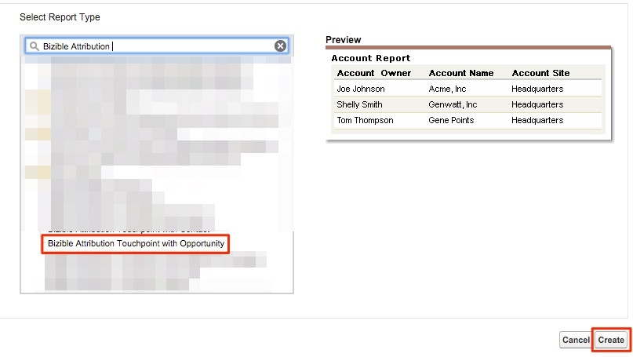

# Opportunitys nach Marketingkanal {#opportunities-by-marketing-channel}

Dieser Bericht zeigt die Anzahl der von Ihren Marketing-Kanälen generierten Opportunitys an. Er enthält alle Ihre Opportunitys. Sie können diesen Bericht jedoch filtern, um bestimmte Arten von Opportunitys zu analysieren.

1. Klicken Sie auf **[!UICONTROL Berichte]** in Salesforce und wählen Sie **[!UICONTROL Neuer Bericht]** aus.

1. Wählen Sie in der Schnellsuche unter „Bizible Attribution“ den Berichtstyp **[!UICONTROL Bizible Attribution Touchpoint mit Opportunity]** und klicken Sie auf **[!UICONTROL Erstellen]**.

   

1. Zeigen Sie oben im Bericht &quot;**[!UICONTROL Attribution-Touchpoints von Bizible]** an und passen Sie das Datumsfeld an den Zeitrahmen an, für den Sie einen Bericht erstellen möchten. In unserem Beispiel geht es um „All Time“. Ändern Sie außerdem das Berichtsformat von &quot;[!UICONTROL &quot; &#x200B;] &quot;**[!UICONTROL &quot;]**.

   

1. Jetzt fügen wir dem Bericht Felder hinzu. Geben Sie in der Schnellsuche auf der linken Seite „Marketing-Kanal“ ein und fügen Sie ihn zur Gruppierung „Zusammenfassung“ im Bericht hinzu.

   

1. Führen Sie nun den Bericht aus und analysieren Sie!

   Dies ist ein Opportunities-Bericht, der nach Marketing-Kanal zusammengefasst wird. Dieser Bericht konzentriert sich auf alle Opportunities, kann jedoch nach Stadium/Art der Opportunity gefiltert werden. Sie können auch beliebige Felder hinzufügen, über die Sie einen Bericht erstellen möchten.

>[!MORELIKETHIS]
>
>[[!DNL Marketo Measure] Tutorials: Stock-SFDC-Berichte](https://experienceleague.adobe.com/de/docs/marketo-measure-learn/tutorials/onboarding/marketo-measure-102/stock-salesforce-reports){target="_blank"}
