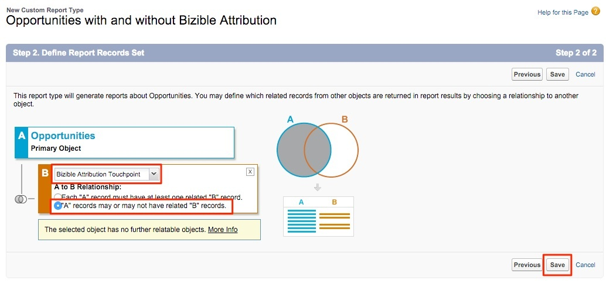

# Reporting zu Chancen mit oder ohne Buyer Attribution Touchpoints {#reporting-on-opportunities-with-or-without-buyer-attribution-touchpoints}

>[!NOTE]
>
>Möglicherweise werden Anweisungen zu „[!DNL Marketo Measure]“ in der Dokumentation angezeigt, obwohl Sie in Ihrem CRM weiterhin „Bizible“ sehen. Wir arbeiten an dieser Aktualisierung, und das Rebranding sollte bald in Ihrem CRM zu sehen sein.

Erstellen Sie einen neuen Berichtstyp, um alle Möglichkeiten mit oder ohne Touchpoints der Käuferzuordnung einzuschließen.

1. Gehen Sie zu **[!UICONTROL Einrichtung]** > **[!UICONTROL Erstellen]** > **[!UICONTROL Berichtstypen]**.

   

1. Wählen Sie **[!UICONTROL Neuer benutzerdefinierter Berichtstyp]** aus.

   

1. Legen Sie das Primäre Objekt auf &quot;[!UICONTROL Opportunities]&quot;fest.

   * Benennen Sie die Bezeichnung des Berichtstyps mit &quot;Chancen mit oder ohne Käuferzuordnung&quot;.
   * Verwenden Sie dieselbe Benennung für den Namen des Berichtstyps. In der Beschreibungseingabe &quot;Chancen mit oder ohne Touchpoints der Käuferzuordnung&quot;.
   * Speichern Sie den Bericht im Ordner &quot;[!UICONTROL Sonstige]&quot;und setzen Sie den Bericht auf &quot;[!UICONTROL Bereitgestellt]&quot;.

   

1. Von dort aus verknüpfen Sie das Opportunities-Objekt mit dem Touchpoints-Objekt &quot;Käuferzuordnung&quot;. Stellen Sie sicher, dass Sie die Schaltfläche &quot;A&quot;-Datensätze mit oder ohne zugehörigen &quot;B&quot;-Datensätzen auswählen. Klicken Sie auf **[!UICONTROL Speichern]**, wenn Sie fertig sind.

   

>[!MORELIKETHIS]
>
>[[!DNL Marketo Measure] Tutorials: Zusätzliche SFDC-Berichte](https://experienceleague.adobe.com/en/docs/marketo-measure-learn/tutorials/onboarding/marketo-measure-102/addtional-salesforce-reports)
