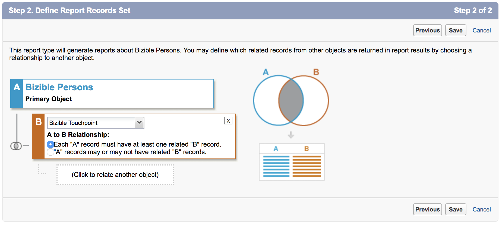
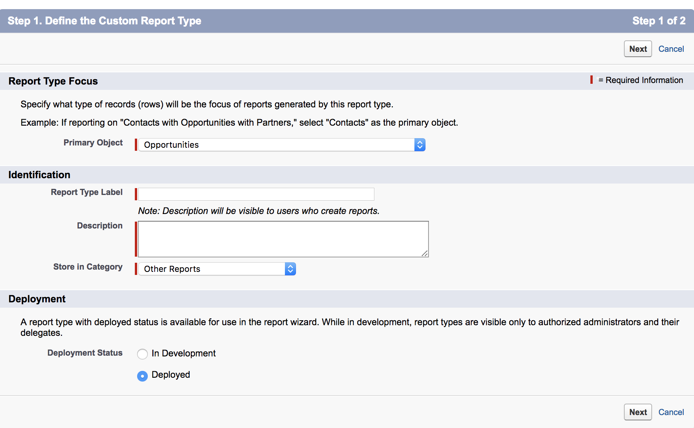
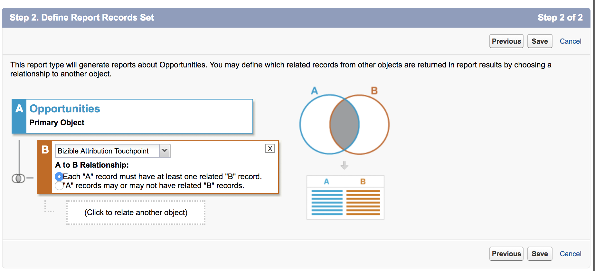

# Erstellen benutzerdefinierter [!DNL Marketo Measure] Berichtstypen {#creating-custom-marketo-measure-report-types}

>[!NOTE]
>
>Sie sehen möglicherweise Anweisungen mit &quot;[!DNL Marketo Measure]&quot; in der Dokumentation, sehen aber trotzdem &quot;[!DNL Bizible]&quot; in Ihrem CRM-System. Wir arbeiten an dieser Aktualisierung, und das Rebranding sollte bald in Ihrem CRM zu sehen sein.

Erfahren Sie, wie Sie benutzerdefinierte [!DNL Marketo Measure] [!DNL Salesforce] Berichtstypen erstellen. Es gibt drei verschiedene Berichtstypen, die wir empfehlen zu erstellen: Leads mit Käufer-Touchpoints (benutzerdefiniert), [!DNL Marketo Measure] Person mit Käufer-Touchpoints (benutzerdefiniert), Chancen mit Buyer Attribution Touchpoint (benutzerdefiniert).

## Leads mit Käufer-Touchpoints (benutzerdefiniert) {#leads-with-buyer-touchpoints-custom}

1. Navigieren Sie zu **[!UICONTROL Setup]** > **[!UICONTROL Build]** > **[!UICONTROL Berichtstypen]** > **[!UICONTROL Neue benutzerdefinierte Berichtstypen]**.

   

1. Definieren Sie den benutzerdefinierten Berichtstyp.

   * [!UICONTROL Berichtstyp Fokus] > [!UICONTROL [!UICONTROL Primäres Objekt]]: Lead
   * Identifizierung > [!UICONTROL Beschriftung des Berichtstyps]: Leads mit Käufer-Touchpoints (benutzerdefiniert)
   * [!UICONTROL In Kategorie speichern]: Andere Berichte
   * [!UICONTROL Bereitstellung] > [!UICONTROL Bereitstellungsstatus]: bereitgestellt

   

1. Definieren Sie die Objektbeziehungen.

   * Ordnen Sie das Lead-Objekt (A) dem [!DNL Marketo Measure] Personen-Objekt (B) und dann dem Buyer Touchpoint-Objekt (C) zu.
   * Stellen Sie sicher, dass &quot;[!UICONTROL Jeder A/B-Datensatz muss mindestens einen B/C]&quot;-Datensatz ausgewählt ist.
   * [!UICONTROL Speichern]

   

## [!DNL Marketo Measure] Person mit Käufer-Touchpoints (benutzerdefiniert) {#marketo-measure-person-with-buyer-touchpoints-custom}

1. Navigieren Sie zu **[!UICONTROL Setup]** > **[!UICONTROL Build]** > **[!UICONTROL Berichtstypen]** > **[!UICONTROL Neue benutzerdefinierte Berichtstypen]**.

   

1. Definieren Sie den benutzerdefinierten Berichtstyp.

   * [!UICONTROL Berichtstyp Fokus] > [!UICONTROL Primäres Objekt]: [!DNL Marketo Measure] Personen
   * [!UICONTROL Identifizierung] > [!UICONTROL Beschriftung des Berichtstyps]: [!DNL Marketo Measure] Person mit Touchpoints des Käufers (benutzerdefiniert)
   * [!UICONTROL In Kategorie speichern]: Andere Berichte
   * [!UICONTROL Bereitstellung] > [!UICONTROL Bereitstellungsstatus]: bereitgestellt

   

1. Definieren Sie die Objektbeziehungen.

   * Ordnen Sie das Objekt [!DNL Marketo Measure] Person (A) dem Buyer Touchpoint-Objekt (B) zu.
   * Stellen Sie sicher, dass &quot;[!UICONTROL Jeder A-Datensatz muss mindestens einen B]-Datensatz haben&quot;ausgewählt ist
   * [!UICONTROL Speichern]

   

## Möglichkeiten mit Buyer Attribution Touchpoint (benutzerdefiniert) {#opportunities-with-buyer-attribution-touchpoint-custom}

1. Navigieren Sie zu **[!UICONTROL Setup]** > **[!UICONTROL Build]** > **[!UICONTROL Berichtstypen]** > **[!UICONTROL Neue benutzerdefinierte Berichtstypen]**.

   

1. Definieren Sie den benutzerdefinierten Berichtstyp.

   * [!UICONTROL Berichtstyp Fokus] > [!UICONTROL Primäres Objekt]: Chancen
   * [!UICONTROL Identifizierung] > [!UICONTROL Beschriftung des Berichtstyps]: Chancen mit Buyer Attribution Touchpoint (benutzerdefiniert)
   * [!UICONTROL In Kategorie speichern]: Andere Berichte
   * [!UICONTROL Bereitstellung] > [!UICONTROL Bereitstellungsstatus]: bereitgestellt

   

1. Definieren Sie die Objektbeziehungen.

   * Verknüpfen des Opportunities-Objekts (A) mit dem Buyer Attribution Touchpoint-Objekt (B)
   * Stellen Sie sicher, dass &quot;[!UICONTROL Jeder A-Datensatz muss mindestens einen B]-Datensatz haben&quot;ausgewählt ist
   * [!UICONTROL Speichern]

   

## Hinzufügen benutzerdefinierter Felder zu benutzerdefinierten Berichtstypen {#adding-custom-fields-to-custom-report-types}

1. Nach der Erstellung der Berichte gelangen Sie zu einer Übersicht über den Berichtstyp. Klicken Sie auf **[!UICONTROL Layout bearbeiten]**.

   

1. Stellen Sie sicher, dass die benutzerdefinierten Felder, die Sie zum Bericht hinzufügen möchten, im Abschnitt Feldlayout-Eigenschaften angezeigt werden. Wenn Sie weitere Felder hinzufügen möchten, verwenden Sie die Option &quot;[!UICONTROL Felder für die Suche hinzufügen]&quot;.

   
