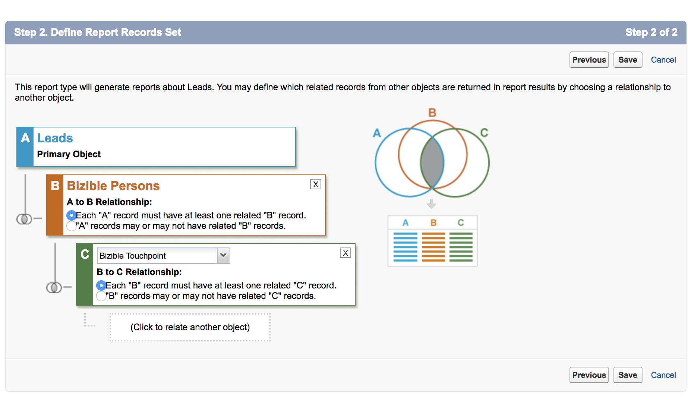
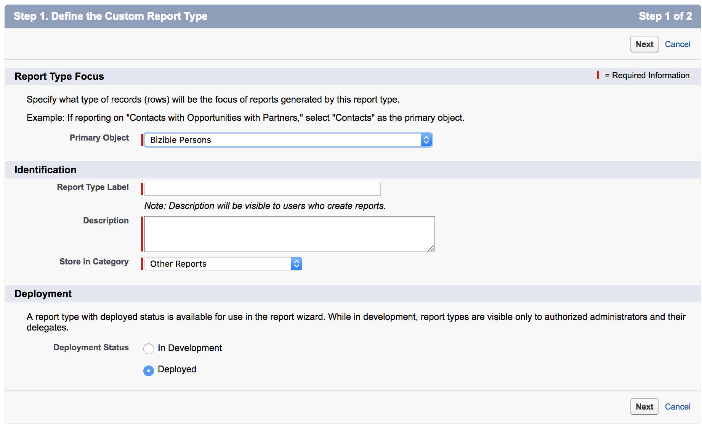
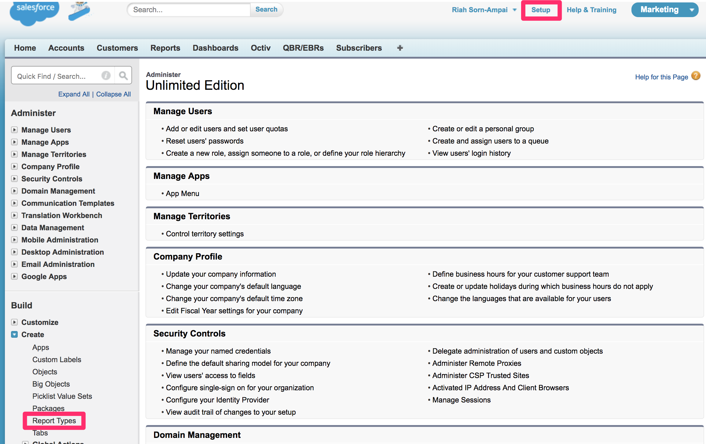
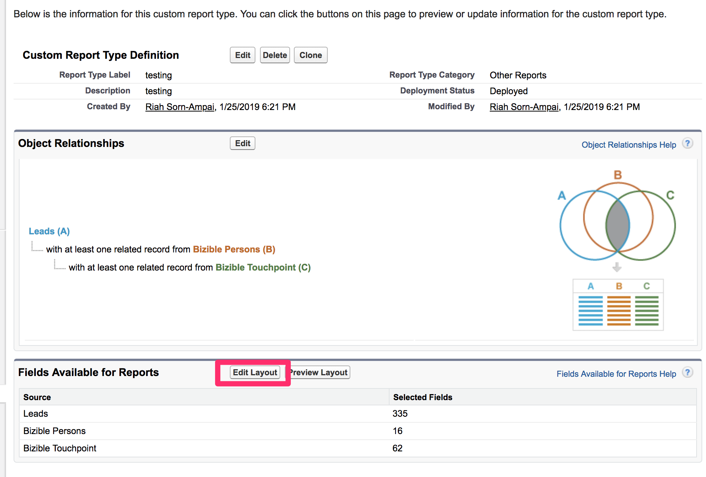

# Erstellen benutzerdefinierter [!DNL Marketo Measure] Berichtstypen {#creating-custom-marketo-measure-report-types}

>[!NOTE]
>
>Möglicherweise werden in der Dokumentation Anweisungen für &quot;[!DNL Marketo Measure]&quot; angezeigt, in Ihrem CRM-System wird jedoch weiterhin &quot;[!DNL Bizible]&quot; angezeigt. Wir arbeiten an dieser Aktualisierung, und das Rebranding sollte bald in Ihrem CRM zu sehen sein.

Erfahren Sie, wie Sie benutzerdefinierte [!DNL Marketo Measure] [!DNL Salesforce] Berichtstypen erstellen. Es gibt drei verschiedene Berichtstypen, die wir empfehlen zu erstellen: Leads mit Käufer-Touchpoints (benutzerdefiniert), [!DNL Marketo Measure] Person mit Käufer-Touchpoints (benutzerdefiniert), Opportunities mit Buyer Attribution Touchpoint (benutzerdefiniert).

## Leads mit Käufer-Touchpoints (benutzerdefiniert) {#leads-with-buyer-touchpoints-custom}

1. Navigieren Sie **[!UICONTROL Setup]** > **[!UICONTROL Erstellen]** > **[!UICONTROL Berichtstypen]** > **[!UICONTROL Neue benutzerdefinierte Berichtstypen]**.

   

1. Definieren Sie den benutzerdefinierten Berichtstyp.

   * [!UICONTROL Berichttyp-Fokus] > [!UICONTROL [!UICONTROL Primäres Objekt]]: Lead
   * Identifizierung > [!UICONTROL Berichtstyp-Kennzeichnung]: Leads mit Käufer-Touchpoints (benutzerdefiniert)
   * [!UICONTROL In Kategorie speichern]: Andere Berichte
   * [!UICONTROL Bereitstellung] > [!UICONTROL Bereitstellungsstatus]: Bereitgestellt

   

1. Definieren Sie die Objektbeziehungen.

   * Das Lead-Objekt (A) mit dem [!DNL Marketo Measure] Personenobjekt (B) und dann mit dem Buyer Touchpoint-Objekt (C) verknüpfen
   * Stellen Sie sicher[!UICONTROL  dass „Jeder A/B-Datensatz muss mindestens einen B/C]-Datensatz enthalten“ ausgewählt ist
   * [!UICONTROL Speichern]

   

## [!DNL Marketo Measure] Person mit Käufer-Touchpoints (benutzerdefiniert) {#marketo-measure-person-with-buyer-touchpoints-custom}

1. Navigieren Sie **[!UICONTROL Setup]** > **[!UICONTROL Erstellen]** > **[!UICONTROL Berichtstypen]** > **[!UICONTROL Neue benutzerdefinierte Berichtstypen]**.

   

1. Definieren Sie den benutzerdefinierten Berichtstyp.

   * [!UICONTROL Berichttyp-Fokus] > [!UICONTROL Primäres Objekt]: [!DNL Marketo Measure] Personen
   * [!UICONTROL Identifizierung] > [!UICONTROL Berichtstyp-Kennzeichnung]: [!DNL Marketo Measure] Person mit Käufer-Touchpoints (benutzerdefiniert)
   * [!UICONTROL In Kategorie speichern]: Andere Berichte
   * [!UICONTROL Bereitstellung] > [!UICONTROL Bereitstellungsstatus]: Bereitgestellt

   

1. Definieren Sie die Objektbeziehungen.

   * Verknüpfen Sie das [!DNL Marketo Measure] Personenobjekt (A) mit dem Buyer Touchpoint-Objekt (B)
   * Stellen Sie sicher[!UICONTROL  dass „Jeder A-Eintrag muss mindestens einen B-Eintrag ]&quot; ausgewählt ist.
   * [!UICONTROL Speichern]

   

## Opportunities mit Buyer Attribution Touchpoint (benutzerdefiniert) {#opportunities-with-buyer-attribution-touchpoint-custom}

1. Navigieren Sie **[!UICONTROL Setup]** > **[!UICONTROL Erstellen]** > **[!UICONTROL Berichtstypen]** > **[!UICONTROL Neue benutzerdefinierte Berichtstypen]**.

   

1. Definieren Sie den benutzerdefinierten Berichtstyp.

   * [!UICONTROL Berichtstyp - Fokus] > [!UICONTROL Primäres Objekt]: Opportunities
   * [!UICONTROL Identifizierung] > [!UICONTROL Berichtstyp-Kennzeichnung]: Opportunities mit Buyer Attribution Touchpoint (benutzerdefiniert)
   * [!UICONTROL In Kategorie speichern]: Andere Berichte
   * [!UICONTROL Bereitstellung] > [!UICONTROL Bereitstellungsstatus]: Bereitgestellt

   

1. Definieren Sie die Objektbeziehungen.

   * Verknüpfen Sie das Opportunities-Objekt (A) mit dem Buyer Attribution Touchpoint-Objekt (B)
   * Stellen Sie sicher[!UICONTROL  dass „Jeder A-Eintrag muss mindestens einen B-Eintrag ]&quot; ausgewählt ist.
   * [!UICONTROL Speichern]

   

## Hinzufügen benutzerdefinierter Felder zu benutzerdefinierten Berichtstypen {#adding-custom-fields-to-custom-report-types}

1. Nachdem die Berichte erstellt wurden, werden Sie zu einer Übersicht über den Berichtstyp weitergeleitet. Klicken Sie **[!UICONTROL Layout bearbeiten]**.

   

1. Stellen Sie sicher, dass die benutzerdefinierten Felder, die Sie dem Bericht hinzufügen möchten, im Abschnitt Feldlayout-Eigenschaften angezeigt werden. Wenn Sie andere Felder hinzufügen möchten, verwenden Sie die Option &quot;[!UICONTROL Verknüpfte Felder über die Suche hinzufügen]&quot;.

   
