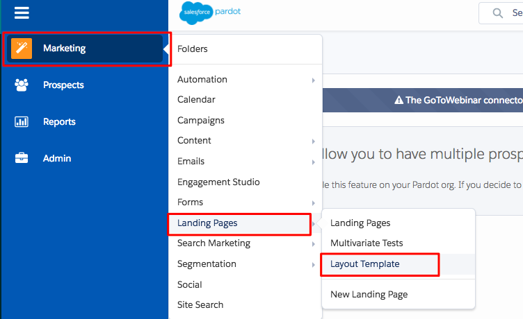

# Hinzufügen [!DNL Marketo Measure] JavaScript zu [!DNL Pardot] {#adding-marketo-measure-javascript-to-pardot}

[!DNL Pardot] Formulare erfordern zusätzliche Bearbeitungsmöglichkeiten innerhalb der Formularvorlage, die über die Bereitstellung eines Skripts auf der Website hinausgehen, damit [!DNL Marketo Measure] Formularübermittlungen erkennen können. Der Prozess ist einfach. Er erfordert nur, dass das Skript zur [!DNL Marketo Measure]-Nachverfolgung in der [!DNL Pardot] Formularvorlage abgelegt wird.

## Schrittweise Anleitungen {#step-by-step-instructions}

Nachdem Sie sich bei Ihrem [!DNL Pardot]-Konto angemeldet haben, führen Sie die folgenden Schritte aus.

1. Navigieren Sie zu **[!UICONTROL Marketing]**.

1. Klicken Sie auf **[!UICONTROL Landingpages]**.

1. Wählen Sie **[!UICONTROL Layoutvorlage]** aus.

   

1. Bestimmen Sie die entsprechende Layout-Vorlage und klicken Sie **[!UICONTROL rechts]** Bearbeiten“.

   

1. Kopieren Sie den [!DNL Marketo Measure] JavaScript-Code und fügen Sie ihn direkt vor dem schließenden Header-Tag auf Ihrer HTML-Seite ein.

   `<script type="text/javascript" src="https://cdn.bizible.com/scripts/bizible.js" async=""></script>`

1. Führen Sie diese Schritte für alle entsprechenden Layoutvorlagen für Landingpages aus.

1. Stellen Sie sicher, dass sich die [!DNL Marketo Measure] JavaScript auch auf der allgemeinen Site-Seite befindet.

   Innerhalb der [!DNL Pardot] Layout-Vorlage sieht der Code in etwa wie folgt aus:

```text
<script type="text/javascript" src="https://cdn.bizible.com/scripts/bizible.js" async=""></script>
   </head>
   <body>
```

## Weitere Hinweise {#additional-notes}

Wenn der [!DNL Pardot] IFrame das folgende HTML-Tag aufweist:

`<base href="http://go.pardot.com">`

_Und_ IFrame selbst ist eigentlich eine sichere Seite (HTTPS) anstatt unsicher (HTTP), beim Laden des Skripts im [!DNL Pardot] IFrame versucht der Browser, eine HTTP-Version des Skripts auf einer HTTPS-Seite zu laden, die fehlschlägt, wodurch das Tracking unterbrochen wird. Die Lösung besteht darin, das Skript im [!DNL Pardot] IFrame zu aktualisieren, um die sichere Version des Skripts zu laden:

`<script type="text/javascript" src="https://cdn.bizible.com/scripts/bizible.js" async=""></script>`

Möglicherweise gibt es bereits andere Trackingcode-Snippets in diesem Bereich, z. B. einen [!DNL Google Analytics]. Achten Sie darauf, sie durch ein Semikolon `;` und ein einziges Leerzeichen zu trennen, wie in diesem Beispiel gezeigt:

`<script type="text/javascript" src="https://cdn.bizible.com/scripts/bizible.js" async=""></script>; <script async="true" type="othercode_example" src="otherfile_example.js" ></script>`
