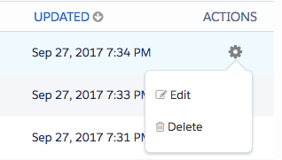

# Hinzufügen [!DNL Marketo Measure] JavaScript in [!DNL Pardot] {#adding-marketo-measure-javascript-to-pardot}

[!DNL Pardot] Formulare müssen innerhalb der Formularvorlage zusätzlich verarbeitet werden, bevor Skript auf der Site eingefügt werden kann für [!DNL Marketo Measure] , um Formularübermittlungen zu erkennen. Der Prozess ist einfach; er erfordert nur das Platzieren der [!DNL Marketo Measure] Tracking-Skript in [!DNL Pardot] Formularvorlage.

## Schrittweise Anleitungen {#step-by-step-instructions}

Sobald Sie sich bei Ihrem [!DNL Pardot] Gehen Sie wie folgt vor.

1. Navigieren Sie zu **[!UICONTROL Marketing]**.

1. Klicks **[!UICONTROL Landing Pages]**.

1. Auswählen **[!UICONTROL Layout-Vorlage]**.

   

1. Legen Sie die entsprechende Layoutvorlage fest und klicken Sie auf **[!UICONTROL Bearbeiten]** nach rechts.

   

1. Kopieren und einfügen Sie die [!DNL Marketo Measure] JavaScript-Code direkt vor dem schließenden -Header-Tag auf Ihrer HTML-Seite.

   `<script type="text/javascript" src="https://cdn.bizible.com/scripts/bizible.js" async=""></script>`

1. Führen Sie diese Schritte für alle entsprechenden Landingpage-Layoutvorlagen aus.

1. Stellen Sie sicher, dass [!DNL Marketo Measure] JavaScript befindet sich auch auf der allgemeinen Site-Seite.

   Innerhalb der [!DNL Pardot] Layout-Vorlage Der Code sieht in etwa wie folgt aus:

```text
<script type="text/javascript" src="https://cdn.bizible.com/scripts/bizible.js" async=""></script>
   </head>
   <body>
```

## Weitere Hinweise {#additional-notes}

Wenn die Variable [!DNL Pardot] IFrame hat das folgende HTML-Tag:

`<base href="http://go.pardot.com">`

_und_ Der IFrame selbst ist beim Laden des Skripts in der [!DNL Pardot] IFrame, der Browser versucht, eine HTTP-Version des Skripts auf einer HTTPS-Seite zu laden, die fehlschlägt, wodurch das Tracking unterbrochen wird. Die Lösung besteht darin, das Skript auf der [!DNL Pardot] IFrame zum Laden der sicheren Version des Skripts:

`<script type="text/javascript" src="https://cdn.bizible.com/scripts/bizible.js" async=""></script>`

Es gibt möglicherweise bereits andere Trackingcode-Snippets in diesem Bereich, z. B. eine [!DNL Google Analytics] Code. Achten Sie darauf, sie durch ein Semikolon zu trennen `;` und ein einzelnes Leerzeichen, wie in diesem Beispiel gezeigt:

`<script type="text/javascript" src="https://cdn.bizible.com/scripts/bizible.js" async=""></script>; <script async="true" type="othercode_example" src="otherfile_example.js" ></script>`
