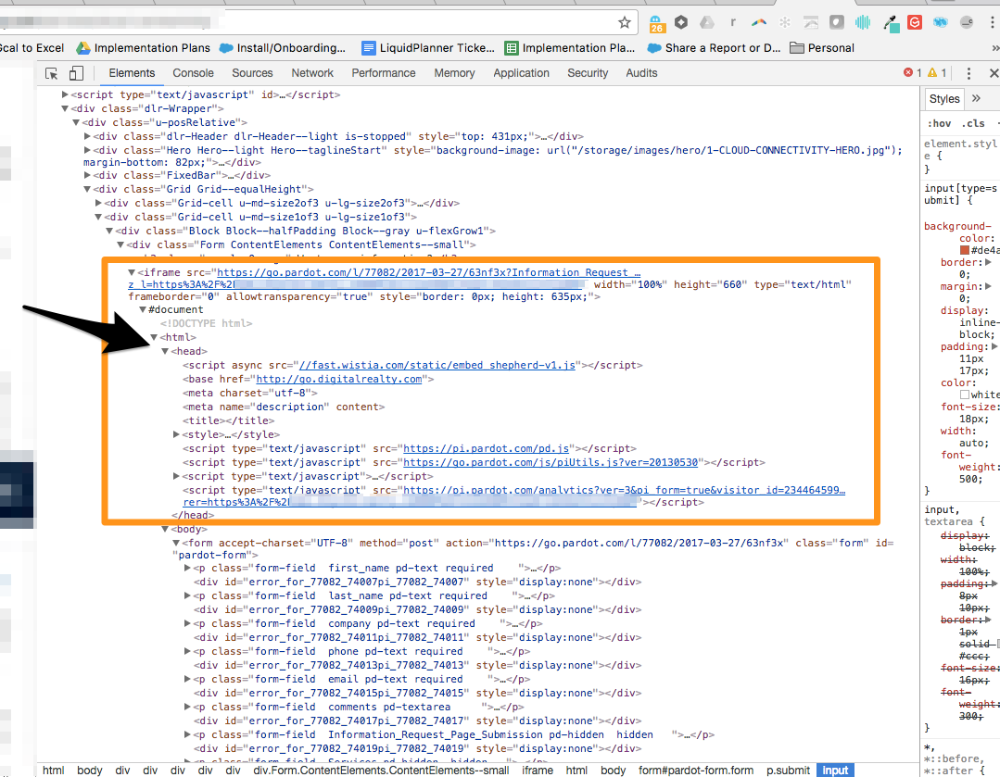

# IFrame Forms und [!DNL Marketo Measure] {#iframe-forms-and-marketo-measure}

Mit [!DNL Marketo Measure] Eine unserer Kernfunktionen besteht darin, Ihre digitalen Marketingbemühungen durch Sitzungen auf Ihrer Site und Formularübermittlungen zu verfolgen. Wenn unser JavaScript auf der Site platziert wird, fügen wir im Allgemeinen automatisch alle Formulare auf der Site hinzu. Diese Funktion ist jedoch eingeschränkt, wenn das Formular in einem IFrame enthalten ist.

Sie können sich einen IFrame als eine Seite innerhalb einer Seite vorstellen. Wenn wir also anfordern, dass unser Skript zu allen Seiten Ihrer Site hinzugefügt wird, müssen wir das Skript innerhalb des IFrame platzieren, um sicherzustellen, dass wir das Tracking durchführen.

In vielen Fällen wird der IFrame über einen Marketing Automation Provider verwaltet, sodass Sie dies innerhalb dieser Plattform oder über Ihren Formularanbieter konfigurieren müssen.

Es wird empfohlen, das JavaScript im Kopfbereich des IFrame zu platzieren. Von dort aus werden wir automatisch an die Formulare in diesem Rahmen anhängen.

Wenn Sie Fragen zum Hinzufügen von JavaScript zu IFrame-Formularen haben, wenden Sie sich an Ihren Kundenbetreuer oder [Marketo-Support](https://nation.marketo.com/t5/support/ct-p/Support){target=&quot;_blank&quot;}.
