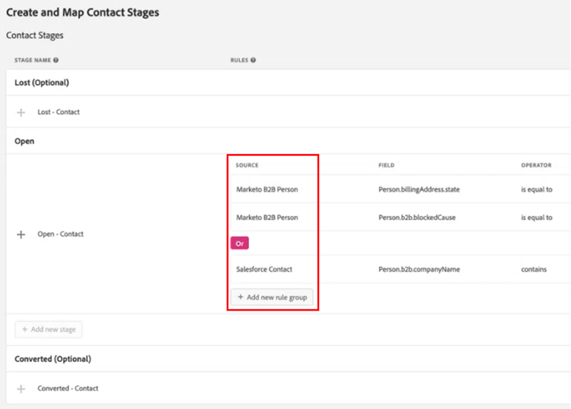

# [!DNL Marketo Measure] Implementierungshandbuch für Ultimate {#marketo-measure-ultimate-implementation-guide}

Dieser Artikel dient als Implementierungshandbuch für Marketo Measure Ultimate und bietet klare Schritte und Einblicke, um eine erfolgreiche Integration und Nutzung sicherzustellen.

## Hauptunterschiede bei der Verwendung von Ultimate im Vergleich zu Standard Tiers {#main-differences-when-using-ultimate-over-standard-tiers}

B2B-Daten über AEP importieren: Marketingexperten müssen ihre B2B-Daten (z. B. Konto, Chancen, Kontakt, Lead, Kampagne, Kampagnenmitglied, Aktivität) über AEP importieren. Es können Daten aus nahezu jeder Datenquelle und aus mehreren Datenquellen desselben Typs aufgenommen werden, um alle Ihre Daten für die Attribution einzubringen.

* Die Lösung kann mit nahezu jedem CRM verwendet werden, nicht nur Salesforce und Dynamics.
* Es können mehrere CRM-Instanzen und/oder MAP-Instanzen mit einer Instanz von Marketo Measure verbunden werden.
* Es können Drittanbieterdaten zu Webinar-Registrierung und -Teilnahme eingebracht werden.

Die direkten Verbindungen von CRM und Marketo Engage sind für Ultimate nicht mehr verfügbar.

* Ultimate pusht keine Daten an das CRM-System zurück. Kundinnen und Kunden können Daten aus Data Warehouse verwenden.
* Marketingexperten bringen weiterhin Ad Platform-Daten über direkte Verbindungen und Tracking von Web-Aktivitäten über Marketo Measure-JavaScript.

Endbenutzer werden mit AEP bereitgestellt. Wenn sie bereits über AEP verfügen, werden wir keine neue Instanz bereitstellen.

* Die bereitgestellte AEP-Version umfasst alle Quell-Connectoren, Schemadaten-Modellierung, Datensätze, Ad-hoc-Abfragedienste und ein Ziel nur für Marketo Measure.

Erfahren Sie mehr über [Marketo Measure Ultimate](/help/marketo-measure-ultimate/marketo-measure-ultimate-overview.md){target="_blank"}.

## Schemata und Datensätze {#schemas-and-datasets}

>[!NOTE]
>
>In [Erstellen von Bausteinen eines Schemas](https://experienceleague.adobe.com/docs/experience-platform/xdm/schema/composition.html?lang=de#building-blocks-of-a-schema){target="_blank"} erhalten Sie einen Überblick über Schemata, Klassen und Feldergruppen.

**XDM-Schema = Klasse + Schemafeldgruppe&#42;**

* Die erforderlichen Felder können nicht geändert werden. Kundinnen und Kunden können bei Bedarf benutzerdefinierte Felder erstellen und hinzufügen.
* Beispiel für einen hierarchiebasierten Feldnamen: accountOrganisation.annualRevenue.amount

&#42; _Ein Schema umfasst eine Klasse und keine oder mehr Schemafeldgruppen. Dies bedeutet, dass Sie ein Datensatzschema auch ohne die Verwendung von Feldergruppen erstellen können._

[Datensätze – Überblick](https://experienceleague.adobe.com/docs/experience-platform/catalog/datasets/overview.html?lang=de){target="_blank"}: Alle erfolgreich in AEP erfassten Daten werden im Data Lake als Datensätze gespeichert. Ein Datensatz ist ein Speicher- und Verwaltungskonstrukt für eine Sammlung von Daten, normalerweise eine Tabelle, die ein Schema (Spalten) und Felder (Zeilen) enthält.

## Erstellen eines Schemas {#creating-a-schema}

Es wird empfohlen, zehn standardmäßige B2B-Schemas mit einem Dienstprogramm zur automatischen Erzeugung zu erstellen.

* Weitere Informationen wie Schritte zum Herunterladen und Einrichten des Hilfsprogramms [finden Sie hier](https://experienceleague.adobe.com/docs/experience-platform/sources/connectors/adobe-applications/marketo/marketo-namespaces.html?lang=de#set-up-b2b-namespaces-and-schema-auto-generation-utility){target="_blank"}.

Für diejenigen mit einer _**CDP-Berechtigung**_: Erstellen Sie Schemata, indem Sie zur Seite „Quellen“ navigieren.

* Wählen Sie aus einer Quelle „Daten hinzufügen“ > „Vorlagen verwenden“ aus.

* Wählen Sie ein Konto und alle B2B-Vorlagen aus, um zehn B2B-Standardschemata zu erstellen.

## Datenflüsse {#dataflows}

>[!IMPORTANT]
>
>Beim Hinzufügen eines neuen Datensatzes wird empfohlen, einen Fluss zu erstellen, anstatt einen vorhandenen zu verwenden.

[Datenflüsse – Übersicht](https://experienceleague.adobe.com/docs/experience-platform/dataflows/home.html?lang=de){target="_blank"}

**Schritte zum Erstellen eines Datenflusses:**

1. Wählen Sie eine Quelle aus.
1. Wählen Sie ein vorhandenes Konto aus oder erstellen Sie ein Konto.
1. Wählen Sie einen Datentyp aus der Liste der verfügbaren Typen aus, die aus der Quelle importiert werden sollen.
1. Wählen Sie einen vorhandenen Datensatz aus oder erstellen Sie einen Datensatz.
1. Ordnen Sie die Felder aus der Quelle dem Schema zu.

   >[!NOTE]
   >
   >* Wenn Sie einen Schematyp einem anderen identischen Typ zuordnen, erfolgt dies automatisch.
   >* Sie können die Zuordnung auch aus einem anderen Fluss im System importieren.
   >* Sie können ein Quellfeld mehreren Zielfeldern zuordnen, aber nicht umgekehrt.
   >* Sie können berechnete Felder erstellen ([Zuordnungsfunktionen für die Datenvorbereitung](https://experienceleague.adobe.com/docs/experience-platform/data-prep/functions.html?lang=de){target="_blank"}).

   >[!CAUTION]
   >
   >* Sie können einen Datenfluss bearbeiten, aber die Daten werden nicht aufgestockt, wenn eine Zuordnung geändert wird.
   >* Wenn ein erforderliches Feld NULL ist, wird der gesamte Fluss zurückgewiesen.

   >[!NOTE]
   >
   >[Datenintegritätsanforderung in Marketo Measure Ultimate](/help/marketo-measure-ultimate/data-integrity-requirement.md){target="_blank"}

1. Legen Sie eine Kadenz für das Laden von Daten fest.
1. Überprüfen Sie und schließen Sie ab.
1. Überprüfen Sie die Seite &quot;Kontostatus&quot;in den Einstellungen der Benutzeroberfläche zum Messen des Datenflusses.

**Monitoring:**

Seite „Quellen“ > „Datenflüsse“ zum Überprüfen des Status von Datenflüssen

* Um die Aktivitätsdetails eines Datensatzes anzuzeigen, klicken Sie einfach auf den Datensatz.
* Um Datenflussfehler anzuzeigen, wählen Sie einen Datenfluss aus, wählen Sie eine Datenflussausführung aus und klicken Sie auf „Vorschau der Fehlerdiagnose“.

## Dateninspektion {#data-inspection}

Option 1: Um Abfragen direkt über die Benutzeroberfläche auszuführen, rufen Sie die Registerkarte „Abfragen“ unter „Daten-Management“ auf.

Option 2: [Herunterladen und Verwenden von PSQL](https://experienceleague.adobe.com/docs/experience-platform/query/clients/psql.html?lang=de){target="_blank"} (schneller und zuverlässiger).

## Aktivieren des Datensatzes für Marketo Measure {#activate-dataset-for-marketo-measure}

Bevor Sie beginnen, gehen Sie zum Abschnitt „Experience Platform“ > „Sandbox-Zuordnung“ in den Einstellungen der Measure-UI und ordnen Sie eine Sandbox zu.

>[!CAUTION]
>
>Diese Einstellung kann nach Auswahl nicht mehr geändert werden.

1. Gehen Sie in AEP zu „Ziele“ > „Marketo Measure“, um Datensätze zu exportieren.
1. Konfigurieren Sie das Ziel.
1. Aktivieren Sie den Datensatz.
1. Überprüfen Sie auf der Seite „Kontostatus“ unter Measure-UI-Einstellungen den Datenflussstatus.

>[!NOTE]
>
>* Es wird empfohlen, pro Datenfluss nur einen Datensatz einzuschließen.
>* Daten für eine bestimmte Entität (z. B. Konto) aus einer bestimmten Quelle können nur in einen Datensatz übertragen werden. Jeder Datensatz kann in nur einem Datenfluss enthalten sein. Verstöße stoppen den Datenfluss in der Laufzeit.
>* Löschen Sie das gesamte Ziel in AEP, um Daten in Measure zu löschen. Durch Deaktivieren werden neue Datenexporte gestoppt und alte Daten beibehalten.
>* Die Measure-Konfiguration sieht größtenteils gleich aus, aber einige Teile wie die Phasenzuordnung sehen anders aus.
>* Es dauert einige Stunden, bis ein neuer Datenfluss eine Flussausführung generiert, und dann treten sie in regelmäßigen, stündlichen Intervallen auf.

In Maßnahme muss die Standardwährung im Abschnitt &quot;Währung&quot;festgelegt werden.

* Wenn Sie mehrere Währungen verwenden, muss das Schema der Währungsumrechnung in AEP eingetragen sein, damit wir es lesen und für Umrechnungen verwenden können.

**Phasenzuordnung:**

Wir importieren nicht automatisch Phasen aus Benutzerdaten, daher müssen alle Phasen manuell zugeordnet werden.

* Benutzende können Phasen aus verschiedenen Quellen zuordnen.

Wenn die Phasen nicht zugeordnet sind, funktioniert das System nicht, da die Daten nicht weitergegeben werden können.

Wenn Sie Kundin oder Kunde von Marketo Measure Ultimate sind und Ihr Standard-Dashboard-Objekt auf „Kontakt“ festgelegt haben, verwenden Sie folgende beiden Lead-Felder nicht ([mehr dazu erfahren Sie hier](/help/marketo-measure-ultimate/data-integrity-requirement.md){target="_blank"}).

* b2b.personStatus
* b2b.isConverted

**Regeln für Kampagnenmitglieder:**

Wählen Sie einen Datensatz aus und legen Sie Regeln für jeden fest.

**Regeln für Erlebnisereignisse:**

Wählen Sie einen Datensatz aus und wählen Sie Aktivitätstypen.

* Benutzerdefinierte Aktivitäten werden noch nicht unterstützt.
* Bei Kundenaktivitäten, die nicht zu den verfügbaren Optionen passen, empfehlen wir, diese als „interessante Momente“ zu kategorisieren und benutzerdefinierte Felder zu verwenden, um sie zu unterscheiden.

**Offline-Kanäle:**

* Wir führen keine dataset-spezifischen Kanalzuordnungsregeln durch, daher wäre dies global.
* Wir müssen schließlich sowohl den CRM-Kampagnentyp als auch den Kanal abgleichen. Zunächst können wir jedoch den Kanalnamen beiden Feldern als Problemumgehung zuordnen.
* **Kanalregeln: Wieder aufgefüllte Daten enthalten keine Daten zum Phasenübergang.**

Die Einstellungen für Touchpoint und Segment bleiben unverändert.
