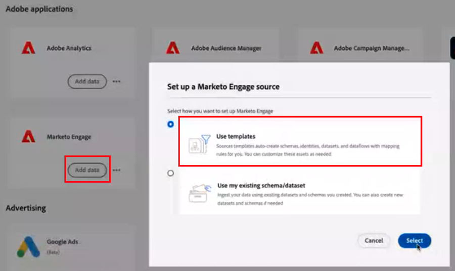

# [!DNL Marketo Measure] Ultimate-Implementierungshandbuch {#marketo-measure-ultimate-implementation-guide}

EINTRÄGLICHER SATZ

## Hauptunterschiede bei der Verwendung von Ultimate im Vergleich zu Standardebenen {#main-differences-when-using-ultimate-over-standard-tiers}

Import von B2B-Daten über AEP: Von Marketingexperten wird erwartet, dass sie ihre B2B-Daten (z. B. Konto, Gelegenheit, Kontakt, Lead, Kampagne, Kampagnenmitglied, Aktivität) über AEP importieren. Es können Daten aus nahezu jeder Datenquelle sowie aus mehreren Datenquellen desselben Typs aufgenommen werden, um alle Ihre Daten für die Attribution einzubringen.

* Die Lösung kann mit nahezu jedem CRM verwendet werden, nicht nur Salesforce und Dynamics.
* Verbinden Sie mehrere CRM-Instanzen und/oder MAP-Instanzen mit einer Marketo Measure-Instanz.
* Es können Drittanbieterdaten zu Webinar-Registrierung und -Teilnahme einbegracht werden.

Die direkten CRM- und Marketo Engage-Verbindungen sind für Ultimate nicht mehr verfügbar.

* Ultimate sendet keine Daten an das CRM-System. Kunden können Daten aus Data Warehouse verwenden.
* Marketingexperten bringen weiterhin Ad Platform-Daten über direkte Verbindungen und Tracking von Web-Aktivitäten über Marketo Measure-JavaScript.

Ultimate-Benutzer erhalten AEP. Wenn sie bereits über AEP verfügen, werden wir keine neue Instanz zurückgeben.

* Die bereitgestellte AEP-Version umfasst alle Quell-Connectoren, Schemadaten-Modellierung, Datensätze, Ad-hoc-Abfragedienste und ein Ziel nur für Marketo Measure.

Weitere Informationen [Marketo Measure Ultimate](/help/marketo-measure-ultimate/marketo-measure-ultimate-overview.md).

## Schemas und Datensätze {#schemas-and-datasets}

>[!NOTE]
>
>Checkout [Erstellen von Bausteinen eines Schemas](https://experienceleague.adobe.com/docs/experience-platform/xdm/schema/composition.html?lang=en#building-blocks-of-a-schema) für eine Übersicht über Schemas, Klassen und Feldergruppen.

**XDM-Schema = Klasse + Schemafeldgruppe&#42;**

* Die erforderlichen Felder können nicht geändert werden. Kunden können bei Bedarf benutzerdefinierte Felder erstellen und hinzufügen.
* Beispiel für einen hierarchiebasierten Feldnamen: accountOrganisation.annualRevenue.amount

&#42; _Ein Schema umfasst eine Klasse und keine oder mehr Schemafeldgruppen. Dies bedeutet, dass Sie ein Datensatzschema ohne die Verwendung von Feldergruppen erstellen können._

[Datensätze - Übersicht](https://experienceleague.adobe.com/docs/experience-platform/catalog/datasets/overview.html): Alle erfolgreich in AEP erfassten Daten werden im Data Lake als Datensätze persistiert. Ein Datensatz ist ein Speicher- und Verwaltungskonstrukt für eine Sammlung von Daten, normalerweise eine Tabelle, die ein Schema (Spalten) und Felder (Zeilen) enthält.

## Erstellen eines Schemas {#creating-a-schema}

Es wird empfohlen, ein Dienstprogramm zur automatischen Erzeugung zu verwenden, um 10 standardmäßige B2B-Schemas zu erstellen.

* Schritte zum Herunterladen und Einrichten des Dienstprogramms [finden Sie hier .](https://experienceleague.adobe.com/docs/experience-platform/sources/connectors/adobe-applications/marketo/marketo-namespaces.html#set-up-b2b-namespaces-and-schema-auto-generation-utility).

Für diejenigen mit einer _**Berechtigung CDP**_: Erstellen Sie Schemata, indem Sie zur Seite Quellen navigieren.

* Wählen Sie aus einer Quelle Daten hinzufügen > Vorlagen verwenden aus.

* Wählen Sie ein Konto und alle B2B-Vorlagen aus, um 10 standardmäßige B2B-Schemata zu erstellen.

## Datenflüsse {#dataflows}

[Datenflüsse - Überblick](https://experienceleague.adobe.com/docs/experience-platform/dataflows/home.html)

**Schritte zum Erstellen eines Datenflusses:**

1. Wählen Sie eine Quelle.
1. Wählen Sie ein vorhandenes Konto aus oder erstellen Sie ein Konto.
1. Wählen Sie einen Datentyp aus der Liste der verfügbaren Typen aus, die aus der Quelle importiert werden sollen.
1. Wählen Sie einen vorhandenen Datensatz aus oder erstellen Sie einen neuen Datensatz.
1. Ordnen Sie die Felder aus der Quelle dem Schema zu.

   >[!NOTE]
   >
   >* Wenn Sie einen Schematyp einem anderen identischen Typ zuordnen, erfolgt dies automatisch.
   >* Sie können die Zuordnung auch aus einem anderen Fluss im System importieren.
   >* Sie können ein Quellfeld mehreren Zielfeldern zuordnen, aber nicht das Gegenteil.
   >* Sie können berechnete Felder erstellen (z. B. Zuordnungsfunktionen für die Datenvorbereitung).

   >[!CAUTION]
   >
   >* Sie können einen Datenfluss bearbeiten, die Daten werden jedoch nicht aufgestockt, wenn eine Zuordnung geändert wird.
   >* Wenn ein erforderliches Feld NULL ist, wird der gesamte Fluss zurückgewiesen.

   >[!NOTE]
   >
   >[Marketo Measure Ultimate Data Integrity-Anforderung](help/marketo-measure-ultimate/data-integrity-requirement.md)

1. Legen Sie eine Datenlade-Kadenz fest.
1. Überprüfen und abschließen.
1. Aktivieren Sie die Seite &quot;Kontostatus&quot;unter UI-Einstellungen für Datenflug-Status messen .

**Überwachung:**

Quellen > Datenflüsse Seite zum Überprüfen des Status von Datenflüssen

* Um die Aktivitätsdetails eines Datensatzes anzuzeigen, klicken Sie einfach auf den Datensatz.
* Um Datenflussfehler anzuzeigen, wählen Sie einen Datenfluss aus, wählen Sie einen Datenfluss aus und klicken Sie auf &quot;Fehlerdiagnose-Vorschau&quot;.

## Datenkontrolle {#data-inspection}

ExL: Marketo Measure Ultimate Data Integrity Requirement Dieses Dokument enthält erforderliche Felder für jedes XDM sowie Inspektionsabfragen. Es wird in ExL veröffentlicht. - ES IST BEREITS OBEN GETAGGT - POST ES ERNEUT??

Option 1: Um Abfragen direkt über die Benutzeroberfläche auszuführen, rufen Sie die Registerkarte Abfragen unter Data Management auf.

Option 2: [Herunterladen und Verwenden von PSQL](https://experienceleague.adobe.com/docs/experience-platform/query/clients/psql.html) (schneller und zuverlässiger)

## Datensatz für Marketo Measure aktivieren {#activate-dataset-for-marketo-measure}

Bevor Sie beginnen, gehen Sie zum Abschnitt &quot;Experience Platform > Sandbox-Zuordnung&quot;in den Einstellungen der Kennungs-UI und ordnen Sie eine Sandbox zu.

>[!CAUTION]
>
>Dieser Wert kann nach Auswahl nicht mehr geändert werden.

1. Gehen Sie in AEP zu &quot;Ziele > Marketo Measure-Seite&quot;, um Datensätze zu exportieren.
1. Konfigurieren Sie das Ziel.
1. Datensatz aktivieren.
1. Aktivieren Sie die Seite &quot;Kontostatus&quot;unter UI-Einstellungen für Datenflug-Status messen .

>[!NOTE]
>
>* Daten für eine bestimmte Entität (z. B. Konto) aus einer bestimmten Quelle können nur in einen Datensatz übertragen werden. Jeder Datensatz kann in nur einem Datenfluss enthalten sein. Verstöße stoppen den Datenfluss in der Laufzeit.
>* Löschen Sie das gesamte Ziel in AEP, um Daten in Measurement zu löschen. Durch die Deaktivierung werden nur neue Datenexporte gestoppt und alte Daten beibehalten.
>* Die Konfiguration der Messung wird größtenteils gleich aussehen, aber einige Teile wie die Staging-Zuordnung sehen anders aus.
>* Es dauert einige Stunden, bis ein neuer Datenfluss einen Fluss generiert, und dann treten sie in regelmäßigen stündlichen Intervallen auf.

In Maßnahme muss die Standardwährung im Abschnitt &quot;Währung&quot;festgelegt werden.

* Wenn Sie mehrere Währungen verwenden, muss das Schema der Währungsumrechnung in AEP eingetragen sein, damit wir es lesen und für Konversionen verwenden können.

**Staging-Zuordnung:**

Wir importieren nicht automatisch Phasen aus Benutzerdaten, daher müssen alle Phasen manuell zugeordnet werden.

* Benutzer können Bühnen aus verschiedenen Quellen zuordnen.

Wenn die Bühnen nicht zugeordnet sind, funktioniert das System nicht, da die Daten nicht weitergegeben werden können.

**Kampagnenmitgliedsregeln:**

Sie müssen einen Datensatz auswählen und Regeln für jeden festlegen.

**Erlebnisereignisregeln:**

Sie müssen einen Datensatz auswählen und Aktivitätstypen auswählen.

* Benutzerdefinierte Aktivitäten werden noch nicht unterstützt.
* Wenn der Kunde über Aktivitäten verfügt, die nicht zu den verfügbaren Optionen passen, empfehlen wir, diese als &quot;interessante Momente&quot;zu kategorisieren und benutzerdefinierte Felder zu verwenden, um sie zu unterscheiden.

**Offline-Kanäle:**

* Wir führen keine dataset-spezifischen Kanalzuordnungsregeln durch, daher wäre dies global.
* Wir müssen schließlich sowohl den CRM-Kampagnentyp als auch den Kanal abgleichen. Zunächst können wir jedoch den Kanalnamen beiden Feldern als Problemumgehung zuordnen.
* **Kanalregeln: Aufstockte Daten enthalten keine Daten zur Staging-Transition.**

Die Einstellungen für Touchpoint und Segment bleiben unverändert.
