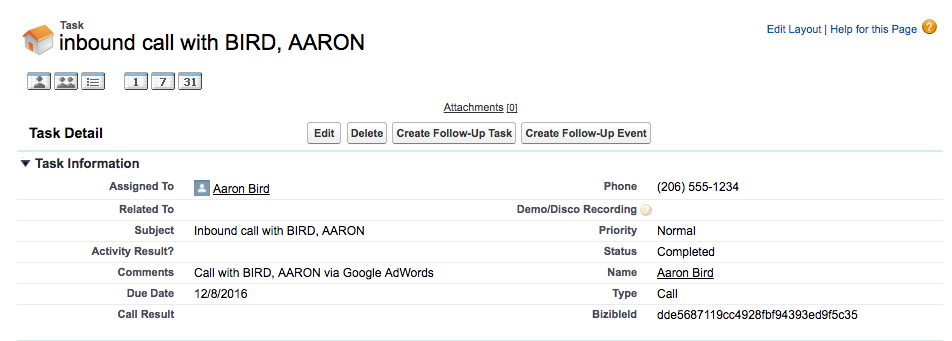

# Anrufverfolgungsintegration {#call-tracking-integration}

Unsere Integration mit [!DNL CallTrackingMetrics] soll eine Websitzung mit einem Telefonanruf zusammenführen. Ein Telefonanruf wird als Formularübermittlung an [!DNL Marketo Measure]. Sie werden einer Web-Sitzung gutgeschrieben, die ansonsten nur als Webbesuch betrachtet worden wäre, da keine tatsächliche Formularübermittlung stattgefunden hat.

## Anrufverfolgung - Erklärung {#call-tracking-explained}

&quot;Call Tracking&quot;(Anrufverfolgung) ist im Allgemeinen ein Produkt von Unternehmen wie [!DNL CallTrackingMetrics], [!DNL DiaglogTech], [!DNL Invoca]oder [!DNL CallRail], um einige zu nennen. Den Benutzern werden anhand der verschiedenen Marketingkanäle oder Kampagnen, aus denen sie stammen, eindeutige Telefonnummern angezeigt. So können Marketing-Experten die Leistung dieser Kanäle oder Kampagnen erkennen.

## Vorher und Nachher {#before-and-after}

Sehen Sie sich das unten stehende Flussdiagramm an, um zu sehen, wie [!DNL Marketo Measure] verwendet, um Telefonanrufe ohne Integration mit CallTrackingMetrics zu verarbeiten. Der Telefonanruf, der stattfand, wurde nicht verfolgt, sodass er als Websitzung angesehen wurde und kein Touchpoint dafür erstellt wurde. Erst beim nächsten Besuch, bei dem der Benutzer ein Formular ausgefüllt hat, wurde ein Touchpoint ausgefüllt.

Mit der Integration können Sie sehen, dass die Websitzung tatsächlich an einen Telefonanruf gebunden war. Das nächste Ausfüllen des Formulars führt zu einem PostLC Touch und wird weiterhin als Teil des Journey verfolgt.

## Funktionsweise {#how-it-works}

CallTrackingMetrics muss ein wenig Entwicklungsarbeit leisten, damit dies funktioniert. Mit dem JavaScript, das sie auf Ihrer Site platzieren, können CallTrackingMetrics die _biz_uid aus dem [!DNL Marketo Measure] Cookie. Diese &quot;[!DNL BizibleId]&quot; wird dann von CallTrackingMetrics gespeichert.

Wenn ein Besucher Ihre Site aufruft und einen Telefonanruf tätigt, ist es Aufgabe von CallTrackingMetrics, diese Daten per Push in [!DNL Salesforce]  In der Regel wird ein [!DNL Salesforce Task] erstellt wird, die Daten wie Telefonnummer, Betreff, Typ und jetzt die [!DNL BizibleId]

Die [!DNL BizibleId] ist ein Feld, das mit der Version 6.7+ von [!DNL Marketo Measure] Marketing Attribution-Paket.

Nachfolgend finden Sie ein Beispiel für einen Task-Datensatz mit der Variablen [!DNL BizibleId] aufgefüllt.

Wann [!DNL Marketo Measure] findet einen Task-Datensatz mit einer bekannten [!DNL BizibleId] ausgefüllter Wert, [!DNL Marketo Measure] kann diesen Benutzer einer Websitzung mit derselben [!DNL BizibleId] und ordnen diese Sitzung einem Telefonanruf anstelle eines Webbesuchs zu.

## Touchpoint {#the-touchpoint}

Wann [!DNL Marketo Measure] die Aufgabe importieren/herunterladen können, verarbeiten wir diese Details zusammen mit der Websitzung. In den meisten Fällen kann sie mit einer verweisenden Stelle oder Anzeige zusammengeführt werden. Im folgenden Beispiel fand ein Besucher das Unternehmen über eine gebührenpflichtige Google-Anzeige und führte einen Telefonanruf durch.

Die [!UICONTROL Touchpoint] Der Typ &quot;Aufruf&quot;wird aus der Aufgabe abgerufen, aus dem Screenshot oben, der bei der Erstellung der Aufgabe auch von CallTrackingMetrics aufgefüllt wird.

## Berichterstellung {#reporting}

Touchpoint-Typwerte, die [!DNL Marketo Measure] Normalerweise werden Push-Benachrichtigungen über Webbesuche, Webformulare oder Webchats gesendet. Bei CallTrackingMetrics-Touchpoints ist der Touchpoint-Typ jedoch Telefonaufruf. So können Marketing-Experten sehen, welche Kanäle die meisten Telefonanrufe erhalten und Umsatz für ihre Organisation generieren.

## FAQs {#faq}

**Warum ist mein Touchpoint-Typ Web-Besuch?**

Der Touchpoint-Typ wird aus dem Feld Task.Type ausgefüllt. Wenn das Feld Task.Type leer ist, dann [!DNL Marketo Measure] wird für den Touchpoint-Typ automatisch &quot;Webbesuch&quot;festgelegt. Sobald das Feld Task.Type ausgefüllt ist [!DNL Marketo Measure] liest diesen Wert und füllt den Touchpoint-Typ entsprechend.

**Welche anderen Felder füllt der Touchpoint über den Telefonanruf?**

Sowohl der Touchpoint-Typ als auch das Medium enthalten die Daten, die vom Task.Type abgerufen werden. Alle anderen Datenpunkte werden aus den Web-Tracking- und JavaScript-Daten abgerufen.

**Warum ist dieser Anruf nicht an eine Websitzung gebunden?**

Überprüfen Sie zunächst die Aufgabe, um sicherzustellen, dass eine [!DNL BizibleId] aufgefüllt. Wenn kein Wert vorhanden ist, können wir keinen Touchpoint erstellen. Dies muss mit CallTrackingMetrics eskaliert werden.

Wenn ein Wert vorhanden ist, beachten Sie, dass wir nur alle Websitzungen als 30 Minuten betrachten. Wenn um 23:17 Uhr auf eine Google-Anzeige geklickt wurde (Start der Sitzung auf der Website), der Anruf jedoch erst um 13:05 Uhr erfolgte, werden die Web-Sitzung und der Telefonanruf nicht zusammengeführt. Stattdessen [!DNL Marketo Measure] erstellt eine separate [!DNL Salesforce Task] Touchpoint zur Verfolgung des Telefonanrufs, jedoch keine Daten zur Websitzung.

## Partnerschaften {#partnerships}

[!DNL Marketo Measure] verfügt derzeit über einen offiziellen Call-Tracking-Partner, der den &quot;offiziellen&quot;Integrationsprozess mit uns durchlaufen hat, zu dem auch das Co-Marketing und das Produkt-Training gehörten. Ein Partner ist CallTrackingMetrics.
