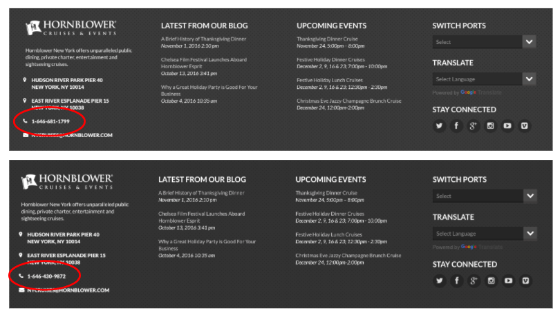

# Anrufverfolgungsintegration {#call-tracking-integration}

Durch unsere Integration mit [!DNL CallTrackingMetrics] soll eine Web-Sitzung mit einem Telefonanruf zusammengeführt werden. Ein Telefonanruf wird als Formularübermittlung an [!DNL Marketo Measure] behandelt. Sie werden einer Web-Sitzung gutgeschrieben, die ansonsten nur als Webbesuch betrachtet worden wäre, da keine tatsächliche Formularübermittlung stattgefunden hat.

## Anrufverfolgung - Erläuterung {#call-tracking-explained}

&quot;Call Tracking&quot;(Anrufverfolgung) ist im Allgemeinen ein Produkt von Unternehmen wie [!DNL CallTrackingMetrics], [!DNL DiaglogTech], [!DNL Invoca] oder [!DNL CallRail], um nur einige zu nennen. Den Benutzern werden anhand der verschiedenen Marketing-Kanäle oder Kampagnen, aus denen sie stammen, eindeutige Telefonnummern angezeigt. So können Marketing-Experten die Leistung dieser Kanäle oder Kampagnen erkennen.

## Vor und Nach {#before-and-after}

Sehen Sie sich das unten stehende Flussdiagramm an, um zu sehen, wie [!DNL Marketo Measure] zur Verarbeitung von Telefonanrufen ohne Integration mit CallTrackingMetrics verwendet wurde. Der Telefonanruf, der stattfand, wurde nicht verfolgt, sodass er als Websitzung angesehen wurde und kein Touchpoint dafür erstellt wurde. Erst beim nächsten Besuch, bei dem der Benutzer ein Formular ausgefüllt hat, wurde ein Touchpoint ausgefüllt.

Mit der Integration können Sie sehen, dass die Websitzung tatsächlich an einen Telefonanruf gebunden war. Das nächste Ausfüllen des Formulars führt zu einem PostLC Touch und wird weiterhin als Teil des Journey verfolgt.

## Funktionsweise {#how-it-works}

CallTrackingMetrics muss einige Entwicklungsarbeiten am Ende durchführen, damit dies funktioniert. Mit der JavaScript, die sie auf Ihrer Site platzieren, kann CallTrackingMetrics die _biz_uid aus dem [!DNL Marketo Measure] -Cookie abrufen. Dieser &quot;[!DNL BizibleId]&quot; wird dann von CallTrackingMetrics gespeichert.

Wenn ein Besucher Ihre Site aufruft und einen Telefonanruf tätigt, ist es Aufgabe von CallTrackingMetrics, diese Daten in [!DNL Salesforce] zu übertragen.  In der Regel wird ein [!DNL Salesforce Task] erstellt, mit dem Daten wie Telefonnummer, Betreff, Typ und jetzt der [!DNL BizibleId] gefüllt werden

Der [!DNL BizibleId] ist ein Feld, das mit Version 6.7+ des [!DNL Marketo Measure] Marketing Attribution-Pakets installiert wird.

Nachfolgend finden Sie ein Beispiel für einen Task-Datensatz mit dem Wert [!DNL BizibleId] .

Wenn [!DNL Marketo Measure] einen Task-Datensatz mit einem bekannten [!DNL BizibleId] -Wert findet, kann [!DNL Marketo Measure] diesen Benutzer einer Web-Sitzung mit demselben [!DNL BizibleId] zuordnen und diese Sitzung einem Telefonaufruf anstelle eines Webbesuchs zuordnen.

## Touchpoint {#the-touchpoint}

Wenn [!DNL Marketo Measure] die Aufgabe importieren/herunterladen kann, werden diese Details zusammen mit der Websitzung verarbeitet. Normalerweise kann es mit einer verweisenden Stelle oder Anzeige zusammengeführt werden. Im folgenden Beispiel fand ein Besucher das Unternehmen über eine gebührenpflichtige Google-Anzeige und führte einen Telefonanruf durch.

Der [!UICONTROL Touchpoint]-Typ &quot;Aufruf&quot;wird aus der Aufgabe abgerufen, aus dem Screenshot oben, der auch von CallTrackingMetrics bei der Erstellung der Aufgabe gefüllt wird.

## Berichterstellung {#reporting}

Touchpoint-Typ -Werte, die [!DNL Marketo Measure] normalerweise sendet, sind Webbesuch, Webformular oder Webchhat, aber bei CallTrackingMetrics -Touchpoints ist der Touchpoint-Typ Telefonaufruf. So können Marketing-Experten sehen, welche Kanäle die meisten Telefonanrufe erhalten und Umsatz für ihre Organisation generieren.

## FAQs {#faq}

**Warum ist mein Webbesuch vom Touchpoint-Typ?**

Der Touchpoint-Typ wird aus dem Feld Task.Type ausgefüllt. Wenn das Feld Task.Type leer ist, setzt [!DNL Marketo Measure] den Touchpoint-Typ automatisch auf &quot;Webbesuch&quot;. Sobald das Feld &quot;Task.Type&quot;mit [!DNL Marketo Measure] ausgefüllt ist, wird dieser Wert gelesen und der Touchpoint-Typ wird entsprechend ausgefüllt.

**Welche anderen Felder füllt der Touchpoint über den Telefonanruf?**

Sowohl der Touchpoint-Typ als auch Medium enthalten die Daten, die vom Task.Type abgerufen werden. Alle anderen Datenpunkte werden aus den Web-Tracking- und JavaScript-Daten abgerufen.

**Warum ist dieser Telefonanruf nicht an eine Websitzung gebunden?**

Überprüfen Sie zunächst die Aufgabe, um sicherzustellen, dass ein &quot;[!DNL BizibleId]&quot;-Wert angegeben ist. Wenn kein Wert vorhanden ist, können wir keinen Touchpoint dafür erstellen. Dies muss mit CallTrackingMetrics eskaliert werden.

Wenn ein Wert vorhanden ist, beachten Sie, dass wir nur alle Websitzungen als 30 Minuten betrachten. Wenn um 23:17 Uhr (Start der Sitzung auf der Website) auf eine Google-Anzeige geklickt wurde, der Anruf jedoch erst um 13:05 Uhr erfolgte, werden die Web-Sitzung und der Telefonanruf nicht zusammengeführt. Stattdessen erstellt [!DNL Marketo Measure] einen separaten [!DNL Salesforce Task] -Touchpoint, um den Telefonanruf zu verfolgen, jedoch keine Websitzungsdaten.

## Partnerschaften {#partnerships}

[!DNL Marketo Measure] verfügt derzeit über einen offiziellen Call-Tracking-Partner, der den &quot;offiziellen&quot;Integrationsprozess mit uns durchlaufen hat, zu dem auch das Co-Marketing und das Produkt-Training gehörten. Ein Partner ist CallTrackingMetrics.
