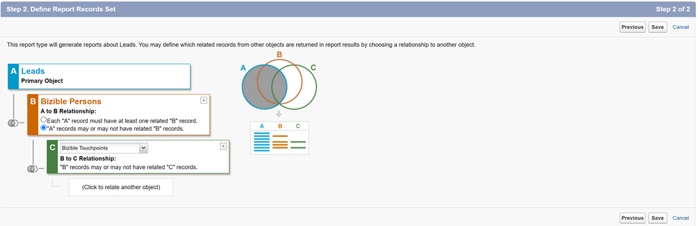

# Versionshinweise 2023 {#release-notes-2023}

Nachstehend finden Sie Informationen zu allen neuen und aktualisierten Funktionen unserer Versionen aus dem Jahr 2023.

## Q4-Version {#q4-release}

**Webtraffic-Dashboard**

Das neu gestaltete [Webtraffic-Dashboard](/help/marketo-measure-discover-ui/dashboards/web-traffic-dashboard.md){target="_blank"} ist jetzt für alle Kundinnen und Kunden verfügbar. Dieses Dashboard bietet einen vollständigen Überblick über die Besucherinteraktionen Ihrer Website. Sie können Metriken wie Unique Visitors-Zählungen pro URL, Gesamtbesuche, Seitenansichten und Formularübermittlungen von bestimmten Formular-URLs oder Landing Pages analysieren. Sie können auch die monatlichen Traffic-Trends verfolgen und leistungsstarke bezahlte Medien identifizieren, was Ihnen dabei hilft, Ihre Strategien für eine optimale Umsatzgenerierung zu präzisieren.

Die Einführung der neuen vordefinierten Dashboards erfolgt in Wellen und wird vor Jahresende abgeschlossen sein.

>[!NOTE]
>
>Während die aktuellen Dashboards bis März 2024 eingestellt werden, können Sie bis dahin beide Versionen verwenden, um einen reibungslosen Übergang zu gewährleisten.

**Entfernen von IP-Adressdaten**

Wir entfernen IP-Adressdaten aus unserem langfristigen Speicher, um die Einhaltung von Datenschutzbestimmungen sicherzustellen. Derzeit enthalten die folgenden Snowflake-Tabellen und -Ansichten IP-Adressen. Wir planen, diese Daten zu entfernen und neue Geolokationsinformationen hinzuzufügen:

<table style="width:400px">
<thead>
  <tr>
    <th style="width:50%">Tabellen</th>
    <th>Ansichten</th>
  </tr>
</thead>
<tbody>
  <tr>
    <td>CUSTOMER_AB_TESTS</td>
    <td>BIZ_CUSTOMER_AB_TESTS</td>
  </tr>
  <tr>
    <td>CUSTOMER_EVENTS</td>
    <td>BIZ_CUSTOMER_EVENTS</td>
  </tr>
  <tr>
    <td>FORM_SUBMITS</td>
    <td>BIZ_FORM_SUBMITS</td>
  </tr>
  <tr>
    <td>IMPRESSIONS</td>
    <td>BIZ_IMPRESSIONS</td>
  </tr>
  <tr>
    <td>PAGE_VIEWS</td>
    <td>BIZ_PAGE_VIEWS</td>
  </tr>
  <tr>
    <td>SESSIONS</td>
    <td>BIZ_SESSIONS</td>
  </tr>
  <tr>
    <td>WEB_HOST_MAPPINGS</td>
    <td>BIZ_WEB_HOST_MAPPINGS</td>
  </tr>
</tbody>
</table>

* Ab jetzt werden wir Landes-Code, Stadt-Code und Regions-Code anstelle von Landesname, Stadtname und Regionsname herunterladen.
* Bei der Verarbeitung aller historischen Web-Aktivitäten kann es zu Inkonsistenzen bei Standortinformationen über verschiedene Einträge hinweg kommen. Diese Inkonsistenzen können das Vorhandensein von IP-Adressen ohne Geolokationsinformationen, aktualisierte Geolokationsinformationen ohne IP-Adressen oder eine Mischung aus Länder- oder Regionennamen und -Codes umfassen.
* _**Dieser Zeitraum mit gemischten Daten wird voraussichtlich vom 04.01.2023 bis zum 28.02.2023 eintreten.**_

**Seitentitel-Daten in URL-Tabelle**

Die URL-Tabelle im [Data Warehouse](/help/marketo-measure-data-warehouse/data-warehouse-schema.md){target="_blank"} enthält jetzt neben den Web-Daten-Tabellen ein Feld für den Seitentitel.

Beachten Sie, dass der Seitentitel in der URL-Tabelle möglicherweise nicht immer mit dem Seitentitel in anderen Web-Tabellen übereinstimmt. Die URL-Tabelle hat den neuesten Seitentitel. Wenn der Titel für die URL geändert wurde, nachdem die Web-Aktivität stattgefunden hat, stimmt er nicht mit dem in der URL-Tabelle vorhandenen Wert überein.

**Entdecken Sie das umgestaltete Dashboard**

Allen Benutzenden von Marketo Measure werden unsere neu gestalteten In-App-Dashboards angezeigt, die eine verbesserte Benutzerfreundlichkeit mit einem Mehrwert kombinieren. Wir führen auch neue Metriken ein, wie „Erzielter ROI“, die die typische Verzögerung zwischen Marketing-Investitionen und Käufen in B2B-Go-to-Märkten berücksichtigen.

Die Einführung der neuen vordefinierten Dashboards erfolgt schrittweise ab der erste Oktoberwoche und wird vor Jahresende abgeschlossen sein. Diese neuen Dashboards werden automatisch in Ihren Instanzen angezeigt, zusammen mit produktinternen Informationen und Links zur Dokumentation.

* [Neues Handbuch zum Entdecken von Dashboards](/help/marketo-measure-discover-ui/dashboards/new-discover-dashboard-guide.md){target="_blank"}
* [Entdecken Sie die Grundlagen von Dashboards](/help/marketo-measure-discover-ui/dashboards/discover-dashboard-basics.md){target="_blank"}
* [Dashboard „Umsatzübersicht“](/help/marketo-measure-discover-ui/dashboards/revenue-overview-dashboard.md){target="_blank"}
* [Dashboard „Zugewiesener Umsatz“](/help/marketo-measure-discover-ui/dashboards/attributed-revenue-dashboard.md){target="_blank"}
* [ROI-Dashboard](/help/marketo-measure-discover-ui/dashboards/roi-dashboard.md){target="_blank"}
* [Passport-Dashboard](/help/marketo-measure-discover-ui/dashboards/passport-dashboard.md){target="_blank"}

>[!NOTE]
>
>Während die aktuellen Dashboards bis März 2024 eingestellt werden, können Sie bis dahin beide Versionen verwenden, um einen reibungslosen Übergang zu gewährleisten.

### Einstellungen {#deprecations}

#### Einstellung von Salesforce-Feldern

Wir werden unsere Exportaufträge an Lead-/Kontaktobjekte schrittweise auslaufen lassen, um unsere Integration zu vereinfachen und den Export in Salesforce-Standardobjekte zu vermeiden. Die unten aufgeführten denormalisierten Felder werden ebenfalls nicht mehr unterstützt, da Kundinnen und Kunden dieselben Daten von ihren Touchpoint-Objekten erhalten können. _**Der Zeitplan für die Einstellung ist Juni 2024.**_

<table style="width:350px">
<tbody>
  <tr>
    <td>bizible2__Ad_Campaign_Name_FT__c</td>
  </tr>
  <tr>
    <td>bizible2__Ad_Campaign_Name_LC__c</td>
  </tr>
  <tr>
    <td>bizible2__Landing_Page_FT__c</td>
  </tr>
  <tr>
    <td>bizible2__Landing_Page_LC__c</td>
  </tr>
  <tr>
    <td>bizible2__Touchpoint_Date_FT__c</td>
  </tr>
  <tr>
    <td>bizible2__Touchpoint_Date_LC__c</td>
  </tr>
  <tr>
    <td>bizible2__Touchpoint_Source_FT__c</td>
  </tr>
  <tr>
    <td>bizible2__Touchpoint_Source_LC__c</td>
  </tr>
  <tr>
    <td>bizible2__Marketing_Channel_FT__c</td>
  </tr>
  <tr>
    <td>bizible2__Marketing_Channel_LC__c</td>
  </tr>
</tbody>
</table>

Folgende Felder enthalten die dieselben Informationen für die Touchpoint- und Attributions-Touchpoint-Objekte:

* bizible2__Ad_Campaign_Name__c
* bizible2__Landing_Page__c
* bizible2__Marketing_Channel__c
* bizible2__Touchpoint_Date__c
* bizible2__Touchpoint_Source__c

**Erforderliche Aktionen**

* Erstellen Sie neue Berichtstypen für Leads und Kontakte mit oder ohne Touchpoints.

* Erstellen Sie Berichte, die die Funktionalität eines vorhandenen Berichts erfassen, der die entfernten Felder verwendet. Im Rahmen dieses Prozesses sollten Sie die Felder im Bericht wie folgt ändern:

* Lead-/Kontakt-FT/LC-Felder entfernen:

* Touchpoint-Felder hinzufügen:

* Der Touchpoint-Positionsfilter und alle Filter, die die FT/LC-Felder verwenden, einschließlich des Datumsfelds, sollten wie folgt aktualisiert werden:

* Löschen Sie alle bereits vorhandenen Berichte, in denen die entfernten Felder verwendet wurden, aus dem Lead-/Kontaktobjekt, um nicht mehr auf diese Felder zu verweisen.

#### Zugehöriges Dynamics-Paket

* Um mit Dynamics verbunden zu bleiben, müssen Sie das neueste Paket (v6.12) installieren. Ältere Versionen `(<v6.12)` werden nicht länger unterstützt. Diese Aktualisierung optimiert die Erstellung historischer Einträge, um die Speicherbelegung zu reduzieren.

* Die veraltete OAuth-Methode mit einem Aktualisierungs-Token wird nicht mehr unterstützt. In [dieser Anleitung](/help/marketo-measure-and-dynamics/getting-started-with-marketo-measure-and-dynamics/oauth-with-azure-active-directory-for-dynamics-crm.md){target="_blank"} finden Sie Informationen zur Aktualisierung Ihrer Anmeldeinformationen entsprechend der Best Practices von Microsoft zur Verwendung von ClientSecret.

#### Feld „custom_properties“

In unserem Data Warehouse dient das Feld „custom_properties“ als Speicher für zusätzliche Datenpunkte, die nicht von unserem festen Schema abgedeckt werden. Aufgrund seines JSON-Formats kann dieses Feld nur eingeschränkt genutzt werden und lässt sich nur schwer in SQL-Anfragen integrieren, was die Leistung beeinträchtigt. Angesichts dieser Faktoren haben wir beschlossen, dieses Feld abzuschaffen. Diese Änderung betrifft hauptsächlich die Datenverarbeitungsschicht in unserem Azure-Tabellenspeicher und die in unser Data Warehouse exportierten Daten.

### Und als Nächstes? {#q4-whats-coming}

**Benutzerdefinierte In-App-Berichterstellung**

Marketo Measure-Kundinnen und -Kunden können erstmals ihre eigenen Berichte direkt in der App erstellen und speichern. Dies erfolgt im Anschluss an die Veröffentlichung der vordefinierten Dashboards Anfang 2024.

 

## Q2-Version {#q2-release}

* **Salesforce-Paketkonsolidierung**

Wir führen alle Salesforce-Pakete zu einem einzigen, umfassenden Paket zusammen, um ein besseres Anwendererlebnis und eine vereinfachte Nutzung zu ermöglichen. Die V1-, V2_EXT- und Reporting-Pakete werden im nächsten Quartal eingestellt. Das neue Paket kombiniert alle vorherigen Funktionen und sorgt so für ein effizienteres Tracking und tiefere Kundenerkenntnisse.

Kundinnen und Kunden, die bereits das V2-Paket installiert haben, müssen es auf die neue konsolidierte Version aktualisieren.

Wir haben zwei neue Felder hinzugefügt, um Ihre Berichtsfunktionen zu erweitern:

* form_name: Dieses Feld ist jetzt in BT-/BAT-Objekten verfügbar und ermöglicht Benutzenden das Erstellen von Berichten anhand von Formularnamen.
* user_touchpoint_id: Mit diesem Feld können Berichte mit Touchpoint-Zählungen für eindeutige Benutzende erstellt werden.

[Dieser Artikel](/help/configuration-and-setup/marketo-measure-and-salesforce/salesforce-package-consolidation.md){target="_blank"} enthält Anleitungen zum Erstellen von Berichten und Dashboards aus den älteren Reporting-Paketen.

* **Aktualisierungen von Salesforce-API-Versionen**

Alle Salesforce-API-Versionen von Apex-Klassen, einschließlich der Klasse UserActivityContext, werden auf unterstützte Versionen aktualisiert. (31.0 bis 57.0).

* **Installation des neuen Pakets**

Den Link zur Installation des neuen konsolidierten Pakets [finden Sie hier](https://login.salesforce.com/packaging/installPackage.apexp?p0=04t1P000000VY6Z){target="_blank"}

### Und als Nächstes? {#q2-whats-coming}

**Änderungen beim IP-Adressspeicher**

Aus Datenschutzgründen werden wir keine IP-Adressen mehr in unserem System speichern. Wir werden die Geolokation der IP-Adresse weiterhin identifizieren und speichern, aber das Format wird sich ändern (z. B. von „Vereinigte Staaten“ zu „US“).
