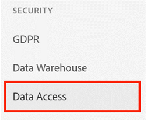

# [!UICONTROL Entdecken des Daten-Downloads] Zugriffskontrolle {#discover-data-download-access-control}

[!UICONTROL Discover-Datendownload]-Steuerelement ermöglicht es [!DNL Marketo Measure]-Administratoren, die Datendownload-Richtlinien für die Discover-Dashboards basierend auf den Benutzerrollen festzulegen. Das Steuerelement deckt alle Datendownload-Aktionen in Discover-Dashboards ab.

1. Klicken Sie **[!UICONTROL Datenzugriff]** unter [!UICONTROL Sicherheit].

   

1. Klicken Sie auf die Dropdown-Liste und wählen Sie die entsprechende Option für Ihre Konsole aus.

   

   <table>
    <tr>
     <td><strong>Alle Benutzer</strong></td>
     <td>Alle Benutzer können Daten herunterladen, einschließlich PDF- und CSV-Formaten.</td>
    </tr>
    <tr>
     <td><strong>Nur Admin-Benutzer</strong></td>
     <td>Nur Admin-Benutzer können Daten herunterladen, einschließlich PDF- und CSV-Formaten.</td>
    </tr>
    <tr>
     <td><strong>Keine</strong></td>
     <td>Niemand kann Daten herunterladen, sowohl PDF- als auch CSV-Formate.</td>
    </tr>
   </table>

1. Klicken Sie auf **[!UICONTROL Speichern]**, wenn Sie fertig sind.

   

>[!NOTE]
>
>Die Einstellung wird möglicherweise erst wirksam, wenn sich Benutzer abgemeldet haben und sich wieder anmelden.
