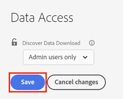

# [!UICONTROL Discover Data Download] Zugriffssteuerung {#discover-data-download-access-control}

Das Steuerelement [!UICONTROL Datendownload in Discover] ermöglicht es [!DNL Marketo Measure] Administratoren, die Richtlinien für den Datendownload für die Discover-Dashboards auf der Grundlage der Benutzerrollen festzulegen. Das Steuerelement erfasst alle Datendownload-Aktionen in Discover-Dashboards.

1. Klicken Sie unter [!UICONTROL Sicherheit] auf **[!UICONTROL Datenzugriff]** .

   

1. Klicken Sie auf das Dropdown-Menü und wählen Sie die entsprechende Option für Ihre Konsole aus.

   

   <table>
    <tr>
     <td><strong>Alle Benutzer</strong></td>
     <td>Alle Benutzer können Daten herunterladen, einschließlich PDF- und CSV-Formaten.</td>
    </tr>
    <tr>
     <td><strong>Nur Administratoren</strong></td>
     <td>Nur Admin-Benutzer können Daten herunterladen, einschließlich PDF- und CSV-Formaten.</td>
    </tr>
    <tr>
     <td><strong>Keine</strong></td>
     <td>Niemand kann Daten herunterladen, einschließlich PDF- und CSV-Formaten.</td>
    </tr>
   </table>

1. Klicken Sie auf **[!UICONTROL Speichern]**, wenn Sie fertig sind.

   

>[!NOTE]
>
>Die Einstellung wird möglicherweise erst wirksam, wenn sich Benutzer abgemeldet und wieder angemeldet haben.
