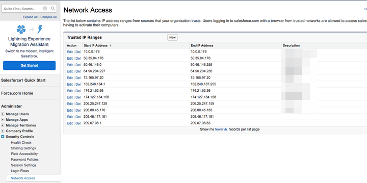

# Sicherheitssitzungsbeschränkungen: IP-Adressen in der Zulassungsliste {#security-session-restrictions-ip-addresses-to-allowlist}

Wenn [Sitzungssicherheitseinstellungen](https://help.salesforce.com/articleView?id=admin_sessions.htm&type=0){target="_blank"} vorhanden sind, die verhindern, dass bestimmte IP-Adressen Daten an Ihre [!DNL Salesforce]-Instanz senden/abrufen, müssen die folgenden IP-Bereiche auf die Zulassungsliste gesetzt werden, damit [!DNL Marketo Measure] Daten an [!DNL Salesforce] senden können:

* 52.162.84.192 – 52.162.84.207
* 23.100.229.112 – 23.100.229.127
* 20.186.163.0 – 20.186.163.15

Um [!DNL Marketo Measure] IP-Adressen zu den vertrauenswürdigen IP-Bereichen in Salesforce hinzuzufügen, klicken Sie auf **[!UICONTROL Setup]** > **[!UICONTROL Administration-]** > **[!UICONTROL Sicherheitssteuerungen]** > **[!UICONTROL Netzwerkzugriff]** > **[!UICONTROL Neu]**.

