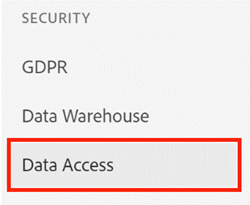

# Single Sign-On {#single-sign-on}

SAML (Security Assertion Markup Language) für SSO (Single Sign-On) ermöglicht es den Benutzenden, sich über den Identitätsanbieter eines Unternehmens zu authentifizieren, wenn sie sich bei der [!DNL Marketo Measure]-App anmelden. SSO ermöglicht es den Benutzenden, sich einmal zu authentifizieren, ohne dass sie sich in verschiedenen Anwendungen authentifizieren müssen. SAML ist eine Notwendigkeit für Kundinnen und Kunden in Unternehmen, da nicht alle Benutzenden über ein [!DNL Salesforce]- oder [!DNL Google]-Konto in ihrer Organisation verfügen. Um zu skalieren, hat [!DNL Marketo Measure] eine SAML-Lösung entwickelt, die Identitätsanbieter von Unternehmen unterstützen kann.

>[!CAUTION]
>
>In diesem Artikel werden das Single Sign-On (SSO) und die erweiterte CRM-Benutzerverwaltung vorgestellt. Wenn Ihr Konto **nach dem 10.09.2020** eingerichtet wurde, beachten Sie diesen Artikel nicht, da SSO und Identitätsmanagement in der [Adobe Admin Console für Ihre [!DNL Marketo Measure] Integration](/help/implementation-guide.md) festgelegt werden.

>[!NOTE]
>
>Es ist wahrscheinlich, dass Unternehmen verschiedene Identitätsanbieter verwenden (z. B. Ping Identity, Okta). Die in den folgenden Einrichtungsanweisungen und in der Benutzeroberfläche verwendeten Begriffe stimmen möglicherweise nicht direkt mit denen Ihres Identitätsanbieters überein.

## Anforderungen {#requirements}

* Benutzende mit AccountAdmin-Rechten in der [!DNL Marketo Measure]-App
* Benutzende mit Adminzugriff auf den Identitätsanbieter der Kundschaft

## Erste Schritte {#getting-started}

Um zu beginnen, navigieren Sie in der [!DNL Marketo Measure]-Anwendung zur Seite „Einstellungen“ > „Sicherheit“ > „Authentifizierung“. Wechseln Sie dann für den Anmeldetyp zu „Benutzerdefiniertes SSO“, um die Konfigurationsoptionen anzuzeigen. Die Änderungen werden erst wirksam, wenn Sie Ihre Authentifizierung testen und auf die Schaltfläche **[!UICONTROL Speichern]** unten auf der Seite klicken.

## Prozess {#process}

Single Sign-On bei [!DNL Marketo Measure] erfordert die Konfiguration Ihrer Authentifizierungseinstellungen in einer Reihe von Schritten, damit Sie nicht Gefahr laufen, aus Ihrem [!DNL Marketo Measure]-Konto ausgesperrt zu werden.

Richten Sie die [!DNL Marketo Measure]-Anwendung in Ihrem Identitätsanbieter ein. Weitere Informationen finden Sie in der unten aufgeführten externen Dokumentation.

    a. Wenn Sie nach der Single-Sign-On-URL, der Empfänger-URL oder der Ziel-URL, der SAML-Assertion-Kundendienst-URL (ACS), gefragt werden, verwenden Sie [https://apps.bizible.com/BizibleSAML2/ReceiveSSORequest](https://apps.bizible.com/BizibleSAML2/ReceiveSSORequest)
    
    b. Wenn Sie nach der URL für die Zielgruppeneinschränkung oder einer anwendungsdefinierten eindeutigen Kennung gefragt werden, verwenden Sie [https://BizibleLPM](https://biziblelpm/)

Wechseln zur benutzerdefinierten SSO in der [!DNL Marketo Measure]-Anwendung

    a. Nachdem die Abrechnungsgruppe für Ihr Konto aktiviert wurde, können Sie zu [!UICONTROL Einstellungen] >>[!UICONTROL Sicherheit] >> [!UICONTROL Authentifizierung]
    
    b navigieren. Standardmäßig wird Ihr Anmeldetyp auf „CRM-Benutzer“ festgelegt
    
    c. Wechseln Sie den Anmeldetyp zu „Benutzerdefiniertes SSO“, um den Konfigurationsprozess zu starten.

Ausfüllen der Verbindungseinstellungen für Ihre Identitätsanbieter-Konfiguration

    a. Ihr Identitätsanbieter gibt möglicherweise ein XML-Dokument mit IdP-Metadaten zurück, aus dem die erforderlichen Konfigurationsfelder abgerufen werden. Laden Sie entweder den Inhalt des XML-Dokuments oder füllen Sie die drei folgenden Felder mit den Daten aus, die während des Identitätsanbieter-Konfigurationsprozesses generiert wurden. **Sie müssen nicht beides abschließen.**
    
    i. IdP-URL: Die URL [!DNL Marketo Measure]  auf die verwiesen werden muss, um Ihre Benutzer für die - [!DNL Marketo Measure]  zu authentifizieren. Manchmal auch als „Umleitungs-URL“ bezeichnet
    ii. IdP-Herausgeber: Eine eindeutige Kennung des Identitätsanbieters. Manchmal auch als „Externer Schlüssel“ bezeichnet
    iii. IdP-Zertifikat: Ein öffentlicher Schlüssel, mit dem [!DNL Marketo Measure] die Signatur aller Antworten des Identitätsanbieters überprüfen und validieren kann.

Legen Sie die Gültigkeit des Tokens für Ihre Benutzenden in Minuten fest.

    a. [!DNL Marketo Measure] erlaubt eine ganze Zahl von 1 bis 1440 Minuten. Nachdem die Sitzungszeit einer Person überschritten wurde, wird sie abgemeldet, sobald sie zu einer neuen Seite navigiert.

Richten Sie die Einstellungen für die Benutzerattribute ein und ordnen Sie sie den jeweiligen Vornamen, Nachnamen und E-Mail-Adressen zu.

    a. Durch die Eingabe der SAML-Attribute  [!DNL Marketo Measure] in in der Lage, Ihre Benutzer anhand der weitergegebenen Informationen zu erkennen.
    
    i. E-Mail-Attribut : Geben Sie den Attributnamen an, den Ihr Identitätsanbieter für die E-Mail-Adresse des Benutzers verwendet.
    ii. Vornamenattribut: Geben Sie den Attributnamen an, den Ihr Identitätsanbieter für den Vornamen des Benutzers verwendet.
    iii. Attribut Nachname : Geben Sie den Attributnamen an, den Ihr Identitätsanbieter für den Nachnamen des Benutzers verwendet.
    
    b. Hinweis: Wenn Sie Ihre SAML-Konfiguration jetzt testen, analysieren wir die Attribute E-Mail, Vorname und Nachname , die Sie für diesen Abschnitt verwenden können.

Richten Sie Ihre Benutzerrolleneinstellungen ein und ordnen Sie sie den entsprechenden Rollen oder Gruppen zu, die von Ihrem IdP klassifiziert wurden.

    a. Kunden haben die Möglichkeit, Benutzerrollen  [!DNL Marketo Measure]  Grundlage von Gruppen zuzuweisen, die in ihrem Identity Provider definiert sind. Indem Sie Ihre SAML-Attribute eingeben, wird [!DNL Marketo Measure] die Rollen und Gruppen Ihrer Benutzenden den [!DNL Marketo Measure] -Benutzerberechtigungen zuordnen. Es wird dringend empfohlen, diese Rollen so einzurichten, dass Ihr - [!DNL Marketo Measure]  über ausreichende Berechtigungen zur Aktualisierung Ihres Kontos verfügt.
    
    b. Wenn keine Rollen oder Gruppen zugeordnet sind, lautet die Standardeinstellung, dass alle Mitarbeiter im Identitätsanbieter Standardbenutzerzugriff haben.
    
    i. [!DNL Marketo Measure] Standardbenutzer: Geben Sie den Rollen- oder Gruppenwert (von Ihrem SSO-Anbieter) für Benutzer an, die schreibgeschützten Zugriff auf den  [!DNL Marketo Measure] application.
    ii. [!DNL Marketo Measure] Konto-Administratorbenutzer haben sollen. Geben Sie den Rollen- oder Gruppenwert (von Ihrem SSO-Anbieter) für Benutzer an, die administrativen Zugriff auf die  [!DNL Marketo Measure] -Anwendung haben sollen. Das bedeutet, dass die Rolle Zugriff auf die Änderung von Konfigurationen und Einstellungen in Bezug auf Ihr Konto hat.
    iii. Ihr Identitäts-Identitäts-Service muss ein Attribut mit dem genauen Namen „Gruppen“ enthalten, in dem die Werte gespeichert sind, die Sie in die Attribute „Bizible Standardbenutzer“ oder „Bizible-Konto-Administrator“ eingegeben haben
    
    c. Wenn mehrere Rollen oder Gruppen einer Rolle zugeordnet werden sollen, geben Sie jeden Wert durch ein Komma getrennt ein.

Testen der Single Sign-On-Konfiguration

    a. Bevor Sie auf Speichern klicken können, müssen Sie auf die Schaltfläche [!UICONTROL SAML-Authentifizierung testen] klicken, um zu überprüfen, ob Ihre Einstellungen ordnungsgemäß konfiguriert wurden.
    
    b. Wenn der Fehler „Fehler“ angezeigt wird, befolgen Sie die Meldung und versuchen Sie es erneut.

Speichern Sie Ihre Einstellungen und weisen Sie Ihre Kolleginnen und Kollegen an, [!UICONTROL Single Sign-On] mit Ihrer neuen, benutzerdefinierten Anmelde-URL zu verwenden.

    a. Wichtig: Nachdem Sie Ihre neuen Authentifizierungseinstellungen gespeichert haben, ist es möglich, dass Ihre Sitzung beendet wird, sobald Sie zu einer neuen Seite navigieren, da Sie die Anmeldung von CRM-Benutzern deaktiviert und benutzerdefinierte SSO aktiviert haben.

Probieren Sie es aus!

    a. Verwenden Sie Ihre neue benutzerdefinierte Anmelde-URL und versuchen Sie, sich mit Ihren Identity Provider [!DNL Marketo Measure] Anmeldeinformationen wieder bei der Anwendung anzumelden.
    
    b. Das Format sieht dann wie &quot;https://apps.adobe.com/business/[accountName]&quot; aus
    
    c. Herzlichen Glückwunsch! Sie haben erfolgreich Single Sign-On in der Anwendung [!DNL Marketo Measure] für Ihr Konto eingerichtet!

>[!NOTE]
>
>Nachdem Sie SSO konfiguriert haben, müssen Sie innerhalb der Anwendung[!DNL Marketo Measure]keine Benutzenden mehr hinzufügen. Die Bereitstellung von Benutzenden sollte direkt über Ihren Identitätsanbieter erfolgen.

## Benutzende eines CRM (Erweiterte Einstellungen) {#crm-users-advanced-setup}

Standardmäßig können alle Konten über ihre CRM-Zugangsdaten auf die [!DNL Marketo Measure]-Anwendung zugreifen. Manchmal müssen Kontoinhaberinnen bzw. -inhaber den Zugriff auf bestimmte Rollen beschränken und ihn nicht für alle Benutzenden mit einer aktiven CRM-Lizenz öffnen. Mit der erweiterten Einrichtung können Sie Ihre CRM-Rollen und -Gruppen den [!DNL Marketo Measure]-Benutzerberechtigungen zuordnen.

Wenn keine Rollen oder Gruppen zugeordnet sind, besteht die Standardeinstellung darin, dass alle aktiven Lizenzen in Ihrem CRM-System über Standardbenutzerzugriff verfügen.

* [!DNL Marketo Measure]-Standardbenutzer: Geben Sie den Rollen- oder Gruppenwert für Benutzende an, die über schreibgeschützten Zugriff auf die [!DNL Marketo Measure]-Anwendung verfügen sollen.
* [!DNL Marketo Measure]-Konto-Admin-Benutzer: Geben Sie den Rollen- oder Gruppenwert für Benutzende an, die über Administratorzugriff auf die [!DNL Marketo Measure]-Anwendung verfügen sollen. Das bedeutet, dass die Rolle Zugriff auf Konfigurationsänderungen und Einstellungen hat, die sich auf Ihr Konto beziehen.

Wenn mehrere Rollen oder Gruppen einer Rolle zugeordnet werden sollen, geben Sie jeden Wert durch ein Komma getrennt ein.

**Salesforce-Rollen**

Verwenden Sie für [!DNL Salesforce]-Rollen den Namen jeder Rolle. Alle Rollen finden Sie unter dem Menü [!UICONTROL Einrichtung] >[!UICONTROL Benutzer verwalten] >[!UICONTROL Rollen].

**Dynamics-Rollen**

Verwenden Sie für [!DNL Dynamics]-Rollen den Namen jeder Sicherheitsrolle. Alle Sicherheitsrollen finden Sie unter dem Menü [!UICONTROL Einstellungen] >[!UICONTROL Sicherheit] >[!UICONTROL Sicherheitsrollen].

**Google-Benutzende**

Sobald das benutzerdefinierte SSO eingerichtet wurde, wird die Seite [!UICONTROL Benutzer] so aktualisiert, dass nur externe Benutzende angezeigt werden, die mit Google-Logins hinzugefügt wurden. Da alle Benutzenden mit Zugriff über die SSO-Konfiguration definiert sind, sind hier weitere externe Benutzende aufgeführt.

Nur gültige [!DNL Google]-Konten können hinzugefügt werden und es muss eine Benutzerrolle definiert sein.

## Externe Links {#external-links}

* [Okta](https://developer.okta.com/standards/SAML/setting_up_a_saml_application_in_okta)
* [Ping Identity](https://docs.pingidentity.com:443/bundle/p1_enterpriseConfigSsoSaml_cas/page/enableAppWithoutURL.html)
* [OneLogin](https://onelogin.service-now.com/support?id=kb_article&sys_id=b2c91143db109700d5505eea4b9619d5)
* [Active Directory](https://docs.microsoft.com/de-de/azure/active-directory/active-directory-saas-custom-apps)
